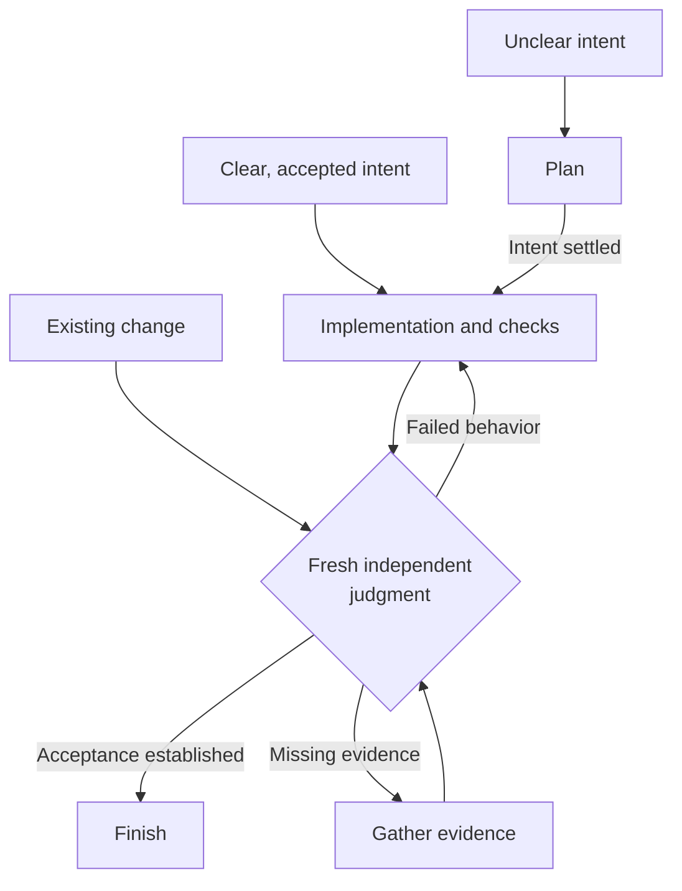

<p align="center">
  
</p>

# AgentOps

AgentOps is an operations layer for AI coding agents. It encodes software
engineering practices into reusable skills and tools for planning,
implementation, coordination, testing, and independent review. AI agents are
stochastic workers; AgentOps supplies the operational and engineering discipline
for directing their work and checking the results.

Use one skill for a bug fix or combine them for a larger project. The instructions
are plain Markdown you can inspect and adapt. Your coding agent does the work
with your existing tests, issue tracker, and Git workflow.

[](https://github.com/boshu2/agentops/actions/workflows/validate.yml)
[](LICENSE)
[](https://github.com/boshu2/agentops/releases/latest)

[Install](#quickstart) · [Workflow](#workflow) · [Why these skills exist](#why-these-skills-exist) ·
[Skill library](#choose-skills-by-the-work) · [Documentation](docs/documentation-index.md)

## Why use AgentOps?

| When the agent… | Reach for… | What you can inspect |
|---|---|---|
| Builds something different from what you meant | Behavior-driven planning | A concrete acceptance example used by both implementation and review |
| Uses three names for the same domain concept | Shared domain language | Consistent terms and rule ownership across the request, code, and tests |
| Says “done” after a green test run | Fresh independent validation | Evidence for each requested behavior, with missing coverage called out |
| Leaves the next session to repeat the investigation | Reusable checks and useful work records | Regression tests, tools, and decisions kept with their existing owners |

The 36-skill library packages established engineering practices. Select what
helps the current task; a clear change can proceed directly in your coding agent.

## Workflow

**Start where the work is. You do not need to run Plan before Implement.**
Choose an entrypoint based on what is already known and how much coordination
the work needs. A bug with clear expected behavior can go straight to a fix;
an unclear feature needs its behavior settled first.



| Your starting point | Where to enter |
|---|---|
| You know what needs to change | **Implement** directly from the existing request or issue. Use **Test** or **Refactor** for focused work. |
| The desired behavior or scope is unclear | **Plan** to settle it; use **Research** when you need facts about the system. |
| A change or design already exists | **Review** for advice; **Validate** in a fresh context for acceptance of an exact change. |
| Work spans several tasks or agents | **Orchestrate** to coordinate scope, dependencies, integration and fresh validation. |
| Earlier work may answer the current question | **Memory** to retrieve relevant, reviewed context. |

These are entrypoints, not mandatory stages. Use one skill, combine a few, or
follow the same workflow directly in your coding agent with no AgentOps skills.
Planning, research and coordination scale with the work; fresh independent
judgment still checks the implemented result against the accepted intent.

Feedback goes back into the work: repair a demonstrated failure or gather
missing evidence, then have a fresh reviewer judge the updated candidate.
Keep the accepted behavior fixed unless you authorize a scope change. Finish
through your repository's normal delivery process once acceptance is established.

<a id="install"></a>

## Quickstart

Choose one installation method. The Claude Code and Codex plugins manage the
skill bundle; the Skills installer lets you choose skills for Cursor or another
supported agent. Installing the same skill through both can leave duplicate copies.

### 1. Get the skills

<details>
<summary><strong>Claude Code</strong></summary>

<a id="claude-code"></a>

Run in your terminal:

```bash
claude plugin marketplace add boshu2/agentops
claude plugin install agentops@agentops-marketplace
claude plugin details agentops@agentops-marketplace
```

Check that `agentops` appears in the plugin inventory. The bundle includes the
[current skill catalog](docs/SKILL-ROUTER.md), four agents, and
[tool-call guards](#optional-admission-control-hooks).

</details>

<details>
<summary><strong>Codex</strong></summary>

<a id="codex"></a>

Run in your terminal:

```bash
codex plugin marketplace add boshu2/agentops
codex plugin add agentops@agentops-marketplace
codex plugin list --json
```

Check that `agentops` appears in the plugin inventory. Its skills use the
`agentops:` prefix. Additional agent roles and optional read limits have
[separate setup](docs/install-day2-ops.md#install-and-update-runtime-plugins).

</details>

<details>
<summary><strong>Cursor and other agents</strong></summary>

With Node.js installed, run this from your project directory:

```bash
npx skills@latest add boshu2/agentops --agent cursor
```

Select `research` for the first task below, or choose the whole library. To pick
a different agent interactively, omit `--agent cursor`. Add `-g` if you want a
user-level installation instead of a project installation.

Cursor discovers skills from its [native skill directories](https://cursor.com/docs/skills).
Open its skill picker and check the installed skill's source path. The
[host coverage guide](docs/contracts/multi-runtime-tier-charter.md#host-and-install-surface-mapping)
distinguishes installation checks from observed runtime behavior.

</details>

### 2. Open a new session

Start a new agent conversation in a project you already work on. Skills use
your coding agent's normal permissions. The first task below is read-only and
doesn't need the optional `ao` CLI.

<a id="try-one-task"></a>

### 3. Try one task

Paste this into your agent conversation:

```text
Use the AgentOps Research skill to trace how this repository validates user
input. Follow one path from the input through its checks and tests. Cite the
files and line numbers, explain one edge case, and identify missing coverage.
Name the Research skill file you loaded. Answer here without changing files.
```

**Check the result:** you should get a trace you can follow in the code, with
file references and any gaps the agent couldn't resolve. Use those references
to request a fix or a regression test. The reported skill path also helps you
catch a missing or duplicate installation.

You can select Research directly with `/agentops:research` in Claude Code,
`$agentops:research` in Codex, or `/` and the installed Research entry in Cursor.

## Why these skills exist

An agent can produce a plausible patch while missing the request, repeating a
failed approach, or leaving the next session to reconstruct what happened.
AgentOps puts instructions for handling those problems into skills you can
read, choose, and reuse.

### The agent starts building before the request is clear

[Plan](skills/plan/SKILL.md) checks the code and docs, asks you about decisions
that change the outcome, and turns the request into observable examples. It
prepares one complete change to build and test. If an assumption needs checking,
it can run a small experiment before committing to an approach.

For an API change, "validate email" leaves room for guesses. "Return HTTP 400
for an empty email and keep valid requests working" gives the implementer and
reviewer the same behavior to check. When work resumes, Plan reads the handoff
and preserves decisions already made.

<a id="how-independent-review-works"></a>

### A passing test misses part of the request

[Implement](skills/implement/SKILL.md) carries the agreed change through the
repository's checks and repairs known failures. [Test](skills/test/SKILL.md)
helps choose behavioral and regression tests. [Review](skills/review/SKILL.md)
provides advice when you want another look at a plan, design, or patch.

To establish whether the job is complete, [Validate](skills/validate/SKILL.md)
brings a separate reviewer with a fresh context to the exact change and the
original request. The author cannot issue its own binding approval. Validate
requires the [optional `ao` CLI](#optional-ao-cli).

Illustrative result for the email example:

```text
Request: Reject an empty email with HTTP 400. Keep valid requests working.
Evidence: Valid requests checked. Empty-email behavior not checked.
Verdict: NOT_PROVEN. The empty-email requirement still needs evidence.
```

The result is `PASS` when every accepted criterion has evidence, `FAIL` when a
criterion fails or the change exceeds scope, and `NOT_PROVEN` when evidence or
reviewer independence is missing. Advice doesn't substitute for this judgment.
If your request could mean advice or acceptance, the agent clarifies it first.

### Parallel agents get in each other's way

[Orchestrate](skills/orchestrate/SKILL.md) checks prerequisites and active
assignments before splitting work. It gives workers separate write scopes,
brings their changes together, and reserves time for independent review of the
combined result. [Agent Native](skills/agent-native/SKILL.md) supplies optional
dispatch guidance.

Start with one agent. Add workers when the work can be separated. Your tracker
still records assignments and status; your coding runtime runs the agents.

<a id="shared-project-context"></a>

### The next session has to rediscover decisions

[Memory](skills/memory/SKILL.md) finds relevant project notes and checks them
against current code and docs. A project can opt into a `.context/README.md`
that points to topic pages and their sources. This repository's
[context map](.context/README.md) shows the layout. Reading cleared notes uses
ordinary filesystem tools and needs neither `ao` nor Beads.

Adding or correcting shared notes requires authorized sources, a selected
destination, and fresh review of factual support and disclosure before Git
admission. Drafts and review evidence stay in protected storage outside Git.
Memory creates no context store or private import automatically. These procedures
don't enforce access permissions or prove that saved notes improve later work.
See [Memory's storage rules](skills/memory/SKILL.md#access-storage-and-honest-limits).

## From behavior to verified change

**Behavior-driven development (BDD)** means agreeing on concrete examples of
what the software should do before coding, then checking the result against
those same examples. **Given** describes the starting situation, **When** the
action, and **Then** the observable result. For example, in a system that calls
queued work a **Job**:

```gherkin
Given a Job has already completed
When the worker receives that Job again
Then it returns the completed result without repeating the side effect
```

Keep that example in the existing issue or conversation. The implementer fixes
the relevant path and adds a regression test that checks both the returned
result and the absence of a repeated side effect. A fresh reviewer examines the
exact change and its evidence against the same example. Passing an unrelated
test suite does not fulfill the promise.

Domain-driven design (DDD) keeps the meaning of **Job** consistent across the
request, code, tests, and review. Use the repository's established vocabulary
and rule owners; clarify a term when ambiguity would change the behavior.
Plain-text examples suffice. No `.feature` file or glossary is required.

The resulting fix and regression test remain available for future changes.
Record useful decisions and handoffs in the caller's existing tools. This is
the engineering value AgentOps aims to preserve across sessions; a saved note
alone does not establish that later work improved.

<details>
<summary>Try the example: implement directly, plan only if needed, then validate</summary>

Use this in a repository with a Job worker, adapting the domain terms to the
actual system. These are prompts for your coding agent, not shell commands.
Here is the Codex form; in Claude Code, replace `$agentops:` with `/agentops:`.

If the behavior above is already agreed, start with implementation:

```text
$agentops:implement Implement the accepted Job behavior within the agreed scope.
When a completed Job is received again, return its result without repeating
the side effect.
Add a regression check for the returned result and the absence of a repeated
side effect. Run the owning checks and report their results.
```

If the intended behavior or scope is still unclear, use Plan first:

```text
$agentops:plan Clarify how a worker should handle a Job it has already completed.
Reuse our existing domain terms, settle the expected behavior and scope, and
identify the smallest check that distinguishes correct behavior from current code.
```

After implementation and checks, use a **fresh reviewer context**, with access
to the exact change, the accepted scope, and the check results. Validate requires
the [optional `ao` CLI](#optional-ao-cli).

```text
$agentops:validate Review this change against the accepted scope and behavior:
a completed Job received again returns its result without repeating its side
effect. Inspect the implementation and check evidence; report PASS, FAIL, or
NOT_PROVEN with checked scope and any missing evidence. Do not change the code.
```

If validation finds a failure, repair it within the accepted scope. If evidence
is missing, obtain it. Then request fresh judgment of the updated candidate;
do not treat a passing test or an advisory Review as acceptance.

These prompts illustrate a workflow; they are not a transcript or a claim that
the example has run in your repository. Individual skills can also be used on
their own.

</details>

## Design principles

1. **Agree on behavior before implementation.** Keep accepted examples in the
   existing conversation or issue. Tests added later can extend the evidence;
   they cannot redefine what was promised.
2. **Use the domain's own language.** Clarify consequential ambiguity and respect
   boundaries where the same word has different meanings.
3. **Separate authorship from acceptance.** A fresh reviewer checks the exact
   change. The author cannot issue its own binding PASS.
4. **Leave useful improvements behind.** Preserve regression checks, tools, and
   supported decisions where later work can use them. Add guidance when it
   resolves a real need; a new worksheet is not required for every task.

These practices come from BDD, DDD, design by contract, testing, refactoring,
and other established engineering work. The [Practice Registry](PRACTICE-REGISTRY.md)
records their lineage and how skills apply them. See [how it works](docs/how-it-works.md)
for the planning, implementation, and validation responsibilities.

## Where AgentOps fits

AgentOps grew independently from applying DevOps experience and established
engineering practices to agents. Projects such as Compound Engineering and Matt Pocock's
skills have converged on similar approaches. There is substantial overlap:
AgentOps covers planning, implementation, testing, review, and deliberate reuse.
Use it across that workflow, or combine selected practices with other libraries.

| Project or tool | What it provides | How the pieces can work together |
|---|---|---|
| **AgentOps** | Skills for planning, implementation, testing, review, and reuse, plus CLI checks and evidence tools | Use the full workflow or selected skills, with BDD examples and fresh judgment tied to the accepted behavior |
| [Compound Engineering](https://github.com/EveryInc/compound-engineering-plugin) | A connected brainstorm, plan, build, review, and learning-capture workflow | Can supply the development loop and reusable solution records; carry the accepted behavior and evidence into independent judgment |
| [Matt Pocock's skills](https://github.com/mattpocock/skills) | Composable practices for clarifying intent, domain modeling, TDD, and review | Callers can select relevant practices alongside AgentOps skills |
| [Beads](AGENTS.md#repository-work-tracker) or your existing tracker | Work status, dependencies, and handoffs | Keeps ownership of work while AgentOps reads the accepted intent and cites its source |
| Software factories such as [Gas City](skills/using-gc/SKILL.md) | Coordinating and running agents | Own execution through their native control plane; AgentOps supplies guidance, checks, and independent review of results |

For example, a factory can coordinate a Beads-tracked task, an implementer can
use a TDD skill, and a fresh reviewer can check the result against the accepted
BDD example. Choose which workflow leads the task and make those handoffs
explicit. The Compound Engineering and Matt Pocock combinations are ways to
compose practices; the linked factory skill documents its supported integration.

Review and durable context are shared ideas across these projects.
See the [validation contract](skills/validate/SKILL.md) for AgentOps' review requirements.

## Choose skills by the work

These are independent entry points. Pick the one your task needs.

| Skill | Use it to |
|---|---|
| [Plan](skills/plan/SKILL.md) | Clarify a change or resume from an existing handoff |
| [Implement](skills/implement/SKILL.md) | Complete an accepted change or service operation, including checks and repairs |
| [Review](skills/review/SKILL.md) | Get findings and suggestions on a plan, design, or change |
| [Validate](skills/validate/SKILL.md) | Get an independent acceptance judgment on the exact result |
| [Orchestrate](skills/orchestrate/SKILL.md) | Coordinate workers and bring their changes together for review |
| [Memory](skills/memory/SKILL.md) | Find, capture, and maintain reviewed project context |

The library also includes focused skills for [research](skills/research/SKILL.md),
[testing](skills/test/SKILL.md), [refactoring](skills/refactor/SKILL.md),
[domain modeling](skills/domain/SKILL.md), [documentation](skills/doc/SKILL.md),
and [security](skills/security/SKILL.md).
Browse the [full skill catalog](docs/SKILL-ROUTER.md).

For example, use `/agentops:test` in Claude Code or `$agentops:test` in Codex.
Ordinary language works too: "Use AgentOps Test to cover the missing edge case
we just traced. Preserve the current API and run the owning package checks."

## Optional `ao` CLI

The skills are Markdown instructions. `ao` adds deterministic repository checks
and tools for identifying and saving evidence. Install it when a selected
skill requires it or you want those commands.

```bash
brew tap boshu2/agentops https://github.com/boshu2/homebrew-agentops
brew install agentops
ao version
ao quick-start
```

With Go installed, use `go install github.com/boshu2/agentops/cli/cmd/ao@latest`.
`ao quick-start` gives read-only guidance; `ao demo` prints a sample coding task.
Neither writes project state. `ao init` is optional local evidence setup.
See the [command reference](cli/docs/COMMANDS.md) and
[installation guide](docs/install-day2-ops.md) for source builds and skill dependencies.

| Command | Use it to |
|---|---|
| `ao quick-start` | Read the native execution brief, check requirements, and review responsibilities |
| `ao capabilities` | Discover the CLI's available capabilities |
| `ao gate check` | Run the selected repository checks; add `--full` for the whole registry |
| `ao config --show` | Inspect resolved configuration and its sources |

<details>
<summary>Inspect CLI configuration and request JSON output</summary>

Inspect the resolved configuration, or request the result as JSON:

```bash
ao config --show
ao config --show --json
```

The resolver reads project configuration from `.agents/ao/config.yaml` and home
configuration from `~/.agents/ao/config.yaml`. It reports flags ahead of
`AGENTOPS_*` environment variables, then project configuration, home
configuration, and defaults. Use `AGENTOPS_CONFIG` or `--config` to select a
file explicitly. Use a command's output flags to request its format; see
[configuration help](cli/docs/COMMANDS.md#ao-config) for the CLI surface.
Requested validation proof uses its separately selected external evidence root.

</details>

## Updating and advanced setup

<details>
<summary><strong>Upgrading to 3.8</strong></summary>

<a id="upgrading-to-38"></a>
<a id="upgrading-to-37"></a>

Version 3.8 adds Review and Orchestrate to the optional skill menu and supports
reviewed project context. Existing 3.7 command and skill names remain available.

Read the [migration guide](docs/MIGRATION.md) before upgrading from 3.6. Version
3.7 removes CLI commands and former skill names, including `learn`,
`codebase-recon`, and `swarm`; their current owners are `memory`, `research`, and
`agent-native`.

Refresh both the marketplace and the installed plugin:

```bash
# Claude Code
claude plugin marketplace update agentops-marketplace
claude plugin update agentops@agentops-marketplace

# Codex, for a Git-backed marketplace
codex plugin marketplace upgrade agentops-marketplace
codex plugin add agentops@agentops-marketplace
```

Start a new session afterward. For Homebrew, run `brew update` followed by
`brew upgrade agentops`. For Skills installer copies, use `npx skills update`.
Follow the [update guide](docs/install-day2-ops.md#update) for other install paths
and obsolete copies; new installs don't silently remove old skills.
See the [3.8 release notes](docs/releases/2026-09-22-v3.8.0-notes.md) for the current changes
and the [3.7 release notes](docs/releases/2026-09-13-v3.7.0-notes.md) for the earlier removals.

</details>

<details>
<summary><strong>Source installs and skill dependencies</strong></summary>

<a id="other-installation-paths"></a>

From an AgentOps checkout with `ao` installed, preview and link selected skills:

```bash
ao skills link --skill test --skill refactor --dry-run
ao skills link --skill test --skill refactor
```

Omit selectors to link the whole catalog. Linking preserves existing real
directories and foreign links. See the [source checkout instructions](docs/install-day2-ops.md#install-source-checkout)
for cloning, updating, choosing a destination, and removing owned links.

Some skills need `ao`, Python, or a specialist tool. Installation doesn't
install those dependencies. Check the [installation guide](docs/install-day2-ops.md)
and selected skill before using it. The [host mapping](docs/contracts/multi-runtime-tier-charter.md#host-and-install-surface-mapping)
documents coverage and limits for each runtime.

| Skill | Needs | Why |
|---|---|---|
| `rpi` | `ao`, conditional | delegates exact-subject checks to Validate; only persists `verdict.v2` when requested, with the fixed-dispatch adapter optional |
| `plan` | `ao`, conditional | runs `ao provenance snapshot-intent` with an explicit evidence root when the intent source is not durable |
| `validate` | `ao` | derives exact subject identity with the helper and uses `ao provenance store-verdict` when persistence is requested; Python/schema checks are developer-only |
| `reality-check` | `ao`, conditional | inspect selected goal measurements with `ao goals` or evidence-store facts with `ao status` |
| `using-gc` | `ao` | rig prep runs `ao gc prepare` and `ao gc check` |
| `doc` | `ao`, optional | a requested continuity handoff may use `ao session handoff`/`rehydrate` |
| `reverse-engineer` | `python3` | Phase 1's mechanical teardown runs `scripts/reverse_engineer.py` |
| `skill-builder` | `python3`, conditional | Create mode's `build.sh` runs `scripts/generate-skill-mesh.py`; heal/check/audit modes are bash-only |
| `ms` | `python3`, conditional, plus `ms` binary | the MCP-search fallback runs `python3 skills/ms/scripts/mcp-search.py`; the `ms` binary is required for CLI load, write, and admin operations |
| `memory` | `python3`, conditional | a selected toil investigation can use the repository helper `scripts/toil-mining/recent_human.py` on cleared Codex sources |
| `security` | `python3`, conditional | the composable suite and offline redteam surfaces run `security_suite.py` when that scan type is selected |
| `cass` | `python3`, optional | `scripts/prompt_miner.py` mines repeated prompts; one of several selectable Scripts-table entries |

</details>

<details>
<summary><strong>Permissions, optional hooks, and removal</strong></summary>

<a id="optional-admission-control-hooks"></a>

The Claude Code plugin includes a PreToolUse policy dispatcher. Its guards
check for private tracker data in commits, manual provenance-ledger edits, and
overwrites of installed skills. Installing only `ao` doesn't install these hooks.
Other install paths can opt in through [CC Hooks](skills/cc-hooks/SKILL.md).

Read-budget guards and Codex custom roles require separate setup. Codex hooks
need review and trust in its native hook manager. See the
[role and hook instructions](docs/install-day2-ops.md#install-and-update-runtime-plugins).

Disable the Claude plugin with `/plugin disable agentops` in Claude Code.
To remove a plugin from your terminal, use `claude plugin uninstall
agentops@agentops-marketplace` or `codex plugin remove
agentops@agentops-marketplace`.

</details>

<details>
<summary><strong>Architecture and saved review evidence</strong></summary>

AgentOps is the operations layer for agentic engineering. Git stores content
and history, your tracker records work, and your coding agent or selected
factory runs it. AgentOps supplies guidance, checks, and independent judgment.
Your repository keeps its delivery rules.

These systems form a federated integration graph: each keeps its own state and
authority, with references connecting the work and its evidence.

```text
Accepted behavior and domain terms
        |
        v
Coding agent or selected factory --> Code, tests, and check results
                                               |
                                               v
Accepted behavior ----------------> Fresh independent reviewer
                                               |
                                               v
                                    PASS / FAIL / NOT_PROVEN
                                               |
                                               v
                                    Your repository's delivery policy
```

Native execution needs no mandatory AgentOps skills. The [RPI charter](skills/rpi/SKILL.md)
packages a workflow when selected. [Gas City](skills/using-gc/SKILL.md) and
[Agentic Coding Flywheel](skills/using-flywheel/SKILL.md) are optional integrations.
Their completion reports don't replace independent review.

By default, the reviewer uses the author's model family; a different model is
an explicit choice. On request, Validate can save a `verdict.v2` record identifying
the exact content, checked scope, and evidence. New proof belongs in selected,
protected storage outside Git; existing evidence is preserved. Beads is optional.

Read the [architecture](docs/ARCHITECTURE.md), [operating contract](docs/agent-workflow-reference.md),
and [storage rules](docs/adr/ADR-0016-state-tiers.md) for the details.

</details>

## Troubleshooting

| Symptom | What to check |
|---|---|
| `plugin` is not a recognized command | Update Claude Code or Codex to a version with plugin support, then retry |
| A skill is missing | Check its plugin inventory or skill picker, then start a new session |
| `ao` is not found | Install the CLI and check PATH; Go installs usually use `$(go env GOPATH)/bin` |
| A skill asks for Python or another tool | Check the skill's dependencies in the installation guide |
| An old skill name no longer works | Check the [migration guide](docs/MIGRATION.md#skills) and stale copies |

For a reproducible problem, [open an issue](https://github.com/boshu2/agentops/issues)
with your runtime version, install method, command or prompt, and observed result.
Include saved evidence only when it's safe to share.

## Limits

Skills guide the coding agent; their installation alone does not enforce every
instruction. Review quality depends on the accepted examples, evidence, and
reviewer. A green test suite or an agreeing second model can still miss a defect.
Missing proof stays `NOT_PROVEN`.

Reusable code, checks, and decisions can improve later engineering work. Saving
notes alone does not demonstrate that benefit, and AgentOps does not promise
automatic knowledge compounding. See [product evidence and limits](PRODUCT.md).

Your tracker, runtime or factory, and repository policy retain responsibility
for work ownership, execution, and delivery.

## FAQ

**Do I need the CLI to get started?**

No. Install the skills and try Research, Test, or Refactor in your coding agent.
Install `ao` for deterministic gates or a skill that requires it, including Validate.

**Do I need an orchestrator and three running agents?**

No. Start with one implementer and obtain a fresh, author-distinct review when
the change is ready. An orchestrator and parallel workers are optional.

**Must the reviewer use a different model provider?**

No. The default is a fresh context from the author's model family. Cross-model
review is an explicit choice; the reviewer must still examine the accepted
behavior and exact change independently.

**Can I keep my existing workflow and skills?**

Yes. Select guidance for the task and keep clear responsibility for planning,
execution, and review. See [where AgentOps fits](#where-agentops-fits) for
Compound Engineering, Matt Pocock's skills, trackers, and factories.

**Does durable work have to live in Git?**

No. Durability means the next session can recover the relevant work and its
context. Git keeps source history; a tracker can keep decisions and handoffs;
requested proof uses protected external storage. Follow the owning system's
retention and access rules.

## Contributing

Contributions are welcome: documentation fixes, reproducible bug reports,
tests, CLI improvements, and skills. Read the [contribution guide](docs/CONTRIBUTING.md)
for scope, checks, and pull request guidance.

Licensed under [Apache-2.0](LICENSE).
