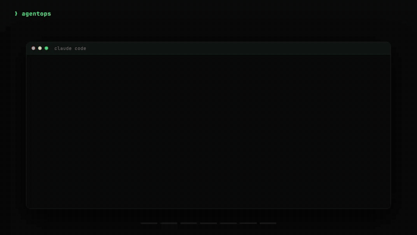

<div align="center">

# AgentOps

[](https://github.com/boshu2/agentops/stargazers)

### Autonomous code validation for coding agents

Coding agents declare "done" on code that is still wrong. AgentOps is the membrane that catches that: every change is independently verified by a fresh-context reviewer — cross-family or deterministic — and reaches *done* only with a proof artifact. **No verdict = not done.** It sits on top of the agent you already use (Claude Code, Codex, Cursor, OpenCode) and turns "looks good" into a recorded verdict you can trust before you grant the next run more autonomy.

</div>

---

## See it work

<div align="center">



<sub><code>/discovery</code> → bead graph · <code>/crank</code> → sub-agents in waves · <code>/validate --mixed</code> → real Claude + Codex verdict. Live sessions. <a href="docs/assets/hero.mp4">MP4</a></sub>

</div>

The membrane breaks intent into bounded slices, gives each a failing test and a write scope, and makes every phase boundary a gate that records a verdict. When the agent says it's finished, a reviewer that never saw it write the code gets the last word:

```text
> /validate --mixed   # the agent reported this PR done

[membrane] evidence sealed → fresh-context judges, Claude Code + Codex CLI
[claude/judge-1] REFUTE  /login has no rate limit — claimed "covered", isn't
[codex/judge-1]  REFUTE  token-bucket refill lacks jitter under burst
[claude/judge-2] PASS    redis integration follows the repo pattern
Verdict: HOLD — not done. Fix /login limit + refill jitter, then re-verify.
Recorded → .agents/council/<run-id>/verdict.md
```

---

## What you get

<!-- agentops:claim:AOP-CLAIM-README-FACTORY-CONTEXT -->

AgentOps is the membrane: prove the agent output, keep the proof, and let that record decide how much autonomy the next run earns. That part is proven. The other three layers feed it and all stay local in `.agents/` — but whether they *compound* into a quality edge is an open, measured bet ([ADR-0004](docs/adr/ADR-0004-corpus-moat-unproven-position-on-the-system.md), [ADR-0011](docs/adr/ADR-0011-escape-corpus-compounding-unproven-structural-starvation.md)):

| Layer | The problem | What AgentOps adds |
|---|---|---|
| **Validation membrane** | agent output can look correct while being wrong | tests, local gates, `/pre-mortem`, `/validate`, `/council`, and pawl verdicts prove or reject the work — no verdict, not done |
| **Evidence trail** | "looks good" does not survive handoff | `.agents/` captures runs, decisions, findings, citations, verdicts, retros, and closeout proof |
| **Context compiler** | validators and implementers start cold | `ao context assemble` builds phase-scoped packets; `ao lookup` retrieves decay-ranked knowledge |
| **Knowledge ratchet** | lessons vanish between sessions | `/forge` mines learnings, `/evolve` reconciles, and durable lessons become constraints before more autonomy is granted |

The corpus is an LLM wiki of markdown. Agents read it natively and write to it as they work, so the bookkeeping happens mechanically instead of becoming another doc you keep up by hand. Whether that compounding corpus measurably beats the same models with no corpus is unproven — the honest status is [ADR-0004](docs/adr/ADR-0004-corpus-moat-unproven-position-on-the-system.md). Public citations of flywheel or corpus outcomes use promoted artifacts under `docs/evidence/` (e.g. [2026-04-02 flywheel case study](docs/evidence/2026-04-02-flywheel-case-study.md)); `.agents/` remains the local operating substrate. Why that beats Notion or Confluence: [docs/wiki-for-agents.md](docs/wiki-for-agents.md). The full theory (context as the lifecycle, the CDLC): [docs/cdlc.md](docs/cdlc.md).

<!-- agentops:claim:AOP-CLAIM-README-COMPETITIVE-MEMORY -->

### The self-improving part 

When a verdict says CONFIRMED but the code later turns out wrong, that's an *escape*. The membrane compiles each escape into a deterministic check that catches it next time — that mechanism is proven end-to-end. Whether the accumulated **escape-corpus** *compounds* into a durable edge is the open question, and the honest answer is "probably starved": a competent membrane catches most things at review, so real escapes are structurally rare ([ADR-0011](docs/adr/ADR-0011-escape-corpus-compounding-unproven-structural-starvation.md)).

---

## Install

Pick your runtime, then type `/quickstart` in the agent.

```bash
# Claude Code
claude plugin marketplace add boshu2/agentops
claude plugin install agentops@agentops-marketplace

# Codex CLI (macOS/Linux/WSL).  OpenCode: install-opencode.sh
curl -fsSL https://raw.githubusercontent.com/boshu2/agentops/main/scripts/install-codex.sh | bash
# Codex CLI (Windows):
irm https://raw.githubusercontent.com/boshu2/agentops/main/scripts/install-codex.ps1 | iex

# Gemini / Antigravity
curl -fsSL https://raw.githubusercontent.com/boshu2/agentops/main/scripts/install-agy.sh | bash

# Other skills-compatible agents
npx skills@latest add boshu2/agentops --cursor -g
```

The `ao` CLI is optional but recommended (bookkeeping, retrieval, health, the loops):

```bash
brew tap boshu2/agentops https://github.com/boshu2/homebrew-agentops && brew install agentops   # macOS
# Windows: irm https://raw.githubusercontent.com/boshu2/agentops/main/scripts/install-ao.ps1 | iex
# Or release binaries / build from source (cli/README.md).
```

Installs hookless: skills and the `ao` CLI guide the workflow, and the local cockpit gate is the release authority. GitHub Actions are an optional/manual backstop, not the routine shipping path. The only hard requirement is an agent runtime and `git`; everything else degrades gracefully. Full dependency matrix: [docs/dependencies.md](docs/dependencies.md). Day-2 install, update, backup, permission, recovery, and escalation paths are in [docs/install-day2-ops.md](docs/install-day2-ops.md).

---

## Quick start

<!-- agentops:claim:AOP-CLAIM-README-FIRST-VALIDATED -->

| You want to… | Run | Done when |
|---|---|---|
| set up a repo | `ao quick-start`, then `/quickstart` | AgentOps reports readiness and a next action |
| ship one validated change | `/rpi "a small goal"` | discovery, build, validation, and learnings all leave evidence in `.agents/` |
| review something now | `/council validate this PR` · `/validate recent` | a consolidated verdict and a record before you ship |

Already installed? Ask your agent: `/quickstart`. Or run `ao doctor` and `ao demo`. First-session walkthrough: [docs/first-value-path.md](docs/first-value-path.md).

---

## Skills

Every skill works alone; flows compose them. Full catalog: [docs/SKILLS.md](docs/SKILLS.md), unsure where to start? [Skill Router](docs/SKILL-ROUTER.md).

| Skill | Use it when |
|---|---|
| `/quickstart` | you want the fastest setup check and next action |
| `/research` | you need codebase context and prior learnings before changing code |
| `/pre-mortem` | you want to pressure-test a plan before building |
| `/rpi` | you want discovery, build, validation, and bookkeeping in one flow |
| `/council` | you want independent judges (optionally Claude and Codex) to return one verdict |
| `/validate` | you want a code-quality and risk review before shipping |
| `/evolve` | a goal-driven improvement loop that compounds knowledge without mutating source |

---

## The `ao` CLI

Repo-native control plane behind the skills. Full reference: [CLI commands](cli/docs/COMMANDS.md).

<!-- agentops:claim:AOP-CLAIM-README-EVOLVE-AUTONOMOUS -->

```bash
ao quick-start            # set up AgentOps in a repo
ao search "query"         # search history and local knowledge
ao lookup --query "topic" # retrieve curated learnings
ao context assemble       # build a task briefing
ao gate check --fast      # the release gate — verify before you push
ao compile                # rebuild the corpus
ao metrics health         # flywheel health
```

<!-- agentops:claim:AOP-CLAIM-README-AUTONOMOUS-FLYWHEEL -->

**In session vs. out of session.** The whole loop runs in a plain session: no daemon, no scheduler, no cloud (the sovereignty floor). For always-on work, the same loop opts into a swappable substrate (an NTM tmux swarm, MCP via `ao mcp serve`, or managed-agents) that dispatches a whole AgentOps loop per ready bead. Details: [docs/3.0.md](docs/3.0.md); component routing: [docs/architecture/component-map.md](docs/architecture/component-map.md). (The knowledge flywheel and the escape-corpus's compounding are unproven hypotheses — [ADR-0004](docs/adr/ADR-0004-corpus-moat-unproven-position-on-the-system.md), [ADR-0011](docs/adr/ADR-0011-escape-corpus-compounding-unproven-structural-starvation.md); the proven product is the verification itself.)

---

## Honest limitations

- **It doesn't write code.** It wraps Claude Code / Codex / Cursor / OpenCode with bookkeeping, gates, and a corpus; the harness still writes it.
- **No hosted control plane or telemetry.** Everything lives in your repo; there's no cross-team dashboard unless you commit `.agents/`.
- **Multi-model councils cost tokens.** Six judges per PR isn't free; running them on a substrate makes the cost predictable, not zero.
- **The corpus needs hygiene.** `ao defrag` and `ao maturity` keep it healthy; neglected, it rots like any markdown vault.
- **There are many skills.** `/quickstart` and the [Skill Router](docs/SKILL-ROUTER.md) exist so you don't have to learn them all up front; current inventory is generated from `skills/**/SKILL.md`.
- **The compounding is unproven.** The verification is proven; whether the corpus or the escape-corpus *compounds* into a quality edge is a measured-in-the-open hypothesis ([ADR-0004](docs/adr/ADR-0004-corpus-moat-unproven-position-on-the-system.md), [ADR-0011](docs/adr/ADR-0011-escape-corpus-compounding-unproven-structural-starvation.md)), not a marketing claim.

**What if the labs ship this natively?** They will — the cross-family gate itself is already table stakes (CodeRabbit, Qodo, and Copilot all ship binding pre-merge review). Two things don't follow the vendor: the *verification discipline* you run on every change, and the `.agents/` corpus — plain markdown in your repo, forkable, Apache-2.0, portable to whatever model wins next quarter. That portability is a durable edge, not a proven quality one; we don't claim the corpus makes your agent smarter until the A/B says so.

---

## Docs & contributing

[What 3.1 adds](docs/3.1.md) · [What 3.0 is](docs/3.0.md) · [operating loop](docs/architecture/operating-loop.md) · [component map](docs/architecture/component-map.md) · [docs index](docs/documentation-index.md) · [newcomer guide](docs/newcomer-guide.md) · [architecture](docs/ARCHITECTURE.md) · [FAQ](docs/FAQ.md) · built on the [12-factor doctrine](https://12factoragentops.com).

Contributing: [docs/CONTRIBUTING.md](docs/CONTRIBUTING.md) (agents: read [AGENTS.md](AGENTS.md), track work with `br`). License: Apache-2.0.
