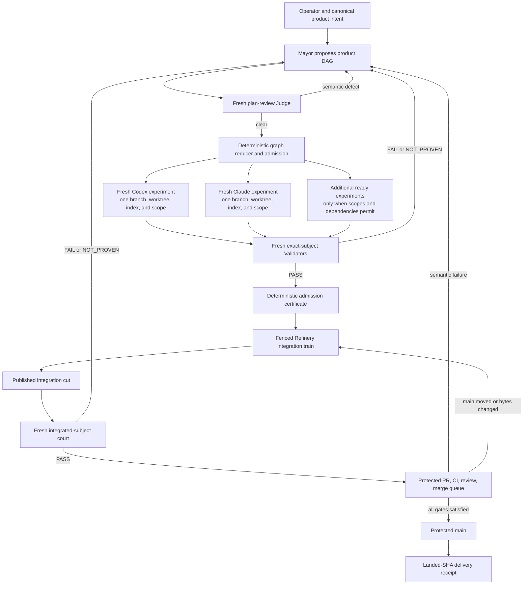

# Gas City Factory Architecture

This document explains how the AgentOps Gas City executor composes with the
Fenced Steward product factory. It is the canonical walkthrough for the
implemented architecture. The binding decision is
[ADR-0015](../adr/ADR-0015-gas-city-fenced-steward.md); the dated research and
duel remain historical evidence in the
[role-topology audit](../audits/gas-city-role-topology-2026-07-17/README.md).

## Status and scope

The v1 implementation includes the thin executor and the bead-native factory:

| Surface | Current state |
|---|---|
| Isolated Gas City deployment | Implemented in `deploy/gc/` |
| Explicit Codex/Claude Implementer and Validator pools | Implemented in `packs/agentops-executor/` |
| Exact packet, provider, workspace, manifest, evidence, and freshness binding | Implemented and covered by the GC executor gate |
| Mayor, plan-review, and Refiner pools | Implemented in `packs/agentops-factory/` |
| Program bead graph, reducer, admission certificate, worktree allocator, fencing | Implemented with atomic `bd create --graph` admission and bead metadata transitions |
| Refinery integration and PR delivery | Implemented as fenced pack commands and qualified through protected PR #916 |
| Parallel factory capacity | Bootstrap supports an explicit bounded city cap; default remains one and factory qualification uses eight |

The factory lives in the separate optional pack
`packs/agentops-factory/`. It imports `agentops-executor` rather than expanding
the executor's responsibility.

The live canary proves one complete single-experiment bead path with both
providers, a fresh candidate Validator, a fresh integration Validator, the
actual Refiner, protected CI, and merge to `main`. It does not yet prove the
multi-wave concurrency and injected-fault matrix. The exact evidence is in the
[live bead canary](../audits/gas-city-factory-live-bead-canary.md).

AgentOps remains a semantic work-and-proof protocol, not a queue, Git workflow,
retry controller, or release system. The factory is an optional caller-selected
adapter around independent AgentOps invocations.

## Mental model: two nested loops

The system has two different meanings of orchestration.

Gas City's role-agnostic orchestrator runs formulas, beads, sessions, waits,
events, orders, health reconciliation, and scaling. The Mayor is a configured
semantic agent that interprets product intent and proposes work to that
mechanism plane.



Every worker node is still one complete AgentOps experiment:

```text
resolved intent bytes and digest
  -> Implement once
  -> runtime-derived candidate manifest, changed paths, scope receipt, checks
  -> fresh Validate once over the exact subject
  -> verdict.v2: PASS | FAIL | NOT_PROVEN
  -> report and stop
```

The outer graph may create a later successor experiment. It cannot revise,
continue, or reinterpret the completed inner experiment.

## Vocabulary

| Term | Meaning in this architecture |
|---|---|
| City | One Gas City deployment and root pack with private runtime state |
| Rig | A registered repository/workspace with its own scoped agents and bead namespace |
| Pack | Reusable configuration declaring agents, prompts, commands, formulas, and orders |
| Bead | The durable unit of work and lifecycle truth: status, dependencies, ownership, routing, and factory transition metadata |
| Provider | Runtime family such as Codex or Claude selected by an agent definition and packet |
| Session | A disposable live process for one configured agent identity or pool member |
| Packet | One explicit AgentOps Implement or Validate request with exact identity and boundaries |
| Experiment | One bounded Implement plus fresh Validate cycle ending in a durable result |
| Program graph | Mayor proposal that admission atomically materializes as program, experiment, dependency, and Refinery beads |
| Admission certificate | Deterministic reference proving that exact component verdicts satisfy intake policy |
| Delivery record | Immutable Refinery evidence connecting candidates, integration cuts, PR state, and landed SHA; the Refinery bead remains lifecycle truth |

The most important distinction is that a thin-executor transport bead closing
is not an AgentOps verdict. A factory experiment bead closes only after its
exact verdict is recorded, and a Refinery bead closes only after protected
landing. A landed PR is still not a release verdict.

## Current thin executor

### Deployment

`deploy/gc/city.toml` defines:

- built-in Codex and Claude providers with full option-schema replacement;
- a private `CODEX_HOME` and explicitly selected authentication link;
- interactive Claude with inherited `print_args` cleared;
- a deployment-pinned `GC_BIN` in workspace session environment;
- generic Codex and Claude targets suspended;
- scaffold Dog and control-dispatcher pools suspended; and
- a configurable `workspace.max_active_sessions` (default one; bounded factory
  qualification passes eight explicitly).

`deploy/gc/bootstrap.sh` creates or repairs only
a marked managed city, registers an explicit disposable rig, installs the local
or pinned pack import, binds private runtime paths, checks provider readiness,
and optionally starts the city. It does not start a Mayor, run an experiment,
or infer completion.

The deployment guide is `deploy/gc/README.md`.

### Physical roles

The executor has four physical pools and two semantic roles:

| Target | Scope | Provider | Wake | Capacity per rig |
|---|---|---|---|---|
| `agentops.implementer` | rig | Codex | fresh | min 0, max 1 |
| `agentops.implementer-claude` | rig | Claude | fresh | min 0, max 1 |
| `agentops.validator` | rig | Codex | fresh | min 0, max 1 |
| `agentops.validator-claude` | rig | Claude | fresh | min 0, max 1 |

Each `agent.toml` fixes its provider. Every packet also declares
`provider = codex | claude`; the adapter verifies that the actual Gas City
session used the requested provider.

### Packet path

The explicit command is:

```text
gc agentops run-packet --packet <absolute-json-path> --rig <rig-name>
  [--binding agentops] [--timeout 1800]
```

The packet carries the exact intent source and digest, physical rig root,
subject includes/excludes, write scope, canonical evidence directory, and result
path. Validate packets additionally bind baseline and subject manifests, the
runtime-derived scope receipt, and author context identity; their write scope is
empty.

The adapter validates before dispatch, creates a deterministic transport bead,
persists its exact identity, then slings that bead with `--no-formula
--no-convoy`. On restart it reconciles the same bead and its `gc.routed_to`
metadata instead of creating or slinging duplicate work. It verifies packet
and intent continuity, checks the runtime provider and context, validates
response artifacts, persists a replayable factual runtime receipt, and returns
one deterministic transport result. The semantic verdict stays in the
referenced `verdict.v2`; the transport response cannot smuggle a verdict field.

The current binding contract is
[`docs/contracts/gas-city-execution-adapter.md`](../contracts/gas-city-execution-adapter.md).

## Factory components

### Mayor

The Mayor is the operator-facing semantic planner and the only persistent
semantic identity in v1. It owns conversation, product interpretation, proposed
acceptance-preserving decomposition, dependency and scope proposals, provider
routing, and explicit successor proposals.

It does not implement, validate, mutate graph truth, operate integration Git,
or merge. Durable beads—not an immortal transcript or JSON state file—allow its
runtime context to recycle.

### Plan-review Judge

Every initial graph and major replan receives a fresh semantic review before
admission. The Judge searches for missing acceptance, semantic coupling hidden
behind disjoint file paths, shared generated surfaces, unsafe dependencies, and
unowned scope. It emits an immutable sidecar and cannot repair the graph.

Normally choose a provider family unlike the Mayor. High-risk plans may use both
families.

### Graph compiler and reducer

The deterministic mechanism plane owns:

- graph schema validation and content identity;
- dependency readiness;
- write-scope intersection and generated-companion conflicts;
- experiment IDs and intent/scope digests;
- worktree and Git-index allocation;
- branch namespaces, leases, and fencing epochs;
- provider-target routing;
- immutable evidence ingestion referenced from beads;
- admission-certificate construction; and
- atomic graph admission and fenced bead transitions.

It may reject malformed or policy-incomplete input, but it cannot make semantic
judgments or synthesize PASS. `bd create --graph` creates the initial graph in
one transaction; later reducer commands update bead dependencies and metadata.
No pack-owned lifecycle state file competes with Gas City.

Reducer transitions are crash-replayable bead reductions. Preparation markers
such as `lease_preparing`, `rejection_preparing`, `successor_preparing`, and
`assembling` are written to the owning bead before external Git or dependency
effects. A replay verifies the stored identities, reconciles the worktree,
branch, dependency edge, successor, or delivery evidence, and completes the
same transition. It never allocates a new semantic work identity merely because
the controller restarted. Packet transport/result JSON and graph, verdict,
admission, and delivery JSON are digest-bound evidence referenced by beads; they
are not a second factory lifecycle machine.

Rerunning `program execute` reduces any open `lease_preparing`, `leased`,
`passed`, `rejection_preparing`, or `rejected` experiment before selecting new
Ready work, and routes a recovered `mayor_required` rescope before admitting
its successor. The chosen
`max_attempts` policy is persisted on the program and experiment before work;
the verdict reducer writes an at-ceiling rescope directly to `hold`, so a crash
cannot accidentally make another automatic attempt dispatchable. Operator
`rescope` remains the explicit override for that held bead.

If a rescope bead exists while its rejected experiment is still
`rejection_preparing`, program execution reduces the experiment first. The
Mayor cannot receive the rescope until the rejected experiment bead itself
records the terminal `rejected` phase and is closed. An open experiment with
`factory.status=rejected` is still a reducer-recovery state, not dispatchable
Mayor work.

### Worker pools

Codex and Claude workers are fresh, fungible, and horizontally scalable. Each
gets one experiment, one worktree, one Git index, one candidate branch, one
lease, and one declared write scope.

Shared paths serialize. Generated outputs either belong to one declared owner
or are regenerated once in Refinery. A worker cannot use stash/reset, unscoped
Git commands, peer branches, integration branches, or `main`.

### Validator pools

The same semantic Validator role serves different judgment events:

1. Mayor-authored plan or replan review;
2. candidate judgment before Refinery intake;
3. combined integration-cut judgment; and
4. current merge-eligible PR-head judgment after any published mutation.

Every event binds a different immutable subject. A candidate PASS cannot be
carried across a combined integration cut or rebase.

Routine candidates normally receive one opposite-family fresh Validator.
High-risk or disputed candidates use Codex and Claude. During the proof period,
the first merge-eligible mixed-author PR head requires both providers to PASS the
same subject. Measure second-provider unique catches, queue share, outage
blocking, latency, and cost before relaxing that policy.

### Refinery

Refinery is one logical delivery authority per rig, backed by a durable delivery
record and a dedicated integration worktree. Its deterministic engine owns
unambiguous Git, regeneration, PR, CI-status, review-status, and receipt
operations. A fresh zero-minimum/max-one triage pool may classify genuinely
ambiguous delivery events; it cannot repair code, judge semantics, or start new
experiments.

Refinery's lease is fenced by a monotonic epoch per repository and target
branch. Reaping invalidates the previous token before another wake acquires the
slot. Every push or PR mutation supplies the token and expected head.

### Protected repository gate

Branch protection, required CI, semantic validation status, human review, and a
merge queue or explicit operator policy are the only path to `main`. Separate
forge identities author PRs and post semantic status so delivery cannot
self-approve.

## Product workflow

### 1. Capture canonical intent

The operator gives the Mayor a product source such as an issue, bead, product
document, or explicit conversation intent. Acceptance, non-goals, required
evidence, and product-level changes remain in that canonical source.

### 2. Propose and review the graph

The Mayor proposes nodes with acceptance reference, write scope, generated
companions, dependencies, risk, provider preference, and first deterministic
check. A fresh plan-review Judge produces findings. The Mayor revises only by
proposing a new plan digest.

### 3. Admit ready experiments

The reducer checks plan-review policy and graph mechanics, then allocates
isolated candidates for dependency-ready, conflict-free nodes. Parallelism is a
consequence of proven independence, not a target count.

### 4. Implement and validate

Each Worker runs one AgentOps packet. AgentOps derives the content manifest,
changed paths, scope receipt, and factual checks. A distinct fresh Validator
judges the exact candidate.

### 5. Apply the rejection ratchet

`FAIL` or `NOT_PROVEN` freezes the exact experiment and returns the immutable
finding on a rescope bead. The adapter creates a separate HQ transport bead and
slings that rescope bead to a fresh Mayor context; the Mayor emits one proposal,
but only the reducer may create the successor experiment bead. A successor
preserves exact acceptance and non-goals while changing at least one execution
field, and receives a new experiment ID, branch, worktree/index, lease, and
fresh Worker. The automatic path stops after three attempts by default and
leaves the rescope bead in `hold`; an operator may resume that exact bead with
the `rescope` command. Product acceptance changes require operator approval.

### 6. Assemble a bounded integration train

Refinery accepts only exact SHAs with valid admission certificates. One train is
limited by the configured candidate count (five by default). In stable DAG
order it:

1. applies each candidate in a disposable scratch tree/index;
2. runs deterministic manifest, scope, build/test, and inbound-reference checks
   after each application;
3. regenerates shared artifacts once;
4. publishes one fenced integration-cut commit; and
5. obtains fresh semantic validation over that cut.

### 7. Shepherd the PR

Refinery opens or updates one PR for the train, observes CI and review state,
and requests protected merge only when all repository policy is satisfied.
Dependent later waves may be drafts; only one wave per target is merge-eligible
in v1.

If `main` moves, Refinery marks the bead `reassembly_required`, allocates a new
fence epoch and integration worktree from the current protected base, replays
the exact admitted candidate deltas, reruns checks, invalidates stale semantic
validation, registers an epoch-specific integration rig, and obtains a fresh
exact-head certificate. Semantic CI or review failure returns evidence to the
Mayor rather than triggering hidden repair.

### 8. Record delivery

After protected merge, Refinery verifies the landed SHA and writes a receipt
connecting program intent, candidate SHAs, component verdicts, integration
digest, validation certificate, PR/CI/review state, and landed commit. Cleanup is
receipt- and fence-gated. Delivery does not imply release.

## Branch and PR topology

```text
main                                           protected; no raw LLM push
gc/candidate/<program>/<node>/<attempt>        worker-owned exact candidate
gc/integration/<program>/<wave>/<epoch>        Refinery-owned integration cut
```

Do not default to one PR per Worker: that moves integration coherence and shared
generation races into GitHub. Do not default to a mega-PR: that destroys review
and rollback granularity. Bounded trains provide a deliberate middle layer.

## Configuration shape

The factory pack owns reusable program and delivery policy while importing the
executor's exact packet roles:

```text
packs/agentops-factory/
  pack.toml
  agents/
    mayor/
    plan-reviewer/
    plan-reviewer-claude/
    refiner/
  commands/
  assets/schemas/
    program-graph.v1
    plan-review.v1
    admission-certificate.v1
    delivery-record.v1
    factory-role-request.v1
    factory-role-response.v1
    rescope-context.v1
```

Initial proof-week capacity is at most four writer lanes inside an explicitly
configured city cap, with fresh Validator sessions and on-demand Mayor/Refiner
capacity. The allocator, scope compiler, isolated indexes, leases, and fencing
must pass their gates before raising that cap.

Dynamic worktree rigs are route-minimized from the bead's admitted
`factory.binding`. A candidate rig exposes exactly two routes: the bead-selected
Codex-or-Claude Implementer and its bead-selected opposite-family Validator.
Integration rigs expose only the binding's two Validator routes. Rig
registration and the durable suspension patches share a city-config lock, and
dispatch stops unless the resolved active inventory is exactly the expected
set.

AgentOps skills remain semantic sources of truth. Thin role prompts inject the
appropriate Mayor, plan-review, Implement, Validate, or Refinery-triage skill.
Worktree allocation, scope intersections, leases, Git commands, regeneration,
PR updates, status checks, receipts, and cleanup belong in schema-checked pack
commands, formulas, and exec orders rather than prompt prose.

## Operations and failure ownership

| Event | Owner and response |
|---|---|
| Session or controller crash | Re-enter through the same request digest or deterministic packet bead; reconcile bead routing and preparation metadata without manufacturing a verdict or duplicate work |
| Unauthorized or stale-token Git write | Deterministic hook/credential/fencing rejection |
| Candidate PASS but branch moves | Invalidate intake; exact SHA no longer matches |
| Candidate `FAIL` or `NOT_PROVEN` | Close the exact experiment, create a blocking rescope bead, and route that bead through a fresh Mayor context for a new successor proposal; stop in HOLD at the attempt ceiling |
| Clean `main` movement | Mark `reassembly_required`; build a new fenced epoch from current protected base; rerun checks and freshly validate the new subject |
| Canonical regeneration changes bytes | Refinery mechanism; invalidate and freshly validate subject |
| Semantic conflict, test defect, or substantive review request | Freeze evidence and return to Mayor; no Refinery repair |
| Flaky CI covered by explicit bounded repository policy | Deterministic rerun with receipt |
| Branch-protection or reviewer block | Wait or escalate; never bypass |
| Provider outage | Surface degraded capacity; never silently lower semantic policy |

Deacon, Boot, Dog, and Gastown recovery-Witness responsibilities land here as
controller behavior, orders, waits, events, thresholds, and alerts. They do not
need resident LLM offices.

## Bun port lessons

Bun's eleven-day milestone was a deliberately mechanical Zig-to-Rust port with
a strong pre-existing language-independent test suite, not a clean-sheet
refactor or finished stable release. Its transferable mechanisms were a shared
porting contract, serialized cross-cutting decisions, a three-file pilot,
phase-specific deterministic queues, coarse worktree shards, explicit resource
fences, and adversarial contexts separated from implementers.

The factory adopts those mechanisms with stricter lifecycle authority:

- advisory reviewers may help a Worker converge before candidate freeze;
- the frozen candidate still requires a distinct binding Validator;
- repeated systematic defects change the Mayor-owned contract or workflow and
  produce new experiment identities;
- expensive global compiler/test analysis runs once and produces bounded work
  packets; and
- canary, security review, fuzzing, release, and regression repair remain
  downstream assurance stages.

It rejects Bun's mega-PR, shared-writer collisions, authority collapse, and any
claim that green compilation/tests prove equivalence or memory safety. The
primary-source ledger and unresolved contradictions are in
[the Bun research note](../audits/gas-city-role-topology-2026-07-17/bun-rust-port-research.md).

## Qualification status and remaining proof

The thin executor, schemas, reducer, worktree/index allocation, scope checks,
leases, fencing, Mayor, fresh plan review, provider-specific Worker/Validator
routes, Refinery delivery record, integration validation, PR state machine, and
protected merge path are implemented. On 2026-07-17 a live program moved one
Claude-authored experiment through a fresh Codex candidate Validator, a Codex
Refiner, a fresh Claude integration Validator, required CI, and protected PR
[#916](https://github.com/boshu2/agentops/pull/916), landing as
`b80a752aad3843af66160b08a823aaed57e07169`.

Promotion beyond the v1 canary still requires one real multi-wave product with
both providers and deliberate stale-token, moved-SHA, dead-worker,
generated-file collision, semantic-failure, unrelated-`main` movement,
dependent-wave, provider-outage, and author-collapsed-validation faults.

Measure Mayor semantic yield, operator reload time, candidate-ready-to-PR time,
Validator queue share, second-provider unique catches, provider-outage blocking,
Refinery-triage unique decisions, stale-main-to-refreshed-PR time, and cost per
delivered PR.

The topology is intentionally falsifiable. Remove the Mayor if it adds no unique
semantic value over the headless graph. Remove Refinery LLM triage if its wakes
are mechanical. Do not promote Apollo or a resident Witness without a controlled
trial demonstrating unique, acted-on value.

## References

- [ADR-0015: Gas City Fenced Steward Factory](../adr/ADR-0015-gas-city-fenced-steward.md)
- [AgentOps operating loop](operating-loop.md)
- [Gas City execution adapter contract](../contracts/gas-city-execution-adapter.md)
- Gas City deployment: `deploy/gc/README.md`
- [Role-topology audit](../audits/gas-city-role-topology-2026-07-17/README.md)
- [Bun Rust-port research](../audits/gas-city-role-topology-2026-07-17/bun-rust-port-research.md)
