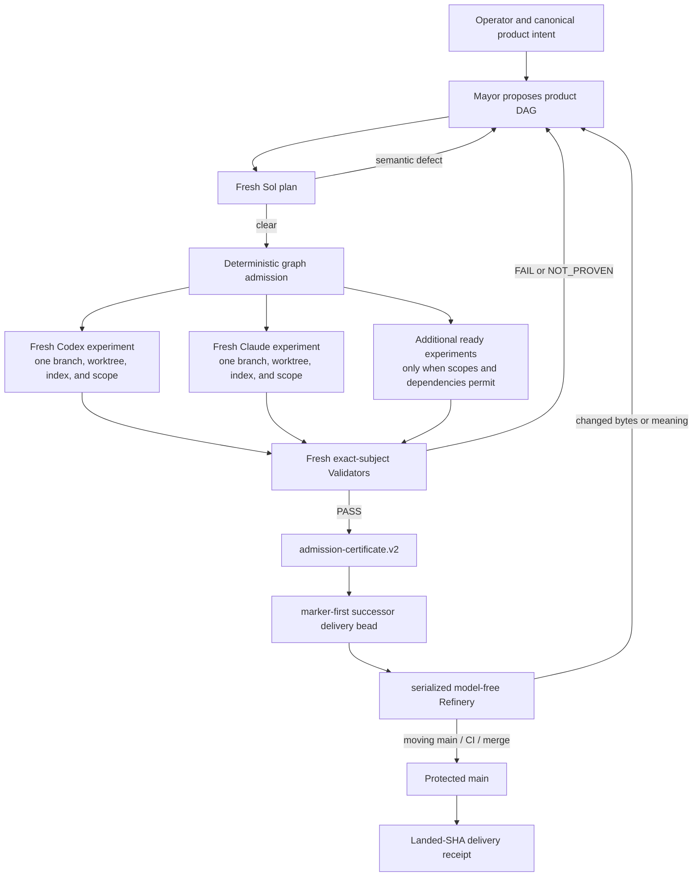

# Gas City Factory Architecture

This document explains how the AgentOps Gas City executor composes with the
Fenced Steward product factory. It is the canonical walkthrough for the
implemented baseline plus 3.3 target. ADR-0015 is superseded historical
context, not binding authority for 3.3; the dated research and duel remain
historical evidence in the
[role-topology audit](https://github.com/boshu2/agentops/blob/main/docs/audits/gas-city-role-topology-2026-07-17/README.md).

## Status and scope

The following is the implemented legacy baseline; it is not a qualification
claim for the 3.3 target:

| Surface | Current state |
|---|---|
| Isolated Gas City deployment | Implemented in `deploy/gc/` |
| Exact GC/Beads provenance and materialization | Implemented with `toolchain.lock.json`, source builds, runtime identity checks, and per-city binary digests |
| Explicit Codex/Claude Implementer and Validator pools | Implemented in `packs/agentops-executor/` |
| Exact packet, provider, workspace, manifest, evidence, and freshness binding | Implemented and covered by the GC executor gate |
| Legacy Mayor, reviewer, and Refiner routes | Present salvage surfaces; not the 3.3 authority |
| Program bead graph, reducer, admission certificate, worktree allocator, fencing | Implemented with atomic `bd create --graph` admission and bead metadata transitions |
| Legacy Refinery delivery | Historical evidence only; replaced by linked delivery beads in 3.3 |
| Parallel factory capacity | Bootstrap supports an explicit bounded city cap; default remains one and factory qualification uses eight |

The factory lives in the separate optional pack
`packs/agentops-factory/`. It imports `agentops-executor` rather than expanding
the executor's responsibility.

Those historical canaries demonstrate packet isolation, protected CI, and a
landed PR, but not the 3.3 delivery authority. They do not prove the terminal
semantic handoff, model-free delivery replay, or zero clean-path Refiner wakes.
The exact evidence remains in the [live bead canary](https://github.com/boshu2/agentops/blob/main/docs/audits/gas-city-factory-live-bead-canary.md).

AgentOps remains a semantic work-and-proof protocol, not a queue, Git workflow,
retry controller, or release system. The factory is an optional caller-selected
adapter around independent AgentOps invocations.

## Mental model: one semantic loop and one mechanical delivery machine

The 3.3 target replaces the legacy factory authority described below. Gas City
still supplies sessions, Orders, health, events, and durable beads; it does not
add another semantic loop.

Gas City's role-agnostic orchestrator runs formulas, beads, sessions, waits,
events, orders, health reconciliation, and scaling. The Mayor is a configured
semantic agent that interprets product intent and proposes work to that
mechanism plane.



Every worker node is still one complete AgentOps experiment:

```text
resolved intent bytes and digest
  -> Implement once
  -> runtime-derived candidate manifest, changed paths, scope receipt, checks
  -> fresh Validate once over the exact subject
  -> verdict.v2: PASS | FAIL | NOT_PROVEN
  -> report and stop
```

The semantic ready set has one shared Terra/Opus writer fabric. `product` and
`delivery_repair` are bead classes with bounded fairness, not queues or pools.
A repair is a successor experiment through this same loop. The outer graph may
not revise, continue, or reinterpret a completed inner experiment.

The fixed 3.3 semantic policy is one Fable Mayor, one Sol-high/Codex plan, one
admitted Terra-high/Codex or Opus-medium/Claude writer, and fresh
Sol-high/Codex validation. Admission chooses the writer profile; a provider
outage reduces capacity and never switches an admitted role. Every recorded
fallback object is exactly `allowed=false`, `used=false`, and `reason=null`.
Fable Refiner is a declared zero-or-one ambiguity adviser, but its dispatch is
closed pending GC33-4 process isolation; Luna-high is support-only and cannot
create, route, judge, or mutate delivery. Refinery is
a model-free, serialized delivery state machine. There is no second loop,
worker pool, or base/main mutex.

## Vocabulary

| Term | Meaning in this architecture |
|---|---|
| City | One Gas City deployment and root pack with private runtime state |
| Rig | A registered repository/workspace with its own scoped agents and bead namespace |
| Pack | Reusable configuration declaring agents, prompts, commands, formulas, and orders |
| Bead | The durable unit of work and lifecycle truth: status, dependencies, ownership, routing, and factory transition metadata |
| Provider | Runtime family such as Codex or Claude selected by an agent definition and packet |
| Session | A disposable live process for one configured agent identity or pool member |
| Packet | One explicit AgentOps Implement or Validate request with exact identity and boundaries |
| Experiment | One bounded Implement plus fresh Validate cycle ending in a durable result |
| Program graph | Mayor proposal that admission atomically materializes as program, semantic experiment, dependency, and linked delivery beads |
| Admission certificate | Deterministic reference proving that exact component verdicts satisfy intake policy |
| Delivery record | Immutable effect and epoch evidence connecting one admitted candidate, delivery state, and landed SHA; the linked delivery bead remains lifecycle truth |

The most important distinction is that a thin-executor transport bead closing
is not an AgentOps verdict. A factory experiment bead closes only after its
exact verdict is recorded, and a linked delivery bead closes only after protected
landing. A landed PR is still not a release verdict.

## Current thin executor

### Deployment

`deploy/gc/city.toml` defines:

- an exact colocated GC/official-Beads pair selected from
  `deploy/gc/toolchain.lock.json`, with version, commit, and binary digest
  identity persisted per city;
- built-in Codex and Claude providers with full option-schema replacement;
- a private `CODEX_HOME` and explicitly selected authentication link;
- interactive Claude with inherited `print_args` cleared;
- a deployment-pinned `GC_BIN` in workspace session environment;
- generic Codex and Claude targets suspended;
- scaffold Dog and control-dispatcher pools suspended; and
- a configurable `workspace.max_active_sessions` (default one; bounded factory
  qualification passes eight explicitly).

`deploy/gc/bootstrap.sh` creates or repairs only
a marked managed city, registers an explicit disposable rig, installs the local
or pinned pack import, binds private runtime paths, checks provider readiness,
reconciles and verifies the primary executor roles' packet-workspace base, and
optionally starts the city. Packet workspaces are directory names relative to
that base, so the base is the registered rig's parent rather than the rig
itself. It does not start a Mayor, run an experiment, or infer completion.

`deploy/gc/materialize-toolchain.sh` checks out and builds the exact source pair
before bootstrap. An ambient or same-version unlisted binary cannot become the
managed runtime, and AgentOps never patches an installed GC or Beads binary.

The deployment guide is `deploy/gc/README.md`.

### Physical roles

The executor has three physical pools and two semantic roles:

| Target | Scope | Provider | Model policy | Lifecycle | Capacity per rig |
|---|---|---|---|---|---|
| `agentops.implementer` | rig | Codex | Terra | fresh interactive | min 0, max 1 |
| `agentops.implementer-claude` | rig | Claude | Opus 4.8 | fresh interactive | min 0, max 1 |
| `agentops.validator` | rig | Codex | Sol | fresh interactive | min 0, max 1 |

Each `agent.toml` fixes its provider and role model. Every packet also declares
`provider = codex | claude`; the adapter verifies the actual Gas City session,
provider, and exact launch model. The 3.3 factory assigns Fable to Mayor, Sol
to plan and fresh validation, and exactly one admission-selected Terra-high or
Opus-medium writer profile to each implementation. A provider outage reduces
capacity; it cannot switch that admitted profile. Fable may answer at most one
nonbinding ambiguity request, but its adviser route stays closed until the
GC33-4 isolation proof; it has no delivery mutation authority. Claude roles are
interactive GC-owned tmux sessions; `claude -p` and `claude --print` are denied
by both repository policy and deployment validation.

### Packet path

The explicit command is:

```text
gc agentops run-packet --packet <absolute-json-path> --rig <rig-name>
  [--binding agentops] [--timeout 1800]
```

The packet carries the exact intent source and digest, physical rig root,
subject includes/excludes, write scope, canonical evidence directory, and result
path. Validate packets additionally bind baseline and subject manifests, the
runtime-derived scope receipt, and author context identity; their write scope is
empty.

The adapter validates before dispatch, creates a deterministic transport bead,
persists its exact identity, then slings that bead with `--no-formula
--no-convoy`. On restart it reconciles the same bead and its `gc.routed_to`
metadata instead of creating or slinging duplicate work. It verifies packet
and intent continuity, checks the runtime provider and context, validates
response artifacts, persists a replayable factual runtime receipt, and returns
one deterministic transport result. The semantic verdict stays in the
referenced `verdict.v2`; the transport response cannot smuggle a verdict field.

The current binding contract is
[`docs/contracts/gas-city-execution-adapter.md`](../contracts/gas-city-execution-adapter.md).

## Factory components

### Mayor

The Mayor is the Fable operator-facing semantic planner. It owns
conversation, product interpretation, proposed
acceptance-preserving decomposition, dependency and scope proposals, provider
routing, and explicit successor proposals.

It does not implement, validate, mutate graph truth, operate integration Git,
or merge. Durable beads—not an immortal transcript or JSON state file—allow its
runtime context to recycle.

### Plan-review Judge

Every initial graph and major replan receives a fresh semantic review before
admission. The Judge searches for missing acceptance, semantic coupling hidden
behind disjoint file paths, shared generated surfaces, unsafe dependencies, and
unowned scope. It emits an immutable sidecar and cannot repair the graph.

Sol performs the fresh plan review. Provider diversity may be requested by a
caller, but is not a binding opposite-provider rule.

### Graph compiler and reducer

The deterministic mechanism plane owns:

- graph schema validation and content identity;
- dependency readiness;
- write-scope intersection and generated-companion conflicts;
- experiment IDs and intent/scope digests;
- worktree and Git-index allocation;
- branch namespaces, leases, and fencing epochs;
- provider-target routing;
- immutable evidence ingestion referenced from beads;
- admission-certificate construction; and
- atomic graph admission and fenced bead transitions.

It may reject malformed or policy-incomplete input, but it cannot make semantic
judgments or synthesize PASS. `bd create --graph` creates the initial graph in
one transaction; later reducer commands update bead dependencies and metadata.
No pack-owned lifecycle state file competes with Gas City.

Reducer transitions are crash-replayable bead reductions. Preparation markers
such as `lease_preparing`, `rejection_preparing`, `successor_preparing`, and
`assembling` are written to the owning bead before external Git or dependency
effects. A replay verifies the stored identities, reconciles the worktree,
branch, dependency edge, successor, or delivery evidence, and completes the
same transition. It never allocates a new semantic work identity merely because
the controller restarted. Packet transport/result JSON and graph, verdict,
admission, and delivery JSON are digest-bound evidence referenced by beads; they
are not a second factory lifecycle machine.

Rerunning `program execute` reduces any open `lease_preparing`, `leased`,
`passed`, `rejection_preparing`, or `rejected` experiment before selecting new
Ready work, and routes a recovered `mayor_required` rescope before admitting
its successor. The chosen
`max_attempts` policy is persisted on the program and experiment before work;
the verdict reducer writes an at-ceiling rescope directly to `hold`, so a crash
cannot accidentally make another automatic attempt dispatchable. Operator
`rescope` remains the explicit override for that held bead.

If a rescope bead exists while its rejected experiment is still
`rejection_preparing`, program execution reduces the experiment first. The
Mayor cannot receive the rescope until the rejected experiment bead itself
records the terminal `rejected` phase and is closed. An open experiment with
`factory.status=rejected` is still a reducer-recovery state, not dispatchable
Mayor work.

### Worker pools

Codex and Claude workers are fresh, fungible, and horizontally scalable. Each
gets one experiment, one worktree, one Git index, one candidate branch, one
lease, and one declared write scope.

Shared paths serialize. Generated outputs either belong to one declared owner.
A worker cannot use stash/reset, unscoped
Git commands, peer branches, integration branches, or `main`.

### Validator pools

The same fresh Sol Validator judges the semantic candidate and any later
byte-changing repair subject:

1. Mayor-authored plan or replan review;
2. candidate judgment before delivery admission; and
3. successor repair judgment after changed bytes.

Every event binds a different immutable subject. A clean moving-base replay is
mechanical and does not itself require a validator; changed bytes always do.

### Refinery

Refinery is a serialized, model-free delivery state machine, backed by linked
delivery beads and immutable receipts. Its deterministic engine owns
unambiguous Git, regeneration, PR, CI-status, review-status, and receipt
operations. Fable may give zero or one bounded ambiguity answer only after
GC33-4 proves its process isolation; GC33-3 keeps that route closed. It cannot
repair code, judge semantics, or start an experiment.

The capability receipt rejects mutable metadata and claims as a fence. Claim
holder death is therefore not a relied-on store property: a mutable claim can
never authorize a delivery effect. Epochs are deterministic successor beads
with immutable predecessor/effect receipts; every remote mutation later
supplies an expected head. The selected 3.3 controller has exactly one
serialized creator/sweep authority, so concurrent same-identity successor
creation is also not a relied-on store property. No base lock is held.

The successful live-attempt-2 receipt remains an immutable observation of the
then-executed `deploy/gc/beads-capability.py` harness (SHA-256
`b5d6d4490492de047554c984008289282aab82cd3e89bf67d5ae8ea71bcbc48e`).
The later pure `beads_capability_static_reference.py` is a corrected contract
reference, not a claim that the real store executed that correction. A new
explicit live attempt is required to establish any new store behavior.

### Protected repository gate

`delivery.mode = auto` creates/adopts a PR, requires nonempty protected hosted
CI, and uses the selected lawful merge identity; `manual` waits in
`manual_review` for external merge or cancellation. Separate forge identities
prevent self-approval and neither mode bypasses protection.

## Product workflow

### 1. Capture canonical intent

The operator gives the Mayor a product source such as an issue, bead, product
document, or explicit conversation intent. Acceptance, non-goals, required
evidence, and product-level changes remain in that canonical source.

### 2. Propose and review the graph

The Mayor proposes nodes with acceptance reference, write scope, generated
companions, dependencies, risk, provider preference, and first deterministic
check. A fresh plan-review Judge produces findings. The Mayor revises only by
proposing a new plan digest.

### 3. Admit ready experiments

The reducer checks plan-review policy and graph mechanics, then allocates
isolated candidates for dependency-ready, conflict-free nodes. Parallelism is a
consequence of proven independence, not a target count.

### 4. Implement and validate

Each Worker runs one AgentOps packet. AgentOps derives the content manifest,
changed paths, scope receipt, and factual checks. A distinct fresh Validator
judges the exact candidate.

### 5. Apply the rejection ratchet

`FAIL` or `NOT_PROVEN` freezes the exact experiment and returns the immutable
finding on a rescope bead. The adapter creates a separate HQ transport bead and
slings that rescope bead to a fresh Mayor context; the Mayor emits one proposal,
but only the reducer may create the successor experiment bead. A successor
preserves exact acceptance and non-goals while changing at least one execution
field, and receives a new experiment ID, branch, worktree/index, lease, and
fresh Worker. The automatic path stops after three attempts by default and
leaves the rescope bead in `hold`; an operator may resume that exact bead with
the `rescope` command. Product acceptance changes require operator approval.

### 6. Admit and hand off one delivery bead

PASS produces `admission-certificate.v2`, then a marker-first handoff:
`handoff-prepared.v1`, terminal semantic references, deterministic non-routable
delivery successor create-or-discover, payload publication, and
`handoff-committed.v1`. The committed marker must match the prepared handoff,
semantic bead and terminal reference, admission certificate, successor bead,
external reference, epoch, mode, state, deadline, and both prepared/published
payload digests; a sweep refuses any mismatch. No effect is legal before
terminal PASS plus that exact committed handoff.

### 7. Shepherd the PR

Refinery opens or adopts one PR for that linked delivery bead, observes CI and
review state, and requests protected merge only when repository policy is met.

If `main` moves, Refinery creates a new mechanical epoch from the current base,
replays the exact admitted delta, and reruns deterministic gates. Changed bytes
or new product meaning creates a successor repair bead for the same semantic
loop; clean replay does not reopen the terminal semantic bead.

### 8. Record delivery

After protected merge, Refinery verifies the landed SHA and writes a receipt
connecting program intent, candidate SHAs, component verdicts, integration
digest, validation certificate, PR/CI/review state, and landed commit. Cleanup is
receipt- and fence-gated. `effect-receipt.v1` records the resulting SHA for
`applied` and `already_applied`; `refused` and `unknown` record no resulting
SHA. Delivery does not imply release.

## Branch and PR topology

```text
main                                           protected; no raw LLM push
gc/candidate/<program>/<node>/<attempt>        worker-owned exact candidate
gc/delivery/<handoff>/<epoch>                  linked delivery successor
```

Each admitted candidate has a linked delivery identity. Atomic groups are
explicit; unrelated candidates are not silently composed by a standing process.

## Configuration shape

The factory pack owns reusable semantic-role contracts while importing the
executor's exact packet roles. The later crash-only reducer owns delivery; no
model-facing delivery-policy role is composed:

```text
packs/agentops-factory/
  pack.toml
  agents/
    mayor/                             Fable semantic planning
    plan-reviewer/                     Sol-high plan binding
    refiner/                           gated Fable ambiguity advice
  assets/schemas/
    program-graph.v2
    admission-certificate.v2
    handoff-prepared.v1
    handoff-committed.v1
    delivery.v1
    ambiguity-request.v1
    effect-receipt.v1
    epoch-receipt.v1
    factory-role-request.v2
    factory-role-response.v2
    rescope-context.v1
```

For 3.3, `factory-role-request.v2` and `factory-role-response.v2` are the
admissible runtime contracts. They bind requested and actual role, model,
reasoning, provider, and fallback facts on semantic beads, and reject a
role-policy violation or silent downgrade (including Sol-high validation being
reported as Terra-low). The 3.3 fixed roles admit no fallback: every recorded
fallback object is exactly `allowed=false`, `used=false`, and `reason=null`.
`program-graph.v2` also binds the same fixed policy and an admission
certificate requires an author attestation for exactly one admitted
Terra-high/Codex or Opus-medium/Claude writer and a Validator attestation for
exact Sol-high/Codex. The `.v1` request,
response, and `delivery-record.v1` schemas are retained only as 3.2 historical
consumer contracts and are non-admissible for any 3.3 handoff or delivery.
The delivery payload is not routed to a model. There is no opposite-provider
rule; the one writer fabric is Terra/Opus and fresh validation is Sol.

Initial proof-week capacity is at most four writer lanes inside an explicitly
configured city cap, with fresh Validator sessions and on-demand Mayor support
capacity. The allocator, scope compiler, isolated indexes, leases, and fencing
must pass their gates before raising that cap.

Dynamic worktree rigs are route-minimized from the bead's admitted
`factory.binding`. A candidate rig exposes its admitted Terra/Opus writer and a
fresh Sol Validator; linked delivery exposes no model route or integration rig. Rig
registration and the durable suspension patches share a city-config lock, and
dispatch stops unless the resolved active inventory is exactly the expected
set.

AgentOps skills remain semantic sources of truth. Thin role prompts inject the
appropriate Mayor, plan-review, Implement, or Validate skill.
Worktree allocation, scope intersections, leases, Git commands, regeneration,
PR updates, status checks, receipts, and cleanup belong in schema-checked pack
commands, formulas, and exec orders rather than prompt prose.

## Operations and failure ownership

| Event | Owner and response |
|---|---|
| Session or controller crash | Re-enter through the same request digest or deterministic packet bead; reconcile bead routing and preparation metadata without manufacturing a verdict or duplicate work |
| Unauthorized or stale-token Git write | Deterministic hook/credential/fencing rejection |
| Candidate PASS but branch moves | Keep terminal PASS; delivery creates a mechanical current-base epoch |
| Candidate `FAIL` or `NOT_PROVEN` | Close the exact experiment, create a blocking rescope bead, and route that bead through a fresh Mayor context for a new successor proposal; stop in HOLD at the attempt ceiling |
| Clean `main` movement | Reproduce the exact delta in a new epoch and run deterministic gates; no Sol unless bytes or meaning change |
| Canonical regeneration changes bytes | Create a `delivery_repair` bead in the shared semantic ready set and obtain fresh Sol validation |
| Semantic conflict, test defect, or substantive review request | Terminalize delivery and return a successor request to Mayor |
| Flaky CI covered by explicit bounded repository policy | Deterministic rerun with receipt |
| Branch-protection or reviewer block | Wait or escalate; never bypass |
| Provider outage | Surface degraded capacity; never silently lower semantic policy |

Deacon, Boot, Dog, and Gastown recovery-Witness responsibilities land here as
controller behavior, orders, waits, events, thresholds, and alerts. They do not
need resident LLM offices.

## Bun port lessons

Bun's eleven-day milestone was a deliberately mechanical Zig-to-Rust port with
a strong pre-existing language-independent test suite, not a clean-sheet
refactor or finished stable release. Its transferable mechanisms were a shared
porting contract, serialized cross-cutting decisions, a three-file pilot,
phase-specific deterministic queues, coarse worktree shards, explicit resource
fences, and adversarial contexts separated from implementers.

The factory adopts those mechanisms with stricter lifecycle authority:

- advisory reviewers may help a Worker converge before candidate freeze;
- the frozen candidate still requires a distinct binding Validator;
- repeated systematic defects change the Mayor-owned contract or workflow and
  produce new experiment identities;
- expensive global compiler/test analysis runs once and produces bounded work
  packets; and
- canary, security review, fuzzing, release, and regression repair remain
  downstream assurance stages.

It rejects Bun's mega-PR, shared-writer collisions, authority collapse, and any
claim that green compilation/tests prove equivalence or memory safety. The
primary-source ledger and unresolved contradictions are in
[the Bun research note](https://github.com/boshu2/agentops/blob/main/docs/audits/gas-city-role-topology-2026-07-17/bun-rust-port-research.md).

## Qualification status and remaining proof

The thin executor, schemas, worktree/index allocation, scope checks, leases,
fencing, packet transport, and protected merge path are implemented legacy
surfaces. The 3.3 delivery state machine is a target qualified separately. On
2026-07-17 a live program moved one Claude-authored experiment through required
CI and protected PR [#916](https://github.com/boshu2/agentops/pull/916), landing as
`b80a752aad3843af66160b08a823aaed57e07169`.

The 3.3 target is NOT qualified until its bounded canary proves the selected
merge actor, moving-main delivery, marker-first crash replay, zero routine
Fable wakes, terminal semantic beads before delivery, and the declared
Terra/Opus writer fabric. Legacy multi-wave/integration evidence is not a
substitute.

Measure Mayor semantic yield, operator reload time, candidate-ready-to-PR time,
Validator queue share, second-provider unique catches, provider-outage blocking,
Refinery-triage unique decisions, stale-main-to-refreshed-PR time, and cost per
delivered PR.

The topology is intentionally falsifiable. Remove the Mayor if it adds no unique
semantic value over the headless graph. Remove Refinery LLM triage if its wakes
are mechanical. Do not promote Apollo or a resident Witness without a controlled
trial demonstrating unique, acted-on value.

## References

- [ADR-0015: Gas City Fenced Steward Factory](../adr/ADR-0015-gas-city-fenced-steward.md)
- [AgentOps operating loop](operating-loop.md)
- [Gas City execution adapter contract](../contracts/gas-city-execution-adapter.md)
- Gas City deployment: `deploy/gc/README.md`
- [Role-topology audit](https://github.com/boshu2/agentops/blob/main/docs/audits/gas-city-role-topology-2026-07-17/README.md)
- [Bun Rust-port research](https://github.com/boshu2/agentops/blob/main/docs/audits/gas-city-role-topology-2026-07-17/bun-rust-port-research.md)
