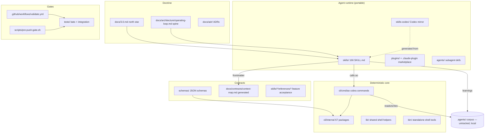

# Codebase Briefing Report — agentops

| | |
|---|---|
| **Repo** | `boshu2/agentops` (local checkout `/Users/bo/dev/agentops`) |
| **Commit** | `2bbc44e8e` (`2bbc44e8ece33e7f20451d73564d9c92e4f0d14d`), 2026-06-10 |
| **Generated** | 2026-06-11 |
| **Author** | Claude swarm worker, via the `codebase-briefing-report` skill |
| **Output path** | `docs/audits/codebase-skills-2026-06-11/codebase-briefing-report.md` (overrides the skill's default `docs/reports/CODEBASE-REPORT.md` per the calling task) |
| **Checkout caveat** | This working copy is a **shallow clone (depth boundary 2026-06-07) on a detached HEAD**. All history-based numbers below cover only the visible 4-day window and are marked accordingly. |

---

## 1. What It Is

AgentOps is **the in-session operating loop + context compiler for coding agents** (`README.md`). It sits on top of an existing agent harness (Claude Code, Codex, Cursor, OpenCode) and adds the bookkeeping an engineering team would expect: a record of attempts and decisions, gates between phases, and a `.agents/` corpus of learnings that compounds across sessions. The product is two halves that ship together: a **portable skill corpus** (166 `SKILL.md` definitions under `skills/`, mirrored for Codex under `skills-codex/`) and a **Go CLI (`ao`)** under `cli/` that provides the deterministic command surface those skills call. AgentOps 3.0 is deliberately **hookless and daemon-free** (`docs/3.0.md`, ADR-0002, ADR-0009): nothing auto-injects at session start; orientation comes from `ao session bootstrap`, and CI plus a local pre-push gate are the authoritative quality wall. The doctrine spine is the 7-move operating loop (`docs/architecture/operating-loop.md`): BDD-shaped intent → vertical slices → TDD per slice → conflict-free parallel waves → bead completion → evidence/learning capture.

**Run model:** users install skills (symlinked from this live checkout into `~/.claude/skills`, `~/.codex/skills`, `~/.gemini/skills`) and build/install the `ao` binary (`cd cli && make build`; goreleaser + homebrew-tap for distribution). Development is **push-to-main** with no PR review since ag-qidx (2026-06-07): `scripts/pre-push-gate.sh --fast` is the blocking pre-merge wall, `.github/workflows/validate.yml` is the post-push backstop (`CLAUDE.md` → Workflow).

## 2. Architecture Overview

The system is layered as **doctrine → contracts → skills (runtime) → CLI (deterministic core) → gates**, with the `.agents/` corpus as the compounding data store. Skills are the portable agent runtime; the build rule is "repeatable + codeable → `ao` subcommand; skills just call it." Architecture vocabulary is DDD + hexagonal: 5 bounded contexts (BC1 Corpus → BC5 Runtime), with each skill declaring its `hexagonal_role` / `consumes` / `produces` in frontmatter, from which `docs/contracts/context-map.md` is **generated** (hand-editing is CI-gated by `validate-context-map-drift`).

Dependency direction holds cleanly in the Go core: `cli/cmd/ao` (620 files) imports `cli/internal/*` (67 packages); `cli/go.mod` carries only **8 direct third-party deps** (cobra, pflag, yaml.v3, BurntSushi/toml, go-cmp, goleak, golang.org/x/text, rapid) — a deliberately thin supply chain. Skills never contain logic that the CLI could own; the inverse flow (CLI shelling to skills) does not exist. The one notable layering wrinkle: the **legacy RPI lane** in `cli/cmd/ao` (`rpi_loop_supervisor.go`, `rpi_phased_*.go`, etc.) is live, tested, load-bearing code whose product role is retired — documented as "no new surface area, no flat delete" (`CLAUDE.md` → Session Constraints).

## 3. Module Map

One row per significant top-level directory (tracked-file counts from `git ls-files`).

| Module | Responsibility | Key files | Depends on |
|---|---|---|---|
| `cli/` | The `ao` Go binary — command surface + all deterministic logic (1,419 tracked files) | `cli/cmd/ao/` (620 .go), `cli/internal/` (67 pkgs: corpus, gates, goals, rpi, refinery, provenance, skillshealth…), `cli/go.mod` | `lib/schemas` contracts; 8 third-party deps |
| `skills/` | Source of truth for the 166-skill corpus (1,202 tracked files; 140,915 md lines) | `skills/*/SKILL.md`, `skills/*/references/`, `skills/domain/references/` (DDD vocabulary) | calls `ao`; frontmatter feeds `docs/contracts/` |
| `skills-codex/` + `skills-codex-overrides/` | Codex-runtime mirror of the corpus (642 md files) + per-skill overrides | `skills-codex/**` | generated/derived from `skills/` |
| `docs/` | Doctrine, ADRs, contracts, MkDocs site (434 tracked files; 388 md) | `docs/3.0.md`, `docs/architecture/operating-loop.md`, `docs/contracts/context-map.md`, `docs/provenance/ledger.jsonl`, `mkdocs.yml` | generated from skills + CLI (`cli/docs/COMMANDS.md`) |
| `scripts/` | Release/validation/maintenance shell (272 .sh, 45,239 LOC) | `scripts/pre-push-gate.sh` (2,210 LOC), `scripts/install.sh`, collect/validate scripts | `lib/`, `tests/scripts/` bats coverage |
| `tests/` | Cross-cutting integration + script tests (487 files; 124 `.bats`) | `tests/scripts/*.bats`, `tests/install/`, `tests/docs/` | `scripts/`, `lib/bats-common.bash` |
| `lib/` | Shared shell helpers sourced by scripts/skills (9 files) | `ao-paths.sh`, `bats-common.bash`, `bash4-guard.sh`, `skills-core.js` | — |
| `bin/` | Standalone shell tools (1 file tracked at this SHA) | `bin/` entries | `lib/` |
| `schemas/` | JSON schemas for config/manifest contracts | `schemas/**` | consumed by `cli/internal` + CI |
| `plugins/` + `.claude-plugin/` | Claude plugin marketplace packaging | `plugins/marketplace.json` | `skills/`, `agents/` |
| `agents/` | Subagent definitions shipped with the plugin | `code-reviewer.md`, `researcher.md` | — |
| `evals/` | Eval workbench + scenarios (own Go module) | `evals/workbench/go-cli/go.mod`, `evals/scenarios/` | `cli/` behavior under test |
| `deploy/` | Out-of-band service units | `agentops-refinery.service` | `ao refinery` |
| `manifests/`, `spec/`, `examples/`, `homebrew-tap/`, `images/` | Packaging manifests, specs, usage examples, brew formula, doc assets | — | — |
| `.github/` | CI: 11 workflows; `validate.yml` (2,020 lines) is the omnibus T0/T1/T2 gate | `validate.yml`, `nightly.yml`, `release.yml`, `install-e2e.yml` | `scripts/`, `tests/` |
| `.agents/` | The knowledge corpus/flywheel — **local data, deliberately untracked** (15,669 md files, 130 MB on disk; only 12 tracked) | `.agents/AGENTS.md`, briefings/plans/research | written by skills + `ao` |
| `dist/` | goreleaser build output — **untracked artifacts, 146 MB** | — | — |
| `cmd/`, `internal/` (root) | **Empty untracked directory skeletons** (zero files, zero tracked) — leftover scaffolding, not a Go module | — | — |
| `wt-ag-if7p/`, `wt-ag-pj51/`, `wt-ag-qidx/` | Embedded git worktrees from in-flight bead work (untracked) | — | — |

## 4. Metrics

All numbers computed at `2bbc44e8e` on 2026-06-11; commands noted. "not measured" = no tool run.

**Size**
- Tracked files: **5,085** (`git ls-files | wc -l`).
- Go (cli/): **1,282** `.go` files — **146,770** non-test LOC + **235,187** test LOC across **622** `_test.go` files (`find`/`wc`). Test:source line ratio ≈ **1.6 : 1**.
- Shell (scripts/): **272** `.sh` files, **45,239** lines. `lib/` + `bin/`: 12 files, 1,514 lines.
- Skills: **166** `SKILL.md` (excluding `_fixtures`); **140,915** total markdown lines under `skills/`. Codex mirror: 642 md files.
- Docs: **388** md files under `docs/`; repo-wide tracked+untracked md count is dominated by the untracked `.agents/` corpus (15,669 md files).
- Per-language totals via cloc/tokei: **not measured** (no LOC tool installed on this host).

**Activity** *(shallow clone — window 2026-06-07 → 2026-06-10 only)*
- Visible commits: **112 in ~4 days** (`git rev-list --count HEAD`) — consistent with the "runs hot, hundreds of commits/week" warning in `~/dev/CLAUDE.md`. Total project history: **not measured** (shallow boundary).
- Visible committers: Boden Fuller (64), Bo (44), dependabot[bot] (2) — one human, two identities.
- Hottest files in window: `CHANGELOG.md` + `docs/CHANGELOG.md` (4 each), `skills/using-atm/SKILL.md`, `skills/agent-mail/SKILL.md`, `docs/3.1.md` (2 each).
- Last change: 2026-06-10.

**Tests** *(run on this host, 2026-06-11)*
- `cd cli && go build ./... && go vet ./... && go test ./...` → **build clean, vet clean, 12,155 tests passed across 94 packages**, exit 0.
- Bats suites: 124 `.bats` files under `tests/` — **not run** (full suite exercised by CI/pre-push gate, not re-run here).
- Coverage %: **not measured** (no coverage run; `.codecov.yml` present).

**Tooling signals**
- CI: 11 workflows; `validate.yml` = 2,020 lines (tiered T0 ≤30s / T1 ≤5min / T2 ≤15min, all required). Local wall: Go orchestrator `ao gate check`, with `scripts/pre-push-gate.sh` = 2,210 lines retained as the `AGENTOPS_GATE_BASH=1` fallback until sunset.
- Go: `go 1.26` toolchain, **8 direct deps**, golangci-lint budget (warn 15 / fail 25 cyclomatic, `.claude/rules/go.md`).
- Dependency automation: `renovate.json` + dependabot commits present.
- Lint/format configs present: `.markdownlint.json`, `.gitleaks.toml`, `.goreleaser.yml`, `pyproject`-equivalent for docs (`requirements-docs.txt`).

## 5. Health & Risk Summary

| # | Risk | Rating | Next action |
|---|---|---|---|
| 1 | **Bus factor = 1.** All visible commits are one person (two git identities); no second maintainer, and push-to-main removed PR review entirely. | **High** | Keep the pre-push gate blocking and `validate.yml` required; document a recovery runbook for the gate + release pipeline so a non-author can operate them; consider periodic external review passes (e.g. `code-review` skill) as a standing substitute for human review. |
| 2 | **Dual-gate drift (Go wall vs bash fallback).** `ao gate check` is the default wall while the 2,210-line `pre-push-gate.sh` remains as a fallback; two implementations of the check inventory can still diverge. | **High** | Finish the bash-gate sunset to a single Go-owned gate (or formally freeze the bash gate and generate it); keep the inventory parity test blocking until deletion. |
| 3 | **2,020-line `validate.yml` monolith.** CI logic embedded in one YAML file is hard to test, review, or partially run; it is itself a single point of failure for the post-push backstop. | **Med** | Continue extracting steps into `scripts/*.sh` covered by `tests/scripts/*.bats` (`workflow-scripts-syntax.yml` suggests this is underway); track remaining inline-YAML logic as a burn-down. |
| 4 | **Live deployment from a shallow, detached-HEAD checkout.** This checkout is the fleet-wide skill source of truth (symlinked into `~/.claude/skills` etc.) but sits on `HEAD (no branch)` with a dirty tree, 3 embedded worktrees, and a 2026-06-07 shallow boundary that blunts history-based tooling. | **Med** | Re-attach to `main` (`git switch main`) after in-flight bead work lands; `git fetch --unshallow` if history-based metrics/blame matter; prune merged `wt-*` worktrees via `bd worktree`/`git worktree prune`. |
| 5 | **Untracked bulk + dead skeletons in the working tree.** 146 MB `dist/`, 130 MB local `.agents/`, and empty root `cmd/`/`internal/` directory skeletons (zero files) confuse newcomers and tooling about what is product vs residue. | **Med** | Delete the empty `cmd/`/`internal/` skeletons; confirm `dist/` is gitignored and periodically cleaned; keep `.agents/` documented as local-only (it is, in `.agents/AGENTS.md` — verify the gitignore covers it). |
| 6 | **Doc/doctrine drift is a known live hazard.** `CLAUDE.md` itself flags stale claims (Gas City references, the retired-as-live RPI lane), and the repo needs an explicit precedence rule (executable > contracts > narrative) to arbitrate disagreements. | **Med** | Keep the precedence rule; when a drift is found, fix the narrative doc in the same arc (the doc-release gates and `tests/docs/` checks are the right enforcement point — extend them when new drift classes appear). |
| 7 | **Test mass as maintenance load.** 235k lines of Go test (1.6× source) plus a test-count-regression ratchet means every refactor pays a large test-update tax, especially across the legacy RPI lane that must be maintained but not extended. | **Med** | Execute the caller-migration refactor (soc-1gbpz) to retire the legacy RPI lane and its suites rather than carrying them indefinitely; prefer L2 entry-point tests over per-file L1 when consolidating (`.claude/rules/go.md`). |
| 8 | **Dependency surface.** Only 8 direct Go deps, renovate + dependabot active, gitleaks + gosec/semgrep conventions in place — staleness/security exposure is genuinely small. | **Low** | Keep renovate merges flowing through the gate; no further action. |
| 9 | **Coverage not quantified.** Tests demonstrably run green (12,155) but no coverage number exists in-repo to detect untested command surface among 620 `cli/cmd/ao` files. | **Low** | Wire `go test -coverprofile` into the nightly (not the hot path) and publish the number via the existing `.codecov.yml`. |

## 6. If You Read Nothing Else

1. **Two products, one repo:** the `skills/` corpus (166 skills, portable across Claude/Codex/Gemini) and the Go `ao` CLI (`cli/`, 67 internal packages) — logic lives in the CLI, skills are instructions that call it. Doctrine lives in `docs/3.0.md` and `docs/architecture/operating-loop.md`; when docs disagree, executable behavior wins.
2. **It's hookless and daemon-free by decision** (ADR-0002, ADR-0009): no auto-injection, no always-on infra. CI (`validate.yml`) plus the local `pre-push-gate.sh` are the entire quality wall — and since 2026-06-07 the model is **push-to-main with no PR review**, so the gate is load-bearing; never bypass it.
3. **Never edit `~/.claude/skills` or installed copies** — `skills/` in this repo is the source of truth, and this very checkout is symlink-served live to all runtimes. Every change to main needs a bead; all edits go through `bd worktree`, not the shared checkout.
4. **The build is healthy right now:** at `2bbc44e8e` the full Go suite passes (12,155 tests / 94 packages, vet clean) with only 8 direct dependencies. The biggest structural risks are organizational, not code: bus factor of one, and two parallel gate implementations (bash vs Go) mid-migration.
5. **Mind the residue:** root `cmd/`/`internal/` are empty untracked skeletons, `dist/` is 146 MB of build output, `.agents/` is a 130 MB local-only knowledge store, and three `wt-*` worktrees are embedded in the tree. None of it is product; don't onboard your mental model on it.
