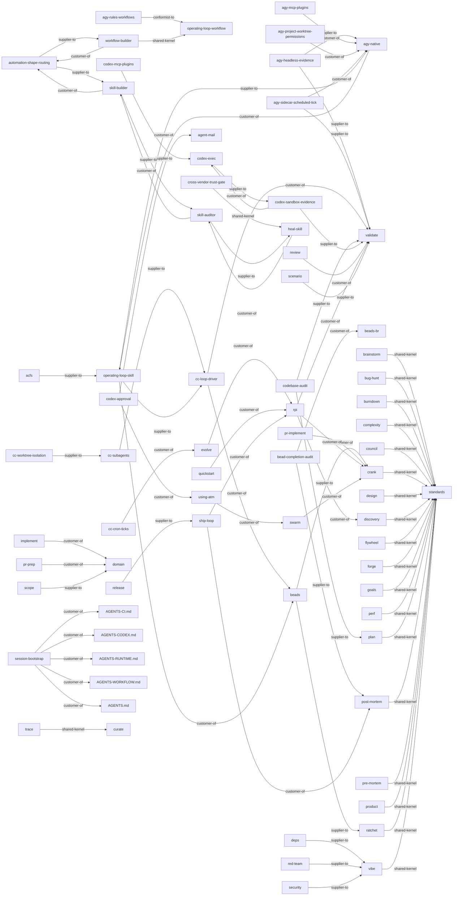

<!-- generated from skills/*/SKILL.md frontmatter -->

# AgentOps Context Map

Generated from SKILL.md frontmatter. See [ADR-0001](https://github.com/boshu2/agentops/blob/main/docs/adr/ADR-0001-ddd-hexagonal-adoption.md)
and [CDLC](https://github.com/boshu2/agentops/blob/main/docs/cdlc.md) for the architectural rationale.

## Skills by hexagonal role

### domain

- `brainstorm` — Separate goals from implementation.
- `bug-hunt` — Investigate bugs and root causes.
- `burndown` — Drive a finite epic set to all-merged, then stop. Use when finishing a specific list of tasks, burning down a backlog epic, or executing a bounded set of beads until done.
- `complexity` — Find focused refactor hotspots.
- `council` — Run multi-judge consensus. Use when: an irreversible or high-stakes decision needs independent judges before committing — architecture forks, one-way doors, scoring options.
- `crank` — Execute epics through waves.
- `cross-vendor-trust-gate` — Run the skill-factory final trust gate: operate trust-gate.sh, read skill.trust.json, and enforce --require-cross.
- `design` — Validate product fit before discovery. Use when: framing a problem, checking product/market fit, or pressure-testing user value before writing a discovery packet or any code.
- `discovery` — Create dense execution packets.
- `domain` — Canonical vocabulary for human-AI software work. Use when naming concepts, resolving terminology disputes, or establishing shared domain language across agents and docs.
- `flywheel` — Check knowledge flywheel health.
- `forge` — Mine transcripts into learnings.
- `goals` — Maintain AgentOps goals.
- `operating-loop-skill` — Use when driving one bead end-to-end through claim, work, independent validation, closeout, and persistence. Triggers:
- `perf` — Profile and optimize hotspots.
- `plan` — Decompose goals into issue plans.
- `post-mortem` — Review completed work and learn. Use when: a task, PR arc, or session is finished and you want to extract learnings, or after ≥5 PRs (the scope checkpoint).
- `pre-mortem` — Stress-test plans before work. Use when: a plan is drafted but not yet executed and you want to surface failure modes, risks, and what would prove it wrong before committing.
- `product` — Create or refine PRODUCT.md.
- `ratchet` — Record Brownian Ratchet gates.
- `shared` — Shared AgentOps skill contracts.
- `standards` — Provide repo coding standards.
- `vibe` — Validate code readiness. Use when: doing a quick readiness or sanity check that code is ready to commit or ship, short of a full review.

### driving-adapter

- `acfs` — Use when operating ACFS flywheel health checks, init, and agent loop tooling from ~/acfs/bin/acfs. Triggers:
- `agy-native` — Drive AgentOps in AGY: loop, plugins, memory, evidence, scoped worktrees. Triggers: agy, antigravity, agy plugin, AGY evidence.
- `agy-rules-workflows` — Install AGY rules, workflow, goal, and schedule controls for AgentOps loop law. Triggers: AGY rules, agy-loop, AGY schedule.
- `bootstrap` — Initialize AgentOps project files.
- `cc-cron-ticks` — Use when scheduling autonomous in-session flywheel ticks with Claude Code cron routines. Triggers:
- `cc-loop-driver` — Use when running a Claude-native control-plane tick loop with worker and separate-validator subagents. Triggers:
- `codex-approval` — Use when Codex needs Fable approval through an ATM/NTM validator pane. Triggers: - codex approval - ask fable - fable plan review
- `codex-exec` — Use when running Codex workers or validators non-interactively through codex exec with evidence. Triggers:
- `codex-goals` — Use when using Codex Goals to define an objective once and let Codex iterate until done. Triggers:
- `implement` — Implement one tracked issue.
- `inject` — Load relevant .agents context.
- `operating-loop-workflow` — Install or run the seven-move operating-loop Workflow for AgentOps plugin users and multi-agent orchestration.
- `pr-implement` — Implement a scoped OSS PR.
- `pr-prep` — Prepare PR commits and body.
- `push` — Validate, commit, and push.
- `quickstart` — Show AgentOps next action.
- `recover` — Recover session context.
- `research` — Explore and write findings.
- `review` — Review diffs for risk, find mocks, scan for bugs, audit codebases. Use when: reviewing a diff/PR for bugs and risk, hunting mocks/stubs/placeholders, or auditing for quality.
- `session-bootstrap` — Universal AgentOps init prompt for starting or onboarding a fresh agent session.
- `ship-loop` — Run the fast-lane internal ship cycle for one closable bead or small slice: claim, test, implement, push, merge, close.
- `status` — Show AgentOps work status.
- `validate` — Produce PASS/WARN/FAIL verdicts for artifacts, plans, code, PRs, or gates. Use when: you need a structured verdict on an artifact, plan, code, PR, or CI gate before proceeding.

### driven-adapter

- `agy-mcp-plugins` — Wire MCP servers and AgentOps plugin bundles into the AGY image with least-privilege access, rollback evidence, and validation hooks.
- `beads` — Track issues with bd/br, triage with bv, and convert plans to beads.
- `codex-mcp-plugins` — Use when wiring MCP servers or plugins into Codex CLI and the AgentOps Codex skill bundle. Triggers:
- `deps` — Audit dependency risks and updates.
- `pr-research` — Research an upstream repo.
- `scope` — Hard-block edits outside declared frozen directories and protect paths during risky changes.
- `security` — Run repository security scans for vulnerabilities, dependency risk, secrets, and release gates.

### supporting

- `agent-mail` — Use when coordinating agents with Agent Mail locks, inboxes, threads, and conflict-prevention handoffs.
- `agent-native` — Make an out-of-session agent AgentOps-native with skills, the ao CLI, and CI instead of hooks.
- `agy-headless-evidence` — Run AGY headlessly via scheduled ticks or `agy -p`, capture agentapi JSONL evidence, and validate automated AGY loops or event streams.
- `agy-project-worktree-permissions` — Prove AGY project/worktree isolation with scoped --add-dir permissions, role tiers, dcg guardrails, and persisted evidence.
- `agy-sidecar-scheduled-tick` — Run a recurring AGY sidecar loop tick and capture agentapi evidence. Triggers: agy, sidecar, schedule, agentapi.
- `autodev` — Manage the PROGRAM.md/AUTODEV.md contract consumed by evolve/factory ticks. Use for loop rules, boundaries, or PROGRAM.md repair.
- `automation-shape-routing` — Front door for agent automation — decide the SHAPE (Workflow vs ATM vs skill), then hand off. Triggers: "build automation", "convert skills to workflows", "which shape".
- `bead-completion-audit` — Use when auditing closed beads for real shipped evidence, acceptance proof, and truthful closeout. Triggers:
- `beads-br` — Local-first issue tracker (beads_rust) for AI agents. Use when tracking tasks, managing dependencies, finding ready work, or syncing issues to git via JSONL.
- `beads-bv` — Graph-aware task triage with bv and br. Use when prioritizing work, finding bottlenecks, tracking dependencies, or managing local issues across projects.
- `beads-workflow` — Use when converting markdown plans into br beads with dependencies for implementation or swarm execution.
- `caam` — Use when switching AI coding CLI accounts quickly to recover from subscription rate limits or OAuth friction.
- `casr` — Resume sessions across Claude Code, Codex, Gemini, and other providers when switching agents or migrating active chat history.
- `cass` — Mine past agent sessions for working prompts, decisions, and patterns. Use when "what did I ask?", "find that prompt", session archaeology, or agent history.
- `cass-memory` — Use when starting non-trivial work, mining lessons, or preventing repeated mistakes with cm procedural memory.
- `cc-hooks` — Configure Claude Code hooks for PreToolUse, PostToolUse, Stop, Notification. Use when blocking commands, auto-formatting, custom permissions, or writing hooks.
- `cc-subagents` — Use when dispatching scoped Claude Code subagents with worktrees, roles, tools, memory, and evidence gates. Triggers:
- `cc-worktree-isolation` — Use when isolating parallel Claude Code workers in separate git worktrees to prevent file collisions. Triggers:
- `codebase-audit` — Domain-parameterized codebase audits (security, UX, perf, API, copy, CLI) + report modes (archaeology, architecture/briefing, patterns, risk). Use when auditing or onboarding.
- `codex-sandbox-evidence` — Use when running codex exec in a least-privilege sandbox with machine-checkable proof. Triggers:
- `compile` — Compile .agents knowledge wiki.
- `curate` — Mine transcripts, .agents, bd, and git for skill diffs, bd updates, or rare wiki entries.
- `dcg` — Handle blocked destructive commands. Use when dcg blocks rm -rf, git reset --hard, DROP DATABASE, kubectl delete, or when configuring agent safety guardrails.
- `doc` — Generate and validate repo docs, READMEs, and OSS doc packs.
- `eval-outcomes` — Grade agent or model output against Outcomes for holdout-safe evals and runtime comparisons.
- `evolve` — Run autonomous improvement loops.
- `handoff` — Write compact session handoffs.
- `heal-skill` — Repair skill hygiene.
- `multi-model-triangulation` — Cross-validate decisions using multiple AI models (Codex, Gemini, Grok). Use when "get a second opinion", evaluating approaches, or high-stakes decisions.
- `ntm` — Orchestrates NTM tmux agent swarms and robot APIs. Use when spawning/sending panes, reading robot state, triaging work, locks/mail, safety, pipelines, serve, or NTM errors.
- `ntm-browser-test-coordination` — Use when coordinating browser or UI tests through NTM panes with screenshots and handoffs. Triggers:
- `ntm-review-worker-orchestration` — Use when operating an NTM review or analysis worker with bounded inputs and evidence-backed output. Triggers:
- `planning-workflow` — Comprehensive markdown planning methodology for software projects. Use when starting a new project, creating implementation plans, or refining architecture before coding.
- `rch` — Use when offloading slow builds to remote workers or recovering RCH worker, hook, SSH, sync, or disk issues.
- `red-team` — Probe docs and skills. Use when: adversarially probing a doc, skill, plan, or claim for weaknesses, gaps, or unstated assumptions before it ships.
- `refactor` — Execute safe refactors.
- `release` — Run release validation.
- `reverse-engineer-rpi` — Reverse-engineer product specs.
- `rpi` — Run discovery, crank, validation.
- `sbh` — Disk-pressure defense for AI coding workloads. Use when: disk full, low space, ballast, cleanup, scan artifacts, emergency, sbh daemon, sbh status.
- `scaffold` — Create project, component, or boilerplate scaffolds. Use when starting a new project, module, or component, generating boilerplate, or stamping a repeatable file structure.
- `scenario` — Manage holdout scenarios.
- `skill-auditor` — Audit SKILL.md files against the AgentOps template and readiness checks. Use for quality reviews or template compliance.
- `skill-builder` — Scaffold or absorb new SKILL.md files against the unified AgentOps template. Triggers: "create a skill", "scaffold skill", "absorb external skill", "new skill".
- `swarm` — Dispatch parallel agents.
- `test` — Generate tests and coverage plans.
- `trace` — Trace decisions through artifacts.
- `ubs` — Use when reviewing code with UBS for bugs, security issues, AI-generated quality, or pre-commit checks.
- `using-atm` — Use ATM as the out-of-session substrate: spawn Claude/Codex panes running /rpi and /evolve over a bead queue, then tend the swarm to convergence.
- `vibing-with-ntm` — Use when tending NTM agent swarms, unsticking panes, handling rate limits, or coordinating convergence.
- `workflow-builder` — Scaffold a new Claude Workflow script — deterministic multi-agent orchestration. Triggers: "build a workflow", "create a workflow", "scaffold workflow", "author a workflow".

### generic

- `converter` — Convert AgentOps skill formats.
- `using-agentops` — Explain AgentOps workflows.

### unclassified

- (no unclassified skills)

## Context relationships

## Data flow (consumes / produces)

| Skill | Direction | Artifact |
|-------|-----------|----------|
| `acfs` | produces | substrate-health-report |
| `agent-native` | consumes | converter |
| `agent-native` | consumes | standards |
| `agent-native` | consumes | validate |
| `agent-native` | produces | docs/contracts/agent-runtime-profile.md |
| `agy-headless-evidence` | consumes | agy-native |
| `agy-headless-evidence` | produces | agy-evidence-dir |
| `agy-mcp-plugins` | consumes | mcp-server |
| `agy-mcp-plugins` | consumes | skill-bundle |
| `agy-mcp-plugins` | produces | agy-mcp-config |
| `agy-mcp-plugins` | produces | agy-plugin-install |
| `agy-native` | consumes | operating-loop-skill |
| `agy-native` | produces | agy-run-evidence |
| `agy-project-worktree-permissions` | consumes | agy-native |
| `agy-project-worktree-permissions` | produces | agy-isolation-evidence |
| `agy-rules-workflows` | consumes | operating-loop-workflow |
| `agy-rules-workflows` | produces | agy-rules |
| `agy-rules-workflows` | produces | agy-workflows |
| `agy-sidecar-scheduled-tick` | consumes | agy-headless-evidence |
| `agy-sidecar-scheduled-tick` | consumes | agy-native |
| `agy-sidecar-scheduled-tick` | produces | agy-sidecar-tick-evidence |
| `autodev` | consumes | evolve |
| `autodev` | consumes | rpi |
| `bead-completion-audit` | consumes | closed-beads |
| `bead-completion-audit` | produces | compliance-report.md |
| `beads` | consumes | bd-issue |
| `beads` | produces | bd-issue |
| `bootstrap` | consumes | doc |
| `bootstrap` | consumes | goals |
| `bootstrap` | consumes | product |
| `bootstrap` | consumes | shared |
| `brainstorm` | consumes | standards |
| `brainstorm` | produces | result.json |
| `brainstorm` | produces | verdict.json |
| `bug-hunt` | consumes | beads |
| `bug-hunt` | consumes | standards |
| `burndown` | consumes | beads |
| `burndown` | consumes | implement |
| `burndown` | consumes | post-mortem |
| `burndown` | consumes | rpi |
| `burndown` | produces | .agents/burndown/*.json |
| `burndown` | produces | git-changes |
| `cc-cron-ticks` | consumes | autodev |
| `cc-cron-ticks` | consumes | evolve |
| `cc-cron-ticks` | produces | scheduled-tick |
| `cc-loop-driver` | consumes | beads |
| `cc-loop-driver` | consumes | validate |
| `cc-loop-driver` | produces | evidence/<id>.md |
| `cc-loop-driver` | produces | git-commit |
| `cc-subagents` | produces | subagent-dispatch-plan |
| `cc-worktree-isolation` | consumes | git-worktree |
| `cc-worktree-isolation` | produces | isolated-worktree-plan |
| `codebase-audit` | produces | codebase-audit |
| `codex-approval` | consumes | agent-mail |
| `codex-approval` | consumes | using-atm |
| `codex-approval` | produces | council-verdict |
| `codex-exec` | produces | codex-run-output |
| `codex-goals` | produces | codex-goal-state |
| `codex-mcp-plugins` | consumes | codex-plugin |
| `codex-mcp-plugins` | consumes | mcp-server |
| `codex-mcp-plugins` | produces | codex-config |
| `codex-sandbox-evidence` | consumes | codex-exec |
| `codex-sandbox-evidence` | produces | codex-evidence-jsonl |
| `compile` | produces | .agents/compiled/lint-report.md |
| `complexity` | consumes | doc |
| `complexity` | consumes | standards |
| `complexity` | produces | stdout |
| `converter` | produces | converted-skill |
| `council` | consumes | standards |
| `council` | produces | result.json |
| `council` | produces | verdict.json |
| `crank` | consumes | beads |
| `crank` | consumes | implement |
| `crank` | consumes | post-mortem |
| `crank` | consumes | swarm |
| `crank` | consumes | vibe |
| `crank` | produces | .agents/swarm/results/*.json |
| `crank` | produces | git-changes |
| `cross-vendor-trust-gate` | consumes | converted-skill |
| `cross-vendor-trust-gate` | produces | stdout |
| `cross-vendor-trust-gate` | produces | trust-artifact |
| `curate` | produces | .agents/research/*.md |
| `deps` | consumes | repo-context |
| `deps` | produces | result.json |
| `design` | consumes | standards |
| `design` | produces | result.json |
| `discovery` | consumes | brainstorm |
| `discovery` | consumes | design |
| `discovery` | consumes | plan |
| `discovery` | consumes | pre-mortem |
| `discovery` | consumes | research |
| `discovery` | consumes | shared |
| `discovery` | produces | .agents/plans/*.md |
| `discovery` | produces | bd-issue |
| `discovery` | produces | execution-packet.json |
| `doc` | consumes | repo-context |
| `doc` | produces | documentation |
| `domain` | produces | stdout |
| `eval-outcomes` | consumes | council |
| `eval-outcomes` | consumes | ratchet |
| `eval-outcomes` | consumes | validate |
| `eval-outcomes` | produces | skills/council/schemas/verdict.json |
| `evolve` | consumes | compile |
| `evolve` | consumes | goals |
| `evolve` | consumes | post-mortem |
| `evolve` | consumes | rpi |
| `evolve` | produces | git-changes |
| `evolve` | produces | goals-fitness-delta |
| `flywheel` | produces | .agents/learnings/*.md |
| `forge` | produces | .agents/research/*.md |
| `goals` | produces | result.json |
| `handoff` | produces | .agents/research/*.md |
| `implement` | consumes | domain |
| `implement` | produces | git-changes |
| `ntm-browser-test-coordination` | consumes | agent-mail |
| `ntm-browser-test-coordination` | consumes | ntm |
| `ntm-browser-test-coordination` | consumes | test |
| `ntm-browser-test-coordination` | produces | browser-test-coordination-packet |
| `ntm-browser-test-coordination` | produces | browser-test-evidence-index |
| `ntm-browser-test-coordination` | produces | browser-test-handoff |
| `operating-loop-skill` | consumes | beads |
| `operating-loop-skill` | consumes | git |
| `operating-loop-skill` | produces | closed-bead |
| `operating-loop-skill` | produces | evidence/<id>.md |
| `operating-loop-skill` | produces | git-commit |
| `operating-loop-workflow` | produces | git-changes |
| `perf` | consumes | repo-context |
| `perf` | produces | result.json |
| `plan` | consumes | standards |
| `plan` | produces | .agents/plans/*.md |
| `plan` | produces | execution-packet.json |
| `post-mortem` | consumes | council |
| `post-mortem` | consumes | implement |
| `post-mortem` | consumes | vibe |
| `post-mortem` | produces | result.json |
| `pr-implement` | consumes | crank |
| `pr-implement` | produces | git-changes |
| `pr-prep` | consumes | domain |
| `pr-prep` | produces | git-changes |
| `pr-research` | consumes | external-api |
| `pr-research` | produces | result.json |
| `pre-mortem` | consumes | standards |
| `pre-mortem` | produces | result.json |
| `pre-mortem` | produces | verdict.json |
| `product` | produces | result.json |
| `push` | consumes | git-changes |
| `push` | produces | git-changes |
| `quickstart` | consumes | rpi |
| `quickstart` | produces | stdout |
| `ratchet` | consumes | post-mortem |
| `ratchet` | consumes | validate |
| `ratchet` | consumes | vibe |
| `ratchet` | produces | .agents/rpi/*.md |
| `recover` | consumes | bd |
| `recover` | consumes | rpi |
| `recover` | produces | .agents/rpi/*.md |
| `red-team` | consumes | repo-context |
| `red-team` | produces | result.json |
| `refactor` | consumes | complexity |
| `refactor` | consumes | repo-context |
| `refactor` | produces | git-changes |
| `release` | produces | result.json |
| `research` | consumes | inject |
| `research` | consumes | repo-context |
| `research` | produces | .agents/research/*.md |
| `research` | produces | result.json |
| `reverse-engineer-rpi` | produces | .agents/research/*.md |
| `review` | consumes | github-pr |
| `review` | consumes | validate |
| `review` | produces | result.json |
| `rpi` | consumes | crank |
| `rpi` | consumes | discovery |
| `rpi` | consumes | domain |
| `rpi` | consumes | ratchet |
| `rpi` | consumes | validate |
| `rpi` | produces | .agents/rpi/*.md |
| `scaffold` | produces | converted-skill |
| `scenario` | produces | result.json |
| `scope` | produces | filesystem-gate |
| `security` | consumes | repo-context |
| `security` | produces | security-report.json |
| `session-bootstrap` | consumes | bd |
| `session-bootstrap` | consumes | onboard |
| `session-bootstrap` | produces | json |
| `session-bootstrap` | produces | stdout |
| `shared` | produces | stdout |
| `ship-loop` | consumes | beads |
| `ship-loop` | consumes | post-mortem |
| `ship-loop` | consumes | rpi |
| `ship-loop` | produces | git-changes |
| `ship-loop` | produces | merged-prs |
| `skill-auditor` | produces | result.json |
| `skill-builder` | produces | converted-skill |
| `standards` | produces | stdout |
| `status` | consumes | bd |
| `status` | produces | stdout |
| `swarm` | consumes | implement |
| `swarm` | consumes | vibe |
| `swarm` | produces | .agents/swarm/results/*.json |
| `test` | consumes | repo-context |
| `test` | consumes | standards |
| `test` | produces | result.json |
| `trace` | produces | result.json |
| `using-agentops` | produces | documentation |
| `using-atm` | produces | documentation |
| `validate` | produces | result.json |
| `vibe` | consumes | standards |
| `vibe` | produces | result.json |
| `vibe` | produces | verdict.json |
| `workflow-builder` | produces | workflow-script |
