<!-- generated from skills/*/SKILL.md frontmatter -->

# AgentOps Context Map

Generated from SKILL.md frontmatter. See [ADR-0001](https://github.com/boshu2/agentops/blob/main/docs/adr/ADR-0001-ddd-hexagonal-adoption.md)
and [CDLC](https://github.com/boshu2/agentops/blob/main/docs/cdlc.md) for the architectural rationale.

## Skills by hexagonal role

### domain

- `artifact-clarity-pass` — Use when removing generic filler from code, docs, or handoffs while preserving every load-bearing fact. Triggers:
- `brainstorm` — Separate goals from implementation.
- `bug-hunt` — Investigate bugs and root causes.
- `burndown` — Drive a finite epic set to all-merged, then stop.
- `complexity` — Find focused refactor hotspots.
- `council` — Run multi-judge consensus. Use when: an irreversible or high-stakes decision needs independent judges before committing — architecture forks, one-way doors, scoring options.
- `crank` — Execute epics through waves.
- `design` — Validate product fit before discovery. Use when: framing a problem, checking product/market fit, or pressure-testing user value before writing a discovery packet or any code.
- `discovery` — Create dense execution packets.
- `domain` — Canonical vocabulary for human-AI software work.
- `filesystem-path-rationalization` — Use when rationalizing file or directory layout and updating references without breaking builds. Triggers:
- `flywheel` — Check knowledge flywheel health.
- `forge` — Mine transcripts into learnings.
- `goals` — Maintain AgentOps goals.
- `idea-option-forge` — Use when generating, winnowing, and operationalizing many project improvement options. Triggers:
- `mcp-interface-design` — Use when designing MCP servers with clear tools, strict schemas, scoped resources, and useful errors. Triggers:
- `measured-performance-optimization` — Use when optimizing a hot path from saved profiles, measurements, and verified improvements. Triggers:
- `native-debugger-triage` — Use when debugging native programs or ELF binaries with gdb breakpoints, backtraces, and memory inspection. Triggers:
- `operating-loop-skill` — Use when driving one bead end-to-end through claim, work, independent validation, closeout, and persistence. Triggers:
- `perf` — Profile and optimize hotspots.
- `plan` — Decompose goals into issue plans.
- `post-mortem` — Review completed work and learn. Use when: a task, PR arc, or session is finished and you want to extract learnings, or after ≥5 PRs (the scope checkpoint).
- `pre-mortem` — Stress-test plans before work. Use when: a plan is drafted but not yet executed and you want to surface failure modes, risks, and what would prove it wrong before committing.
- `product` — Create or refine PRODUCT.md.
- `ratchet` — Record Brownian Ratchet gates.
- `shared` — Shared AgentOps skill contracts.
- `standards` — Provide repo coding standards.
- `vibe` — Validate code readiness. Use when: doing a quick readiness or sanity check that code is ready to commit or ship, short of a full review.
- `work-contract-portability` — Use when designing agent work contracts, handoffs, evidence, and role boundaries across runtimes. Triggers:
- `worktree-branch-rationalization` — Use when rationalizing git worktrees and branches into a canonical line without losing useful work. Triggers:

### driving-adapter

- `acfs` — Use when operating ACFS flywheel health checks, init, and agent loop tooling from ~/acfs/bin/acfs. Triggers:
- `agy-native` — Drive AgentOps in AGY: loop, plugins, memory, evidence, scoped worktrees. Triggers: agy, antigravity, agy plugin, AGY evidence.
- `agy-rules-workflows` — Install AGY rules, workflow, goal, and schedule controls for AgentOps loop law. Triggers: AGY rules, agy-loop, AGY schedule.
- `bd-first-memory-migration` — Consolidate fragmented agent-memory layers into one bd-canonical store, then GC/retire the rest. Triggers: "memory migration", "consolidate agent memory", "beads-first memory".
- `bootstrap` — Initialize AgentOps project files.
- `cc-cron-ticks` — Use when scheduling autonomous in-session flywheel ticks with Claude Code cron routines. Triggers:
- `cc-loop-driver` — Use when running a Claude-native control-plane tick loop with worker and separate-validator subagents. Triggers:
- `codex-exec` — Use when running Codex workers or validators non-interactively through codex exec with evidence. Triggers:
- `codex-goals` — Use when using Codex Goals to define an objective once and let Codex iterate until done. Triggers:
- `implement` — Implement one tracked issue.
- `inject` — Load relevant .agents context.
- `operating-loop-workflow` — Install and run the operating-loop multi-agent Workflow (the seven-move loop) for AgentOps plugin users.
- `performance-profile-triage` — Use when investigating slowness with baselines, profiler evidence, and ranked bottlenecks. Triggers:
- `pr-implement` — Implement a scoped OSS PR.
- `pr-prep` — Prepare PR commits and body.
- `push` — Validate, commit, and push.
- `quickstart` — Show AgentOps next action.
- `recover` — Recover session context.
- `research` — Explore and write findings.
- `review` — Review diffs for risk, find mocks, scan for bugs, audit codebases. Use when: reviewing a diff/PR for bugs and risk, hunting mocks/stubs/placeholders, or auditing for quality.
- `session-bootstrap` — Universal init prompt — every agent spawned into an AgentOps repo runs `ao session bootstrap` first.
- `ship-loop` — Bot-paired fast-lane cycle for coherent-arc internal PRs (one closable bead or small-epic slice): claim → test → impl → pre-push → push → squash auto-merge → close.
- `spec-reliability-implementation` — Use when implementing a written spec into a reliable service with acceptance examples and observability. Triggers:
- `status` — Show AgentOps work status.
- `validate` — Produce PASS/WARN/FAIL verdicts for artifacts, plans, code, PRs, or gates. Use when: you need a structured verdict on an artifact, plan, code, PR, or CI gate before proceeding.

### driven-adapter

- `agy-mcp-plugins` — Wire MCP servers and AgentOps plugin bundles into the AGY image with least-privilege tool access and rollback evidence.
- `beads` — Track issues with bd/br, triage with bv, and convert plans to beads.
- `codex-mcp-plugins` — Use when wiring MCP servers or plugins into Codex CLI and the AgentOps Codex skill bundle. Triggers:
- `dependency-update-safety` — Use when updating dependencies safely with changelog review, small batches, tests, and rollback. Triggers:
- `deps` — Audit dependency risks and updates.
- `pr-research` — Research an upstream repo.
- `scope` — Hard-block edits outside declared frozen directories via PreToolUse hook.
- `security` — Run repository security scans and composable security analysis.

### supporting

- `agent-mail` — Use when coordinating agents with Agent Mail locks, inboxes, threads, and conflict-prevention handoffs.
- `agent-native` — Make an out-of-session Claude (Managed Agent or Agent SDK loop) AgentOps-native — via skills + the ao CLI + CI, not hooks.
- `agy-headless-evidence` — Run AGY headlessly via scheduled ticks or `agy -p`, capturing agentapi JSONL evidence for validation.
- `autodev` — Manage the PROGRAM.md/AUTODEV.md contract that drives the loop — the config layer Evolve and Factory read each tick, not a loop itself.
- `automation-loop-hardening` — Use when turning repeated manual operations into safer, observable, reusable automation loops. Triggers:
- `automation-shape-routing` — Front door for agent automation — decide the SHAPE (Workflow vs NTM vs skill), then hand off. Triggers: "build automation", "convert skills to workflows", "which shape".
- `bead-completion-audit` — Use when auditing closed beads for real shipped evidence, acceptance proof, and truthful closeout. Triggers:
- `bead-tracker-migration` — Use when migrating an issue tracker workspace from bd to br with loss-free verification. Triggers:
- `beads-br` — Local-first issue tracker (beads_rust) for AI agents. Use when tracking tasks, managing dependencies, finding ready work, or syncing issues to git via JSONL.
- `beads-bv` — Graph-aware task triage with bv and br. Use when prioritizing work, finding bottlenecks, tracking dependencies, or managing local issues across projects.
- `beads-workflow` — Use when converting markdown plans into br beads with dependencies for implementation or swarm execution.
- `behavior-preserving-simplification` — Use when simplifying code, reducing duplication, or clarifying flow while preserving behavior with tests. Triggers:
- `caam` — Use when switching AI coding CLI accounts quickly to recover from subscription rate limits or OAuth friction.
- `casr` — Cross Agent Session Resumer. Convert and resume sessions across Claude Code, Codex, Gemini, and other providers.
- `cass` — Mine past agent sessions for working prompts, decisions, and patterns. Use when "what did I ask?", "find that prompt", session archaeology, or agent history.
- `cass-memory` — Use when starting non-trivial work, mining lessons, or preventing repeated mistakes with cm procedural memory.
- `cc-hooks` — Configure Claude Code hooks for PreToolUse, PostToolUse, Stop, Notification. Use when blocking commands, auto-formatting, custom permissions, or writing hooks.
- `cc-subagents` — Use when dispatching scoped Claude Code subagents with worktrees, roles, tools, memory, and evidence gates. Triggers:
- `cc-worktree-isolation` — Use when isolating parallel Claude Code workers in separate git worktrees to prevent file collisions. Triggers:
- `changelog-quality-pass` — Use when writing or auditing changelogs and release notes for user-facing, semver-aware clarity. Triggers:
- `cli-agent-ux-audit` — Use when improving CLI ergonomics for agents: flags, help, JSON output, exit codes, and robot surfaces. Triggers:
- `cli-doctoring-workflow` — Use when designing or auditing CLI doctor commands, health checks, repair hints, and diagnostic UX. Triggers:
- `codebase-briefing-report` — Use when producing a shareable architecture, module, metrics, and health report for a codebase. Triggers:
- `codebase-risk-audit` — Use when auditing codebase risks with evidence and prioritized remediation. Triggers:
- `codex-sandbox-evidence` — Use when running codex exec in a least-privilege sandbox with machine-checkable proof. Triggers:
- `compile` — Compile .agents knowledge wiki.
- `concurrency-deadlock-remediation` — Use when finding and fixing deadlocks with lock ordering, reproduction, timeouts, or lock-free alternatives. Triggers:
- `contract-conformance-testing` — Use when building conformance tests from specs, contracts, examples, or compatibility matrices. Triggers:
- `curate` — Mine transcripts, .agents, bd, and git for skill diffs, bd updates, or rare wiki entries.
- `dcg` — Handle blocked destructive commands. Use when dcg blocks rm -rf, git reset --hard, DROP DATABASE, kubectl delete, or when configuring agent safety guardrails.
- `doc` — Generate and validate repo docs (default), READMEs (--mode=readme), and OSS doc packs (--mode=oss).
- `eval-outcomes` — Grade against Outcomes as a holdout-safe projection of the locked eval substrate — one bar, many runtimes.
- `evolve` — Run autonomous improvement loops.
- `expertise-to-procedure` — Use when turning tacit expert know-how into a durable skill, playbook, or checklist. Triggers:
- `external-search-triage` — Use when deciding whether external research is needed and turning cited findings into repo actions. Triggers:
- `fuzz-test-design` — Use when designing fuzz, property, randomized, or corpus-based tests and replaying failures. Triggers:
- `gcloud` — Google Cloud Platform CLI - manage GCP resources. Use when working with Compute Engine, Cloud Run, GKE, Cloud Functions, Storage, BigQuery, or other GCP services.
- `gh-actions` — Use when creating GitHub Actions workflows, release automation, checksums, signing, or CI/CD.
- `gh-cli` — GitHub CLI (gh) for repos, issues, PRs, actions, releases. Use when working with GitHub or running gh commands.
- `gh-triage-ru` — GitHub issue/PR triage via ru and gh. Use when processing issues, closing PRs (no-contributions policy), or bulk triage. Independent verification required.
- `golden-artifact-testing` — Use when designing or repairing golden-file, snapshot, fixture, or generated-artifact tests. Triggers:
- `handoff` — Write compact session handoffs.
- `heal-skill` — Repair skill hygiene.
- `implementation-pattern-mining` — Use when mining repeated codebase patterns and turning them into reusable implementation guidance. Triggers:
- `installer-quality-audit` — Use when auditing install, setup, bootstrap, or update scripts for safe, idempotent behavior. Triggers:
- `layered-defect-hunt` — Use when running systematic multi-pass bug hunting across correctness, edges, concurrency, and failures. Triggers:
- `live-service-e2e-testing` — Use when building real-service end-to-end tests with fixtures, cleanup, rate limits, and evidence. Triggers:
- `metamorphic-test-design` — Use when designing metamorphic tests for oracle-poor behavior using invariants and input relations. Triggers:
- `multi-model-triangulation` — Cross-validate decisions using multiple AI models (Codex, Gemini, Grok). Use when "get a second opinion", evaluating approaches, or high-stakes decisions.
- `ntm` — Orchestrates NTM tmux agent swarms and robot APIs. Use when spawning/sending panes, reading robot state, triaging work, locks/mail, safety, pipelines, serve, or NTM errors.
- `ntm-browser-test-coordination` — Use when coordinating browser or UI tests through NTM panes with screenshots and handoffs. Triggers:
- `ntm-review-worker-orchestration` — Use when operating an NTM review or analysis worker with bounded inputs and evidence-backed output. Triggers:
- `planning-workflow` — Comprehensive markdown planning methodology for software projects. Use when starting a new project, creating implementation plans, or refining architecture before coding.
- `process-triage` — Use when diagnosing runaway processes with the pt wrapper and choosing safe remediation.
- `production-placeholder-audit` — Use when finding mocks, stubs, fake paths, or placeholders leaking into production code. Triggers:
- `project-readme-craft` — Use when writing READMEs that help users install, run, test, troubleshoot, and adopt a project. Triggers:
- `project-reality-check` — Use when comparing a project vision to code reality and turning gaps into tracked work. Triggers:
- `project-reasoning-lens-analysis` — Use when analyzing a project through first-principles, systems, adversarial, cost, and user lenses. Triggers:
- `rch` — Use when offloading slow builds to remote workers or recovering RCH worker, hook, SSH, sync, or disk issues.
- `red-team` — Probe docs and skills. Use when: adversarially probing a doc, skill, plan, or claim for weaknesses, gaps, or unstated assumptions before it ships.
- `refactor` — Execute safe refactors.
- `release` — Run release validation.
- `release-readiness-gate` — Use when preparing releases with versioning, changelog, artifacts, smoke tests, tags, and go/no-go. Triggers:
- `repeatedly-apply-skill` — Use when applying a skill repeatedly with progressive deepening for iterative improvement.
- `repository-hygiene-sweep` — Use when cleaning repository branches, worktrees, gc state, large objects, and exclusion rules safely. Triggers:
- `research-software` — Research software tools via source code, GitHub, web. Use when creating skills, learning new tools, finding undocumented features, or bleeding-edge patterns.
- `reverse-engineer-rpi` — Reverse-engineer product specs.
- `ripgrep-search-discipline` — Use when searching code with rg using precise, fast flags instead of slow grep or find patterns. Triggers:
- `rpi` — Run discovery, crank, validation.
- `ru-multi-repo-workflow` — Use when using ru for multi-repo commits, sync, GitHub review, or maintenance automation.
- `rust-crate-release-readiness` — Use when preparing a Rust crate release with metadata, semver, docs, tests, packaging, and rollback notes. Triggers:
- `rust-port-validation-gauntlet` — Use when running a Rust port through build, test, clippy, fmt, miri, fuzz, and bench gates. Triggers:
- `rust-search-integration` — Use when adding fast lexical or semantic code search to a Rust project with an ergonomic query API. Triggers:
- `rust-sqlite-cli-architecture` — Use when designing Rust CLIs backed by SQLite with migrations, transactions, tests, and data safety. Triggers:
- `rust-ub-risk-audit` — Use when auditing Rust UB risks in unsafe, FFI, raw pointers, layout, or concurrency. Triggers:
- `rust-unsafe-boundary-audit` — Use when auditing Rust unsafe blocks and FFI boundaries, invariants, tests, and tooling. Triggers:
- `sbh` — Disk-pressure defense for AI coding workloads. Use when: disk full, low space, ballast, cleanup, scan artifacts, emergency, sbh daemon, sbh status.
- `scaffold` — Create project, component, or boilerplate scaffolds.
- `scenario` — Manage holdout scenarios.
- `skill-auditor` — Audit an existing SKILL.md against the unified AgentOps template (15 checks). Triggers: "audit skill", "skill quality review", "is this skill ready".
- `skill-builder` — Scaffold or absorb new SKILL.md files against the unified AgentOps template. Triggers: "create a skill", "scaffold skill", "absorb external skill", "new skill".
- `ssh` — Use when configuring SSH access, keys, tunnels, host diagnostics, or safe remote command workflows.
- `stash-hygiene-sweep` — Use when auditing git stashes, deciding keep/drop/apply/archive, and clearing confirmed stale entries. Triggers:
- `swarm` — Dispatch parallel agents.
- `system-performance-remediation` — Use when restoring machine responsiveness from high CPU, memory, IO, cache, or runaway process pressure.
- `system-tuning` — Restore system responsiveness via safe, ordered process cleanup and agent-swarm hygiene.
- `test` — Generate tests and coverage plans.
- `trace` — Trace decisions through artifacts.
- `ubs` — Use when reviewing code with UBS for bugs, security issues, AI-generated quality, or pre-commit checks.
- `using-ntm` — Use NTM as the out-of-session substrate: spawn Claude/Codex panes running /rpi and /evolve over a bead queue, then tend the swarm to convergence.
- `vibing-with-ntm` — Use when tending NTM agent swarms, unsticking panes, handling rate limits, or coordinating convergence.
- `workflow-builder` — Scaffold a new Claude Workflow script — deterministic multi-agent orchestration. Triggers: "build a workflow", "create a workflow", "scaffold workflow", "author a workflow".

### generic

- `converter` — Convert AgentOps skill formats.
- `legacy-codebase-recon` — Investigate unfamiliar legacy code before edits. Triggers: legacy module, unknown repo, risky refactor, trace ownership. Triggers:
- `using-agentops` — Explain AgentOps workflows.

### unclassified

- (no unclassified skills)

## Context relationships

```mermaid
graph LR
  acfs -- "supplier-to" --> operating-loop-skill
  agy-headless-evidence -- "customer-of" --> agy-native
  agy-headless-evidence -- "supplier-to" --> validate
  agy-mcp-plugins -- "supplier-to" --> agy-native
  agy-native -- "customer-of" --> operating-loop-skill
  agy-rules-workflows -- "conformist-to" --> operating-loop-workflow
  artifact-clarity-pass -- "shared-kernel" --> standards
  automation-shape-routing -- "supplier-to" --> skill-builder
  automation-shape-routing -- "supplier-to" --> workflow-builder
  bead-completion-audit -- "customer-of" --> beads-br
  bead-completion-audit -- "supplier-to" --> post-mortem
  beads -- "supplier-to" --> crank
  beads -- "supplier-to" --> ratchet
  brainstorm -- "shared-kernel" --> standards
  bug-hunt -- "shared-kernel" --> standards
  burndown -- "shared-kernel" --> standards
  cc-cron-ticks -- "customer-of" --> evolve
  cc-loop-driver -- "customer-of" --> beads
  cc-loop-driver -- "customer-of" --> validate
  cc-subagents -- "supplier-to" --> cc-loop-driver
  cc-worktree-isolation -- "supplier-to" --> cc-subagents
  cli-agent-ux-audit -- "partnership" --> installer-workmanship
  cli-agent-ux-audit -- "partnership" --> readme-writing
  codebase-risk-audit -- "supplier-to" --> plan
  codebase-risk-audit -- "supplier-to" --> validate
  codex-exec -- "supplier-to" --> codex-sandbox-evidence
  codex-mcp-plugins -- "supplier-to" --> codex-exec
  codex-sandbox-evidence -- "customer-of" --> codex-exec
  codex-sandbox-evidence -- "supplier-to" --> validate
  complexity -- "shared-kernel" --> standards
  council -- "shared-kernel" --> standards
  crank -- "shared-kernel" --> standards
  dependency-update-safety -- "supplier-to" --> validate
  deps -- "supplier-to" --> vibe
  design -- "shared-kernel" --> standards
  discovery -- "shared-kernel" --> standards
  evolve -- "customer-of" --> rpi
  expertise-to-procedure -- "customer-of" --> skill-builder
  flywheel -- "shared-kernel" --> standards
  forge -- "shared-kernel" --> standards
  goals -- "shared-kernel" --> standards
  heal-skill -- "customer-of" --> skill-auditor
  idea-option-forge -- "shared-kernel" --> brainstorm
  implement -- "customer-of" --> domain
  implementation-pattern-mining -- "partnership" --> research
  implementation-pattern-mining -- "partnership" --> standards
  live-service-e2e-testing -- "customer-of" --> test
  mcp-interface-design -- "supplier-to" --> cli-agent-ux-audit
  measured-performance-optimization -- "shared-kernel" --> complexity
  operating-loop-skill -- "supplier-to" --> agy-native
  operating-loop-skill -- "customer-of" --> beads
  operating-loop-skill -- "supplier-to" --> cc-loop-driver
  perf -- "shared-kernel" --> standards
  performance-profile-triage -- "customer-of" --> validation
  plan -- "shared-kernel" --> standards
  post-mortem -- "shared-kernel" --> standards
  pr-implement -- "customer-of" --> crank
  pr-prep -- "customer-of" --> domain
  pre-mortem -- "shared-kernel" --> standards
  product -- "shared-kernel" --> standards
  production-placeholder-audit -- "supplier-to" --> review
  production-placeholder-audit -- "supplier-to" --> security
  project-reality-check -- "supplier-to" --> beads
  project-reality-check -- "customer-of" --> legacy-codebase-recon
  quickstart -- "customer-of" --> rpi
  ratchet -- "shared-kernel" --> standards
  red-team -- "supplier-to" --> vibe
  release -- "supplier-to" --> ship-loop
  review -- "customer-of" --> validate
  rpi -- "customer-of" --> crank
  rpi -- "customer-of" --> discovery
  rpi -- "customer-of" --> validate
  rust-search-integration -- "partnership" --> cli-agent-ux-audit
  rust-search-integration -- "partnership" --> legacy-codebase-recon
  scenario -- "supplier-to" --> validation
  scope -- "supplier-to" --> domain
  security -- "supplier-to" --> vibe
  session-bootstrap -- "customer-of" --> AGENTS-CI.md
  session-bootstrap -- "customer-of" --> AGENTS-CODEX.md
  session-bootstrap -- "customer-of" --> AGENTS-RUNTIME.md
  session-bootstrap -- "customer-of" --> AGENTS-WORKFLOW.md
  session-bootstrap -- "customer-of" --> AGENTS.md
  ship-loop -- "customer-of" --> post-mortem
  ship-loop -- "customer-of" --> rpi
  skill-auditor -- "supplier-to" --> heal-skill
  skill-auditor -- "customer-of" --> skill-builder
  skill-builder -- "customer-of" --> automation-shape-routing
  skill-builder -- "supplier-to" --> skill-auditor
  spec-reliability-implementation -- "customer-of" --> validate
  swarm -- "customer-of" --> crank
  trace -- "customer-of" --> provenance
  using-ntm -- "customer-of" --> swarm
  vibe -- "shared-kernel" --> standards
  workflow-builder -- "customer-of" --> automation-shape-routing
  workflow-builder -- "shared-kernel" --> operating-loop-workflow
```

## Data flow (consumes / produces)

| Skill | Direction | Artifact |
|-------|-----------|----------|
| `acfs` | produces | substrate-health-report |
| `agent-native` | consumes | converter |
| `agent-native` | consumes | standards |
| `agent-native` | consumes | validate |
| `agent-native` | produces | docs/contracts/agent-runtime-profile.md |
| `agy-headless-evidence` | consumes | agy-native |
| `agy-headless-evidence` | produces | agy-evidence-dir |
| `agy-mcp-plugins` | consumes | mcp-server |
| `agy-mcp-plugins` | consumes | skill-bundle |
| `agy-mcp-plugins` | produces | agy-mcp-config |
| `agy-mcp-plugins` | produces | agy-plugin-install |
| `agy-native` | consumes | operating-loop-skill |
| `agy-native` | produces | agy-run-evidence |
| `agy-rules-workflows` | consumes | operating-loop-workflow |
| `agy-rules-workflows` | produces | agy-rules |
| `agy-rules-workflows` | produces | agy-workflows |
| `autodev` | consumes | evolve |
| `autodev` | consumes | rpi |
| `bd-first-memory-migration` | consumes | repo-context |
| `bd-first-memory-migration` | produces | bd-memories |
| `bd-first-memory-migration` | produces | migration-report |
| `bead-completion-audit` | consumes | closed-beads |
| `bead-completion-audit` | produces | compliance-report.md |
| `beads` | consumes | bd-issue |
| `beads` | produces | bd-issue |
| `bootstrap` | consumes | doc |
| `bootstrap` | consumes | goals |
| `bootstrap` | consumes | product |
| `bootstrap` | consumes | shared |
| `brainstorm` | consumes | standards |
| `brainstorm` | produces | result.json |
| `brainstorm` | produces | verdict.json |
| `bug-hunt` | consumes | beads |
| `bug-hunt` | consumes | standards |
| `burndown` | consumes | beads |
| `burndown` | consumes | implement |
| `burndown` | consumes | post-mortem |
| `burndown` | consumes | rpi |
| `burndown` | produces | .agents/burndown/*.json |
| `burndown` | produces | git-changes |
| `cc-cron-ticks` | consumes | autodev |
| `cc-cron-ticks` | consumes | evolve |
| `cc-cron-ticks` | produces | scheduled-tick |
| `cc-loop-driver` | consumes | beads |
| `cc-loop-driver` | consumes | validate |
| `cc-loop-driver` | produces | evidence/<id>.md |
| `cc-loop-driver` | produces | git-commit |
| `cc-subagents` | produces | subagent-dispatch-plan |
| `cc-worktree-isolation` | consumes | git-worktree |
| `cc-worktree-isolation` | produces | isolated-worktree-plan |
| `cli-agent-ux-audit` | produces | ergonomics-scorecard |
| `cli-agent-ux-audit` | produces | remediation-plan |
| `cli-doctoring-workflow` | consumes | cli-source |
| `cli-doctoring-workflow` | consumes | command-help |
| `cli-doctoring-workflow` | consumes | error-reports |
| `cli-doctoring-workflow` | consumes | installation-docs |
| `cli-doctoring-workflow` | consumes | support-history |
| `cli-doctoring-workflow` | produces | diagnostic-audit |
| `cli-doctoring-workflow` | produces | doctor-command-design |
| `cli-doctoring-workflow` | produces | health-check-contract |
| `cli-doctoring-workflow` | produces | repair-hint-plan |
| `codebase-briefing-report` | produces | codebase-briefing-report |
| `codebase-risk-audit` | consumes | repository |
| `codebase-risk-audit` | consumes | runtime-configuration |
| `codebase-risk-audit` | consumes | test-results |
| `codebase-risk-audit` | produces | codebase-risk-audit-report |
| `codex-exec` | produces | codex-run-output |
| `codex-goals` | produces | codex-goal-state |
| `codex-mcp-plugins` | consumes | codex-plugin |
| `codex-mcp-plugins` | consumes | mcp-server |
| `codex-mcp-plugins` | produces | codex-config |
| `codex-sandbox-evidence` | consumes | codex-exec |
| `codex-sandbox-evidence` | produces | codex-evidence-jsonl |
| `compile` | produces | .agents/compiled/lint-report.md |
| `complexity` | consumes | doc |
| `complexity` | consumes | standards |
| `complexity` | produces | stdout |
| `contract-conformance-testing` | consumes | standards |
| `contract-conformance-testing` | consumes | test |
| `contract-conformance-testing` | consumes | validate |
| `contract-conformance-testing` | produces | compatibility verdict matrix |
| `contract-conformance-testing` | produces | conformance harness plan |
| `contract-conformance-testing` | produces | executable conformance cases |
| `converter` | produces | converted-skill |
| `council` | consumes | standards |
| `council` | produces | result.json |
| `council` | produces | verdict.json |
| `crank` | consumes | beads |
| `crank` | consumes | implement |
| `crank` | consumes | post-mortem |
| `crank` | consumes | swarm |
| `crank` | consumes | vibe |
| `crank` | produces | .agents/swarm/results/*.json |
| `crank` | produces | git-changes |
| `curate` | produces | .agents/research/*.md |
| `dependency-update-safety` | consumes | manifest-and-lockfile |
| `dependency-update-safety` | consumes | repo-context |
| `dependency-update-safety` | produces | dependency-update-report.md |
| `deps` | consumes | repo-context |
| `deps` | produces | result.json |
| `design` | consumes | standards |
| `design` | produces | result.json |
| `discovery` | consumes | brainstorm |
| `discovery` | consumes | design |
| `discovery` | consumes | plan |
| `discovery` | consumes | pre-mortem |
| `discovery` | consumes | research |
| `discovery` | consumes | shared |
| `discovery` | produces | .agents/plans/*.md |
| `discovery` | produces | bd-issue |
| `discovery` | produces | execution-packet.json |
| `doc` | consumes | repo-context |
| `doc` | produces | documentation |
| `domain` | produces | stdout |
| `eval-outcomes` | consumes | council |
| `eval-outcomes` | consumes | ratchet |
| `eval-outcomes` | consumes | validate |
| `eval-outcomes` | produces | skills/council/schemas/verdict.json |
| `evolve` | consumes | compile |
| `evolve` | consumes | goals |
| `evolve` | consumes | post-mortem |
| `evolve` | consumes | rpi |
| `evolve` | produces | git-changes |
| `evolve` | produces | goals-fitness-delta |
| `expertise-to-procedure` | produces | checklist |
| `expertise-to-procedure` | produces | playbook |
| `expertise-to-procedure` | produces | skill |
| `external-search-triage` | consumes | external-source-candidates |
| `external-search-triage` | consumes | repo-context |
| `external-search-triage` | consumes | task-question |
| `external-search-triage` | produces | citation-log |
| `external-search-triage` | produces | grounded-next-actions |
| `external-search-triage` | produces | search-triage-note |
| `filesystem-path-rationalization` | consumes | convention-target |
| `filesystem-path-rationalization` | consumes | repo-tree |
| `filesystem-path-rationalization` | produces | layout-plan |
| `filesystem-path-rationalization` | produces | move-map |
| `filesystem-path-rationalization` | produces | verified-tree |
| `flywheel` | produces | .agents/learnings/*.md |
| `forge` | produces | .agents/research/*.md |
| `fuzz-test-design` | consumes | failure-report |
| `fuzz-test-design` | consumes | repo-context |
| `fuzz-test-design` | consumes | test-target |
| `fuzz-test-design` | produces | ci-budget |
| `fuzz-test-design` | produces | fuzz-test-plan |
| `fuzz-test-design` | produces | minimized-repro |
| `fuzz-test-design` | produces | regression-test |
| `goals` | produces | result.json |
| `handoff` | produces | .agents/research/*.md |
| `idea-option-forge` | consumes | existing-tracked-work |
| `idea-option-forge` | produces | tracked-issues-with-deps-and-tests |
| `idea-option-forge` | produces | vetted-idea-backlog |
| `implement` | consumes | domain |
| `implement` | produces | git-changes |
| `implementation-pattern-mining` | consumes | codebase |
| `implementation-pattern-mining` | consumes | implementation-examples |
| `implementation-pattern-mining` | consumes | tests |
| `implementation-pattern-mining` | produces | convention-candidates |
| `implementation-pattern-mining` | produces | implementation-guidance |
| `implementation-pattern-mining` | produces | pattern-inventory |
| `layered-defect-hunt` | consumes | code-under-review |
| `layered-defect-hunt` | produces | bug-findings.md |
| `legacy-codebase-recon` | consumes | repo-context |
| `legacy-codebase-recon` | produces | legacy-recon-brief |
| `live-service-e2e-testing` | consumes | environment-contract |
| `live-service-e2e-testing` | consumes | service-contract |
| `live-service-e2e-testing` | consumes | test-plan |
| `live-service-e2e-testing` | produces | cleanup-report |
| `live-service-e2e-testing` | produces | evidence-packet |
| `live-service-e2e-testing` | produces | real-service-e2e-suite |
| `mcp-interface-design` | produces | mcp-interface-design-spec |
| `mcp-interface-design` | produces | tool-surface-audit |
| `measured-performance-optimization` | consumes | benchmark |
| `measured-performance-optimization` | consumes | code |
| `measured-performance-optimization` | produces | benchmark |
| `measured-performance-optimization` | produces | profile |
| `measured-performance-optimization` | produces | stdout |
| `native-debugger-triage` | produces | backtrace |
| `native-debugger-triage` | produces | core-dump-analysis |
| `ntm-browser-test-coordination` | consumes | agent-mail |
| `ntm-browser-test-coordination` | consumes | ntm |
| `ntm-browser-test-coordination` | consumes | test |
| `ntm-browser-test-coordination` | produces | browser-test-coordination-packet |
| `ntm-browser-test-coordination` | produces | browser-test-evidence-index |
| `ntm-browser-test-coordination` | produces | browser-test-handoff |
| `operating-loop-skill` | consumes | beads |
| `operating-loop-skill` | consumes | git |
| `operating-loop-skill` | produces | closed-bead |
| `operating-loop-skill` | produces | evidence/<id>.md |
| `operating-loop-skill` | produces | git-commit |
| `operating-loop-workflow` | produces | git-changes |
| `perf` | consumes | repo-context |
| `perf` | produces | result.json |
| `performance-profile-triage` | consumes | profiler-output |
| `performance-profile-triage` | consumes | runtime-metrics |
| `performance-profile-triage` | consumes | source-code |
| `performance-profile-triage` | produces | performance-report |
| `performance-profile-triage` | produces | validation-evidence |
| `plan` | consumes | standards |
| `plan` | produces | .agents/plans/*.md |
| `plan` | produces | execution-packet.json |
| `post-mortem` | consumes | council |
| `post-mortem` | consumes | implement |
| `post-mortem` | consumes | vibe |
| `post-mortem` | produces | result.json |
| `pr-implement` | consumes | crank |
| `pr-implement` | produces | git-changes |
| `pr-prep` | consumes | domain |
| `pr-prep` | produces | git-changes |
| `pr-research` | consumes | external-api |
| `pr-research` | produces | result.json |
| `pre-mortem` | consumes | standards |
| `pre-mortem` | produces | result.json |
| `pre-mortem` | produces | verdict.json |
| `product` | produces | result.json |
| `production-placeholder-audit` | consumes | build-config |
| `production-placeholder-audit` | consumes | source-code |
| `production-placeholder-audit` | consumes | test-suite |
| `production-placeholder-audit` | produces | mock-code-findings |
| `project-readme-craft` | consumes | existing-docs |
| `project-readme-craft` | consumes | package-metadata |
| `project-readme-craft` | consumes | project-source |
| `project-readme-craft` | produces | README-review |
| `project-readme-craft` | produces | README.md |
| `project-reality-check` | consumes | codebase |
| `project-reality-check` | consumes | project-goals |
| `project-reality-check` | produces | gap-beads |
| `project-reality-check` | produces | reality-check-report |
| `project-reasoning-lens-analysis` | consumes | project-context |
| `project-reasoning-lens-analysis` | produces | multi-lens-analysis.md |
| `push` | consumes | git-changes |
| `push` | produces | git-changes |
| `quickstart` | consumes | rpi |
| `quickstart` | produces | stdout |
| `ratchet` | consumes | post-mortem |
| `ratchet` | consumes | validate |
| `ratchet` | consumes | vibe |
| `ratchet` | produces | .agents/rpi/*.md |
| `recover` | consumes | bd |
| `recover` | consumes | rpi |
| `recover` | produces | .agents/rpi/*.md |
| `red-team` | consumes | repo-context |
| `red-team` | produces | result.json |
| `refactor` | consumes | complexity |
| `refactor` | consumes | repo-context |
| `refactor` | produces | git-changes |
| `release` | produces | result.json |
| `repository-hygiene-sweep` | produces | repo-cleanup-report |
| `research` | consumes | inject |
| `research` | consumes | repo-context |
| `research` | produces | .agents/research/*.md |
| `research` | produces | result.json |
| `reverse-engineer-rpi` | produces | .agents/research/*.md |
| `review` | consumes | github-pr |
| `review` | consumes | validate |
| `review` | produces | result.json |
| `rpi` | consumes | crank |
| `rpi` | consumes | discovery |
| `rpi` | consumes | domain |
| `rpi` | consumes | ratchet |
| `rpi` | consumes | validate |
| `rpi` | produces | .agents/rpi/*.md |
| `rust-crate-release-readiness` | consumes | Cargo.lock |
| `rust-crate-release-readiness` | consumes | Cargo.toml |
| `rust-crate-release-readiness` | consumes | crate-docs |
| `rust-crate-release-readiness` | consumes | crate-source |
| `rust-crate-release-readiness` | consumes | release-notes |
| `rust-crate-release-readiness` | produces | crate-release-readiness-report |
| `rust-crate-release-readiness` | produces | package-dry-run-evidence |
| `rust-crate-release-readiness` | produces | rollback-note |
| `rust-port-validation-gauntlet` | produces | gauntlet-ledger |
| `rust-search-integration` | produces | SEARCH-INTEGRATION-PLAN.md |
| `rust-sqlite-cli-architecture` | consumes | command-map |
| `rust-sqlite-cli-architecture` | consumes | data-model |
| `rust-sqlite-cli-architecture` | consumes | operational-constraints |
| `rust-sqlite-cli-architecture` | consumes | product-requirements |
| `rust-sqlite-cli-architecture` | produces | architecture-plan |
| `rust-sqlite-cli-architecture` | produces | migration-plan |
| `rust-sqlite-cli-architecture` | produces | test-strategy |
| `rust-sqlite-cli-architecture` | produces | transaction-policy |
| `rust-ub-risk-audit` | consumes | cargo-metadata |
| `rust-ub-risk-audit` | consumes | ffi-contracts |
| `rust-ub-risk-audit` | consumes | rust-source |
| `rust-ub-risk-audit` | consumes | test-results |
| `rust-ub-risk-audit` | produces | ub-risk-audit-report |
| `rust-ub-risk-audit` | produces | unsafe-inventory |
| `rust-unsafe-boundary-audit` | consumes | ffi-bindings |
| `rust-unsafe-boundary-audit` | consumes | rust-source |
| `rust-unsafe-boundary-audit` | consumes | test-results |
| `rust-unsafe-boundary-audit` | produces | safety-invariant-inventory |
| `rust-unsafe-boundary-audit` | produces | unsafe-boundary-audit |
| `scaffold` | produces | converted-skill |
| `scenario` | produces | result.json |
| `scope` | produces | filesystem-gate |
| `security` | consumes | repo-context |
| `security` | produces | security-report.json |
| `session-bootstrap` | consumes | bd |
| `session-bootstrap` | consumes | onboard |
| `session-bootstrap` | produces | json |
| `session-bootstrap` | produces | stdout |
| `shared` | produces | stdout |
| `ship-loop` | consumes | beads |
| `ship-loop` | consumes | post-mortem |
| `ship-loop` | consumes | rpi |
| `ship-loop` | produces | git-changes |
| `ship-loop` | produces | merged-prs |
| `skill-auditor` | produces | result.json |
| `skill-builder` | produces | converted-skill |
| `spec-reliability-implementation` | consumes | repo-context |
| `spec-reliability-implementation` | consumes | specification |
| `spec-reliability-implementation` | produces | acceptance-examples.feature |
| `spec-reliability-implementation` | produces | conformance-report.md |
| `spec-reliability-implementation` | produces | running-service |
| `standards` | produces | stdout |
| `status` | consumes | bd |
| `status` | produces | stdout |
| `swarm` | consumes | implement |
| `swarm` | consumes | vibe |
| `swarm` | produces | .agents/swarm/results/*.json |
| `test` | consumes | repo-context |
| `test` | consumes | standards |
| `test` | produces | result.json |
| `trace` | produces | result.json |
| `using-agentops` | produces | documentation |
| `using-ntm` | produces | documentation |
| `validate` | produces | result.json |
| `vibe` | consumes | standards |
| `vibe` | produces | result.json |
| `vibe` | produces | verdict.json |
| `work-contract-portability` | consumes | evidence |
| `work-contract-portability` | consumes | handoff |
| `work-contract-portability` | consumes | task-intent |
| `work-contract-portability` | produces | portability-guidance |
| `work-contract-portability` | produces | role-boundary-notes |
| `workflow-builder` | produces | workflow-script |
| `worktree-branch-rationalization` | consumes | git |
| `worktree-branch-rationalization` | produces | .agents/worktree-rationalization/report.md |
| `worktree-branch-rationalization` | produces | git-branches |
