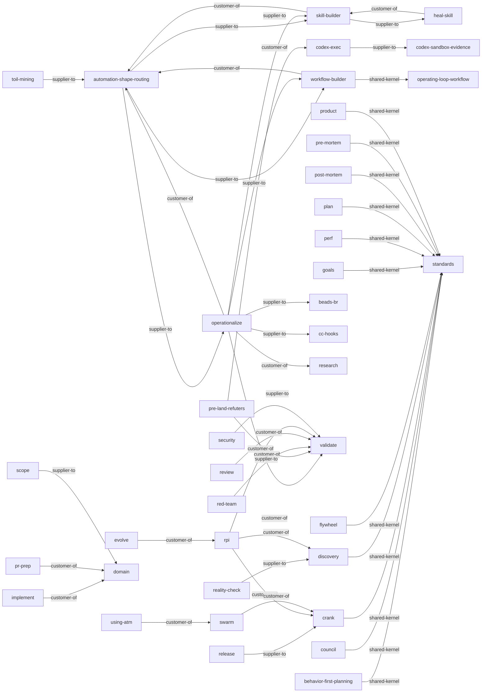

<!-- generated from skills/*/SKILL.md frontmatter -->

# AgentOps Context Map

Generated from SKILL.md frontmatter. See [ADR-0001](https://github.com/boshu2/agentops/blob/main/docs/adr/ADR-0001-ddd-hexagonal-adoption.md)
and [CDLC](https://github.com/boshu2/agentops/blob/main/docs/cdlc.md) for the architectural rationale.

## Skills by hexagonal role

### domain

- `behavior-first-planning` — Behavior-first planning discipline — intent → Gherkin behaviors → EXECUTED-red acceptance tests → spec → acceptance-gated bead DAG. No runnable acceptance test, no bead. Triggers: "plan behavior-first", "acceptance-first planning", "give these beads runnable done-criteria".
- `council` — Run multi-judge consensus. Use when: an irreversible or high-stakes decision needs independent judges before committing — architecture forks, one-way doors, scoring options.
- `crank` — Execute epics through waves. Triggers: "crank an epic", "execute epics through waves", "drive the bead wave plan".
- `discovery` — Create dense execution packets. Fold target for brainstorm + design (goal clarification, product-fit pressure testing). Triggers: "run discovery", "shape intent as BDD", "scope a feature into an execution packet".
- `domain` — Canonical vocabulary for human-AI software work. Use when naming concepts, resolving terminology disputes, or establishing shared domain language across agents and docs. Triggers: "domain", "canonical vocabulary for human-ai software", "domain skill".
- `evolve` — Run autonomous improvement loops.
- `flywheel` — Check knowledge flywheel health. Triggers: "flywheel", "check knowledge flywheel health.", "flywheel skill".
- `goals` — Maintain AgentOps goals. Triggers: "goals", "maintain agentops goals.", "goals skill".
- `operationalize` — Distill context (research, recon, learnings) into evidence-anchored rules routed to automation shapes. Use when a finished artifact should become skills, gates, or beads.
- `perf` — Profile and optimize hotspots. Triggers: "perf", "profile and optimize hotspots.", "perf skill".
- `plan` — Decompose goals into issue plans. Triggers: "plan", "decompose goals into issue plans.", "plan skill".
- `post-mortem` — Review completed work and learn. Use when: a task, PR arc, or session is finished and you want to extract learnings, or after ≥5 PRs (the scope checkpoint).
- `pre-mortem` — Stress-test plans before work. Use when: a plan is drafted but not yet executed and you want to surface failure modes, risks, and what would prove it wrong before committing.
- `product` — Create or refine PRODUCT.md. Triggers: "product", "create or refine product.md.", "product skill".
- `reality-check` — Mid-epic drift audit: code is ground truth; README/PRODUCT/plan are the measuring stick. Use when a wave boundary lands and bead counts look healthy but value feels absent.
- `rpi` — Run discovery, crank, validation. Triggers: "run rpi", "research-plan-implement one turn", "drive a turn through the operating loop".
- `shared` — Shared AgentOps skill contracts. Triggers: "shared", "shared agentops skill contracts.", "shared skill".
- `standards` — Provide repo coding standards. Triggers: "standards", "provide repo coding standards.", "standards skill".

### driving-adapter

- `agy-native` — Drive AgentOps in AGY: loop, plugins, memory, evidence, scoped worktrees. Triggers: agy, antigravity, agy plugin, AGY evidence.
- `bootstrap` — Initialize AgentOps project files. Triggers: "initialize AgentOps", "bootstrap project files", "set up .agents scaffolding".
- `codex-exec` — Use when running Codex workers or validators non-interactively through codex exec with evidence. Triggers:
- `converge` — Drive a fix→re-run-judge-panel loop to terminal agreement or a 3-consecutive-fail BLOCK via the Go `ao converge` command. Thin memo over the CLI — loop and gates live in Go. Triggers: "converge", "drive a fix re-run-judge-panel loop", "converge skill".
- `implement` — Implement one tracked issue. Triggers: "implement", "implement one tracked issue.", "implement skill".
- `pr-prep` — Prepare PR commits and body. Triggers: "pr-prep", "pr prep", "prepare pr commits and body.".
- `pre-land-refuters` — Dispatch fresh-context refuters (model-agnostic; multi-model opt-in) to attack a completion claim at the shared-trunk pawl before landing. Triggers: pre-land validation, refute.
- `push` — Validate, commit, and push.
- `recover` — Recover session context. Triggers: "recover", "recover session context.", "recover skill".
- `research` — Explore and write findings. Triggers: "research", "explore and write findings.", "research skill".
- `review` — Review diffs for risk, find mocks, scan for bugs, audit codebases. Fold target for bug-hunt, codebase-audit, and ubs. Triggers: "review", "review diffs for risk find", "review skill".
- `status` — Show AgentOps work status. Triggers: "status", "show agentops work status.", "status skill".
- `validate` — Produce PASS/WARN/FAIL verdicts for artifacts, plans, code, PRs, or gates — including quick readiness/sanity checks before commit (absorbs vibe) and completion audits. Triggers: "validate an artifact", "PASS/WARN/FAIL verdict", "readiness / completion audit".

### driven-adapter

- `converter` — Convert AgentOps skill formats. Triggers: "converter", "convert agentops skill formats.", "converter skill".
- `scope` — Hard-block edits outside declared frozen directories and protect paths during risky changes. Triggers: "scope", "hard-block edits outside declared frozen", "scope skill".
- `security` — Run repository security scans for vulnerabilities, dependency risk, secrets, and release gates. Triggers: "security", "run repository security scans for", "security skill".

### supporting

- `account-rotation` — Switch coding-agent accounts on a usage/rate limit or to spread swarm lanes. Routes by host+agent: macOS+Claude via claude-acct; Codex/Gemini and Linux/WSL via caam. Triggers: "account-rotation", "account rotation", "switch coding-agent accounts on a".
- `agent-mail` — Use when coordinating agents with Agent Mail locks, inboxes, threads, and conflict-prevention handoffs. Triggers: "agent-mail", "agent mail", "use when coordinating agents with".
- `agent-native` — Make an out-of-session agent AgentOps-native with skills, the ao CLI, local cockpit proof, and CI backstop telemetry instead of runtime hooks. Triggers: "agent-native", "agent native", "make an out-of-session agent agentops-native".
- `automation-shape-routing` — Front door for agent automation — decide the SHAPE (Workflow vs ATM vs skill), then hand off. Triggers: "build automation", "convert skills to workflows", "which shape".
- `beads-br` — Local-first issue tracker (beads_rust) for AI agents. Use when tracking tasks, managing dependencies, finding ready work, or syncing issues to git via JSONL. Triggers: "beads-br", "beads br", "local-first issue tracker beads rust".
- `beads-bv` — Graph-aware task triage with bv and br. Use when prioritizing work, finding bottlenecks, tracking dependencies, or managing local issues across projects. Triggers: "beads-bv", "beads bv", "graph-aware task triage with bv".
- `cass` — Mine past agent sessions for working prompts, decisions, and patterns. Use when "what did I ask?", "find that prompt", session archaeology, or agent history. Triggers: "cass", "mine past agent sessions for", "cass skill".
- `cc-hooks` — Configure Claude Code hooks (PreToolUse, PostToolUse, Stop, Notification). Fold target for the cc-* loop, subagent, and worktree-isolation skills. Triggers: "cc-hooks", "cc hooks", "configure claude code hooks pretooluse".
- `compile` — Compile .agents knowledge wiki. Triggers: "compile the knowledge wiki", "build the LLM wiki", "compile .agents into the wiki".
- `curate` — Mine transcripts, .agents, br, and git for skill diffs, br updates, or rare wiki entries. Triggers: "curate skills from sessions", "mine transcripts for skill diffs", "what should be a skill".
- `dcg` — Handle blocked destructive commands. Use when dcg blocks rm -rf, git reset --hard, DROP DATABASE, kubectl delete, or when configuring agent safety guardrails. Triggers: "dcg", "handle blocked destructive commands. use", "dcg skill".
- `doc` — Generate and validate repo docs, READMEs, and OSS doc packs. Triggers: "doc", "generate and validate repo docs", "doc skill".
- `eval-outcomes` — Grade agent or model output against Outcomes for holdout-safe evals and runtime comparisons. Fold target for scenario. Triggers: "eval-outcomes", "eval outcomes", "grade agent or model output".
- `handoff` — Write compact session handoffs. Triggers: "handoff", "write compact session handoffs.", "handoff skill".
- `heal-skill` — Repair skill hygiene, and deep-audit SKILL.md quality (absorbed from /skill-auditor). Triggers: "heal-skill", "heal skill", "repair skill hygiene", "skill-auditor", "audit skill", "skill audit".
- `ntm` — Orchestrates NTM tmux agent swarms and robot APIs. Use when spawning/sending panes, reading robot state, triaging work, locks/mail, safety, pipelines, serve, or NTM errors. Triggers: "ntm", "orchestrates ntm tmux agent swarms", "ntm skill".
- `rch` — Use when offloading slow builds to remote workers or recovering RCH worker, hook, SSH, sync, or disk issues. Triggers: "rch", "use when offloading slow builds", "rch skill".
- `red-team` — Probe docs and skills. Use when: adversarially probing a doc, skill, plan, or claim for weaknesses, gaps, or unstated assumptions before it ships.
- `refactor` — Execute safe refactors. Triggers: "refactor", "execute safe refactors.", "refactor skill".
- `release` — Run release validation. Triggers: "run release validation", "cut a release", "check release readiness".
- `reverse-engineer` — Reverse-engineer an authorized repo, binary, or product into a verifiable feature inventory and adoption map. Triggers: "reverse-engineer X", "tear down Y", "what should we steal from Z", "evaluate competitor/upstream", "should we fork/adopt/build-native".
- `sbh` — Disk-pressure defense for AI coding workloads. Use when: disk full, low space, ballast, cleanup, scan artifacts, emergency, sbh daemon, sbh status.
- `scaffold` — Create project, component, or boilerplate scaffolds. Use when starting a new project, module, or component, generating boilerplate, or stamping a repeatable file structure. Triggers: "scaffold", "create project component or boilerplate".
- `skill-builder` — Scaffold or absorb new SKILL.md files against the unified AgentOps template. Triggers: "create a skill", "scaffold skill", "absorb external skill", "new skill".
- `swarm` — Dispatch parallel agents. Triggers: "swarm", "dispatch parallel agents.", "swarm skill".
- `test` — Generate tests and coverage plans. Triggers: "test", "generate tests and coverage plans.", "test skill".
- `toil-mining` — Mine usage history (cass, rtk, shell) for repeated toil, score frequency x pain, emit ranked candidates for automation-shape-routing. Use when rituals repeat by hand.
- `using-atm` — Use ATM as the out-of-session substrate: spawn Claude/Codex panes running /rpi and /evolve over a bead queue, then tend the swarm to convergence — including the continuity contract (renewal ticks, the two-tick stall rule, .agents/continuity/state.json). Triggers: "use ATM as the out-of-session substrate", "spawn atm panes over a bead queue", "tend an unattended swarm", "renewal ticks", "two-tick stall rule".
- `workflow-builder` — Scaffold a new Claude Workflow script — deterministic multi-agent orchestration. Triggers: "build a workflow", "create a workflow", "scaffold workflow", "author a workflow".

### generic

- (no skills in this role yet)

### unclassified

- (no unclassified skills)

## Context relationships

## Data flow (consumes / produces)

| Skill | Direction | Artifact |
|-------|-----------|----------|
| `agent-native` | consumes | converter |
| `agent-native` | consumes | standards |
| `agent-native` | consumes | validate |
| `agent-native` | produces | docs/contracts/agent-runtime-profile.md |
| `agy-native` | produces | agy-run-evidence |
| `behavior-first-planning` | consumes | standards |
| `behavior-first-planning` | produces | .agents/plans/*.md |
| `behavior-first-planning` | produces | br-issue |
| `bootstrap` | consumes | doc |
| `bootstrap` | consumes | goals |
| `bootstrap` | consumes | product |
| `bootstrap` | consumes | shared |
| `codex-exec` | produces | codex-run-output |
| `compile` | produces | .agents/compiled/lint-report.md |
| `converge` | consumes | command-help |
| `converge` | produces | stdout |
| `converter` | produces | converted-skill |
| `council` | consumes | standards |
| `council` | produces | result.json |
| `council` | produces | verdict.json |
| `crank` | consumes | beads-br |
| `crank` | consumes | implement |
| `crank` | consumes | post-mortem |
| `crank` | consumes | swarm |
| `crank` | consumes | validate |
| `crank` | produces | .agents/swarm/results/*.json |
| `crank` | produces | git-changes |
| `curate` | produces | .agents/research/*.md |
| `discovery` | consumes | plan |
| `discovery` | consumes | pre-mortem |
| `discovery` | consumes | research |
| `discovery` | consumes | shared |
| `discovery` | produces | .agents/plans/*.md |
| `discovery` | produces | br-issue |
| `discovery` | produces | execution-packet.json |
| `doc` | consumes | repo-context |
| `doc` | produces | documentation |
| `domain` | produces | stdout |
| `eval-outcomes` | consumes | council |
| `eval-outcomes` | consumes | validate |
| `eval-outcomes` | produces | skills/council/schemas/verdict.json |
| `evolve` | consumes | compile |
| `evolve` | consumes | goals |
| `evolve` | consumes | post-mortem |
| `evolve` | consumes | rpi |
| `evolve` | produces | git-changes |
| `evolve` | produces | goals-fitness-delta |
| `flywheel` | produces | .agents/learnings/*.md |
| `goals` | produces | result.json |
| `handoff` | produces | .agents/research/*.md |
| `heal-skill` | produces | audit-report.json |
| `implement` | consumes | domain |
| `implement` | produces | git-changes |
| `operationalize` | consumes | .agents/research/*.md |
| `operationalize` | produces | .agents/operationalize/*.md |
| `operationalize` | produces | routed-handoffs |
| `perf` | consumes | repo-context |
| `perf` | produces | result.json |
| `plan` | consumes | standards |
| `plan` | produces | .agents/plans/*.md |
| `plan` | produces | execution-packet.json |
| `post-mortem` | consumes | council |
| `post-mortem` | consumes | implement |
| `post-mortem` | consumes | validate |
| `post-mortem` | produces | result.json |
| `pr-prep` | consumes | domain |
| `pr-prep` | produces | git-changes |
| `pre-land-refuters` | consumes | codex-exec |
| `pre-land-refuters` | consumes | validate |
| `pre-land-refuters` | produces | .agents/council/*.md |
| `pre-mortem` | consumes | standards |
| `pre-mortem` | produces | result.json |
| `pre-mortem` | produces | verdict.json |
| `product` | produces | result.json |
| `push` | consumes | git-changes |
| `push` | produces | git-changes |
| `reality-check` | consumes | implement |
| `reality-check` | produces | result.json |
| `recover` | consumes | br |
| `recover` | consumes | rpi |
| `recover` | produces | .agents/rpi/*.md |
| `red-team` | consumes | repo-context |
| `red-team` | produces | result.json |
| `refactor` | consumes | repo-context |
| `refactor` | produces | git-changes |
| `release` | produces | result.json |
| `research` | consumes | repo-context |
| `research` | produces | .agents/research/*.md |
| `research` | produces | result.json |
| `reverse-engineer` | produces | .agents/research/*.md |
| `review` | consumes | github-pr |
| `review` | consumes | validate |
| `review` | produces | result.json |
| `rpi` | consumes | crank |
| `rpi` | consumes | discovery |
| `rpi` | consumes | domain |
| `rpi` | consumes | validate |
| `rpi` | produces | .agents/rpi/*.md |
| `scaffold` | produces | converted-skill |
| `scope` | produces | filesystem-gate |
| `security` | consumes | repo-context |
| `security` | produces | security-report.json |
| `shared` | produces | stdout |
| `skill-builder` | produces | converted-skill |
| `standards` | produces | stdout |
| `status` | consumes | br |
| `status` | produces | stdout |
| `swarm` | consumes | implement |
| `swarm` | consumes | validate |
| `swarm` | produces | .agents/swarm/results/*.json |
| `test` | consumes | repo-context |
| `test` | consumes | standards |
| `test` | produces | result.json |
| `toil-mining` | produces | result.json |
| `using-atm` | produces | documentation |
| `validate` | produces | result.json |
| `workflow-builder` | produces | workflow-script |
