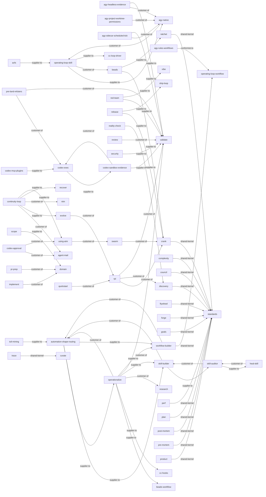

<!-- generated from skills/*/SKILL.md frontmatter -->

# AgentOps Context Map

Generated from SKILL.md frontmatter. See [ADR-0001](https://github.com/boshu2/agentops/blob/main/docs/adr/ADR-0001-ddd-hexagonal-adoption.md)
and [CDLC](https://github.com/boshu2/agentops/blob/main/docs/cdlc.md) for the architectural rationale.

## Skills by hexagonal role

### domain

- `council` — Run multi-judge consensus. Use when: an irreversible or high-stakes decision needs independent judges before committing — architecture forks, one-way doors, scoring options.
- `crank` — Execute epics through waves.
- `discovery` — Create dense execution packets. Fold target for brainstorm + design (goal clarification, product-fit pressure testing).
- `cross-vendor-trust-gate` — Run the skill-factory final trust gate: operate trust-gate.sh, read skill.trust.json, and enforce --require-cross.
- `design` — Validate product fit before discovery. Use when: framing a problem, checking product/market fit, or pressure-testing user value before writing a discovery packet or any code.
- `discovery` — Create dense execution packets. Fold target for brainstorm + design (goal clarification, product-fit pressure testing).
- `domain` — Canonical vocabulary for human-AI software work. Use when naming concepts, resolving terminology disputes, or establishing shared domain language across agents and docs.
- `flywheel` — Check knowledge flywheel health.
- `forge` — Mine transcripts into learnings.
- `goals` — Maintain AgentOps goals.
- `operating-loop-skill` — Use when driving one bead end-to-end through claim, work, independent validation, closeout, and persistence. Triggers:
- `operationalize` — Distill gathered context (research, recon, learnings) into evidence-anchored rules routed to automation shapes. Use when a finished artifact should become skills, gates, or beads.
- `perf` — Profile and optimize hotspots.
- `plan` — Decompose goals into issue plans.
- `post-mortem` — Review completed work and learn. Use when: a task, PR arc, or session is finished and you want to extract learnings, or after ≥5 PRs (the scope checkpoint).
- `pre-mortem` — Stress-test plans before work. Use when: a plan is drafted but not yet executed and you want to surface failure modes, risks, and what would prove it wrong before committing.
- `product` — Create or refine PRODUCT.md.
- `ratchet` — Record Brownian Ratchet gates.
- `reality-check` — Mid-epic drift audit: code is ground truth; README/PRODUCT/plan are the measuring stick. Use when a wave boundary lands and bead counts look healthy but value feels absent.
- `shared` — Shared AgentOps skill contracts.
- `standards` — Provide repo coding standards.

### driving-adapter

- `acfs` — Use when operating ACFS flywheel health checks, init, and agent loop tooling from ~/acfs/bin/acfs. Triggers:
- `agy-native` — Drive AgentOps in AGY: loop, plugins, memory, evidence, scoped worktrees. Triggers: agy, antigravity, agy plugin, AGY evidence.
- `bootstrap` — Initialize AgentOps project files.
- `codex-approval` — Use when Codex needs Fable approval through an ATM/NTM validator pane. Triggers: - codex approval - ask fable - fable plan review
- `codex-exec` — Use when running Codex workers or validators non-interactively through codex exec with evidence. Triggers:
- `implement` — Implement one tracked issue.
- `inject` — Load relevant .agents context.
- `pr-prep` — Prepare PR commits and body.
- `pre-land-refuters` — Dispatch unbiased refuters (fresh Fable + read-only codex exec) to attack a completion claim before landing a large change. Triggers: pre-land validation, refute before push.
- `push` — Validate, commit, and push.
- `recover` — Recover session context.
- `research` — Explore and write findings.
- `review` — Review diffs for risk, find mocks, scan for bugs, audit codebases. Fold target for bug-hunt, codebase-audit, and ubs.
- `review` — Review diffs for risk, find mocks, scan for bugs, audit codebases. Use when: reviewing a diff/PR for bugs and risk, hunting mocks/stubs/placeholders, or auditing for quality. Also: investigate bugs and root causes (absorbs bug-hunt); Domain-parameterized codebase audits (security, UX, perf, API, copy, CLI) + report modes (archaeology, architecture/briefing, patterns, risk) when auditing or onboarding (absorbs codebase-audit); and reviewing code with UBS for bugs, security issues, AI-generated quality, or pre-commit checks (absorbs ubs).
- `session-bootstrap` — Universal AgentOps init prompt for starting or onboarding a fresh agent session.
- `ship-loop` — Run the fast-lane internal ship cycle for one closable bead or small slice: claim, test, implement, push, merge, close.
- `status` — Show AgentOps work status.
- `validate` — Produce PASS/WARN/FAIL verdicts for artifacts, plans, code, PRs, or gates — including quick readiness/sanity checks before commit (absorbs vibe) and completion audits.

### driven-adapter

- `beads` — Track issues with bd/br, triage with bv, and convert plans to beads.
- `scope` — Hard-block edits outside declared frozen directories and protect paths during risky changes.
- `security` — Run repository security scans for vulnerabilities, dependency risk, secrets, and release gates.

### supporting

- `account-rotation` — Switch coding-agent accounts on a usage/rate limit or to spread swarm lanes. Routes by host+agent: macOS+Claude via claude-acct; Codex/Gemini and Linux/WSL via caam.
- `agent-mail` — Use when coordinating agents with Agent Mail locks, inboxes, threads, and conflict-prevention handoffs.
- `agent-native` — Make an out-of-session agent AgentOps-native with skills, the ao CLI, and CI instead of hooks.
- `agy-headless-evidence` — Run AGY headlessly via scheduled ticks or `agy -p`, capture agentapi JSONL evidence, and validate automated AGY loops or event streams.
- `autodev` — Manage the PROGRAM.md/AUTODEV.md contract consumed by evolve/factory ticks. Use for loop rules, boundaries, or PROGRAM.md repair.
- `automation-shape-routing` — Front door for agent automation — decide the SHAPE (Workflow vs ATM vs skill), then hand off. Triggers: "build automation", "convert skills to workflows", "which shape".
- `beads-br` — Local-first issue tracker (beads_rust) for AI agents. Use when tracking tasks, managing dependencies, finding ready work, or syncing issues to git via JSONL.
- `beads-bv` — Graph-aware task triage with bv and br. Use when prioritizing work, finding bottlenecks, tracking dependencies, or managing local issues across projects.
- `beads-workflow` — Use when converting markdown plans into br beads with dependencies for implementation or swarm execution.
- `cass` — Mine past agent sessions for working prompts, decisions, and patterns. Use when "what did I ask?", "find that prompt", session archaeology, or agent history.
- `cc-hooks` — Configure Claude Code hooks (PreToolUse, PostToolUse, Stop, Notification). Fold target for the cc-* loop, subagent, and worktree-isolation skills.
- `cass-memory` — Use when starting non-trivial work, mining lessons, or preventing repeated mistakes with cm procedural memory.
- `cc-hooks` — Configure Claude Code hooks (PreToolUse, PostToolUse, Stop, Notification). Fold target for the cc-* loop, subagent, and worktree-isolation skills.
- `cc-subagents` — Use when dispatching scoped Claude Code subagents with worktrees, roles, tools, memory, and evidence gates. Triggers:
- `cc-worktree-isolation` — Use when isolating parallel Claude Code workers in separate git worktrees to prevent file collisions. Triggers:
- `codebase-audit` — Domain-parameterized codebase audits (security, UX, perf, API, copy, CLI) + report modes (archaeology, architecture/briefing, patterns, risk). Use when auditing or onboarding.
- `codex-sandbox-evidence` — Use when running codex exec in a least-privilege sandbox with machine-checkable proof. Triggers:
- `compile` — Compile .agents knowledge wiki.
- `continuity-loop` — Own the unattended renewal spine: renewal ticks, the two-tick stall rule, escalation for NTM panes over MCP Agent Mail. Use when wiring or tuning a loop's continuity step.
- `curate` — Mine transcripts, .agents, bd, and git for skill diffs, bd updates, or rare wiki entries.
- `dcg` — Handle blocked destructive commands. Use when dcg blocks rm -rf, git reset --hard, DROP DATABASE, kubectl delete, or when configuring agent safety guardrails.
- `doc` — Generate and validate repo docs, READMEs, and OSS doc packs.
- `eval-outcomes` — Grade agent or model output against Outcomes for holdout-safe evals and runtime comparisons. Fold target for scenario.
- `eval-outcomes` — Grade agent or model output against Outcomes for holdout-safe evals and runtime comparisons. Also the fold target for the retired scenario skill — Manage holdout scenarios; author and manage holdout scenarios with measurable acceptance vectors and satisfaction scoring in .agents/holdout/ for behavioral validation.
- `evolve` — Run autonomous improvement loops.
- `handoff` — Write compact session handoffs.
- `heal-skill` — Repair skill hygiene.
- `ntm` — Orchestrates NTM tmux agent swarms and robot APIs. Use when spawning/sending panes, reading robot state, triaging work, locks/mail, safety, pipelines, serve, or NTM errors.
- `rch` — Use when offloading slow builds to remote workers or recovering RCH worker, hook, SSH, sync, or disk issues.
- `red-team` — Probe docs and skills. Use when: adversarially probing a doc, skill, plan, or claim for weaknesses, gaps, or unstated assumptions before it ships.
- `refactor` — Execute safe refactors.
- `release` — Run release validation.
- `rpi` — Run discovery, crank, validation.
- `sbh` — Disk-pressure defense for AI coding workloads. Use when: disk full, low space, ballast, cleanup, scan artifacts, emergency, sbh daemon, sbh status.
- `scaffold` — Create project, component, or boilerplate scaffolds. Use when starting a new project, module, or component, generating boilerplate, or stamping a repeatable file structure.
- `skill-auditor` — Audit SKILL.md files against the AgentOps template and readiness checks. Use for quality reviews or template compliance.
- `skill-builder` — Scaffold or absorb new SKILL.md files against the unified AgentOps template. Triggers: "create a skill", "scaffold skill", "absorb external skill", "new skill".
- `swarm` — Dispatch parallel agents.
- `test` — Generate tests and coverage plans.
- `toil-mining` — Mine usage history (cass, rtk, shell) for repeated toil, cluster and score frequency x pain, emit ranked candidates for automation-shape-routing. Use when rituals repeat by hand.
- `trace` — Trace decisions through artifacts.
- `ubs` — Use when reviewing code with UBS for bugs, security issues, AI-generated quality, or pre-commit checks.
- `using-atm` — Use ATM as the out-of-session substrate: spawn Claude/Codex panes running /rpi and /evolve over a bead queue, then tend the swarm to convergence.
- `vibing-with-ntm` — Use when tending NTM agent swarms, unsticking panes, handling rate limits, or coordinating convergence.
- `workflow-builder` — Scaffold a new Claude Workflow script — deterministic multi-agent orchestration. Triggers: "build a workflow", "create a workflow", "scaffold workflow", "author a workflow".

### generic

- `converter` — Convert AgentOps skill formats.

### unclassified

- (no unclassified skills)

## Context relationships

## Data flow (consumes / produces)

| Skill | Direction | Artifact |
|-------|-----------|----------|
| `acfs` | produces | substrate-health-report |
| `agent-native` | consumes | converter |
| `agent-native` | consumes | standards |
| `agent-native` | consumes | validate |
| `agent-native` | produces | docs/contracts/agent-runtime-profile.md |
| `agy-headless-evidence` | consumes | agy-native |
| `agy-headless-evidence` | produces | agy-evidence-dir |
| `agy-native` | consumes | operating-loop-skill |
| `agy-native` | produces | agy-run-evidence |
| `autodev` | consumes | evolve |
| `autodev` | consumes | rpi |
| `beads` | consumes | bd-issue |
| `beads` | produces | bd-issue |
| `bootstrap` | consumes | doc |
| `bootstrap` | consumes | goals |
| `bootstrap` | consumes | product |
| `bootstrap` | consumes | shared |
| `codex-approval` | consumes | agent-mail |
| `codex-approval` | consumes | using-atm |
| `codex-approval` | produces | council-verdict |
| `codex-exec` | produces | codex-run-output |
| `compile` | produces | .agents/compiled/lint-report.md |
| `complexity` | consumes | doc |
| `complexity` | consumes | standards |
| `complexity` | produces | stdout |
| `continuity-loop` | consumes | agent-mail |
| `continuity-loop` | consumes | ntm |
| `continuity-loop` | produces | .agents/continuity/state.json |
| `continuity-loop` | produces | escalation-message |
| `converter` | produces | converted-skill |
| `council` | consumes | standards |
| `council` | produces | result.json |
| `council` | produces | verdict.json |
| `crank` | consumes | beads |
| `crank` | consumes | implement |
| `crank` | consumes | post-mortem |
| `crank` | consumes | swarm |
| `crank` | consumes | validate |
| `crank` | produces | .agents/swarm/results/*.json |
| `crank` | produces | git-changes |
| `curate` | produces | .agents/research/*.md |
| `discovery` | consumes | brainstorm |
| `discovery` | consumes | design |
| `discovery` | consumes | plan |
| `discovery` | consumes | pre-mortem |
| `discovery` | consumes | research |
| `discovery` | consumes | shared |
| `discovery` | produces | .agents/plans/*.md |
| `discovery` | produces | br-issue |
| `discovery` | produces | execution-packet.json |
| `doc` | consumes | repo-context |
| `doc` | produces | documentation |
| `domain` | produces | stdout |
| `eval-outcomes` | consumes | council |
| `eval-outcomes` | consumes | ratchet |
| `eval-outcomes` | consumes | validate |
| `eval-outcomes` | produces | skills/council/schemas/verdict.json |
| `evolve` | consumes | compile |
| `evolve` | consumes | goals |
| `evolve` | consumes | post-mortem |
| `evolve` | consumes | rpi |
| `evolve` | produces | git-changes |
| `evolve` | produces | goals-fitness-delta |
| `flywheel` | produces | .agents/learnings/*.md |
| `forge` | produces | .agents/research/*.md |
| `goals` | produces | result.json |
| `handoff` | produces | .agents/research/*.md |
| `implement` | consumes | domain |
| `implement` | produces | git-changes |
| `ntm-browser-test-coordination` | consumes | agent-mail |
| `ntm-browser-test-coordination` | consumes | ntm |
| `ntm-browser-test-coordination` | consumes | test |
| `ntm-browser-test-coordination` | produces | browser-test-coordination-packet |
| `ntm-browser-test-coordination` | produces | browser-test-evidence-index |
| `ntm-browser-test-coordination` | produces | browser-test-handoff |
| `operating-loop-skill` | consumes | beads |
| `operating-loop-skill` | consumes | git |
| `operating-loop-skill` | produces | closed-bead |
| `operating-loop-skill` | produces | evidence/<id>.md |
| `operating-loop-skill` | produces | git-commit |
| `operating-loop-workflow` | produces | git-changes |
| `operationalize` | consumes | .agents/research/*.md |
| `operationalize` | consumes | audit-report |
| `operationalize` | consumes | learning |
| `operationalize` | produces | .agents/operationalize/*.md |
| `operationalize` | produces | routed-handoffs |
| `perf` | consumes | repo-context |
| `perf` | produces | result.json |
| `plan` | consumes | standards |
| `plan` | produces | .agents/plans/*.md |
| `plan` | produces | execution-packet.json |
| `post-mortem` | consumes | council |
| `post-mortem` | consumes | implement |
| `post-mortem` | consumes | validate |
| `post-mortem` | produces | result.json |
| `pr-prep` | consumes | domain |
| `pr-prep` | produces | git-changes |
| `pre-land-refuters` | consumes | codex-exec |
| `pre-land-refuters` | consumes | validate |
| `pre-land-refuters` | produces | .agents/council/*.md |
| `pre-mortem` | consumes | standards |
| `pre-mortem` | produces | result.json |
| `pre-mortem` | produces | verdict.json |
| `product` | produces | result.json |
| `push` | consumes | git-changes |
| `push` | produces | git-changes |
| `quickstart` | consumes | rpi |
| `quickstart` | produces | stdout |
| `ratchet` | consumes | post-mortem |
| `ratchet` | consumes | validate |
| `ratchet` | consumes | vibe |
| `ratchet` | produces | .agents/rpi/*.md |
| `reality-check` | consumes | implement |
| `reality-check` | produces | result.json |
| `recover` | consumes | bd |
| `recover` | consumes | rpi |
| `recover` | produces | .agents/rpi/*.md |
| `red-team` | consumes | repo-context |
| `red-team` | produces | result.json |
| `refactor` | consumes | complexity |
| `refactor` | consumes | repo-context |
| `refactor` | produces | git-changes |
| `release` | produces | result.json |
| `research` | consumes | inject |
| `research` | consumes | repo-context |
| `research` | produces | .agents/research/*.md |
| `research` | produces | result.json |
| `review` | consumes | github-pr |
| `review` | consumes | validate |
| `review` | produces | result.json |
| `rpi` | consumes | crank |
| `rpi` | consumes | discovery |
| `rpi` | consumes | domain |
| `rpi` | consumes | ratchet |
| `rpi` | consumes | validate |
| `rpi` | produces | .agents/rpi/*.md |
| `scaffold` | produces | converted-skill |
| `scope` | produces | filesystem-gate |
| `security` | consumes | repo-context |
| `security` | produces | security-report.json |
| `shared` | produces | stdout |
| `skill-auditor` | produces | result.json |
| `skill-builder` | produces | converted-skill |
| `standards` | produces | stdout |
| `status` | consumes | bd |
| `status` | produces | stdout |
| `swarm` | consumes | implement |
| `swarm` | consumes | validate |
| `swarm` | produces | .agents/swarm/results/*.json |
| `test` | consumes | repo-context |
| `test` | consumes | standards |
| `test` | produces | result.json |
| `toil-mining` | produces | result.json |
| `trace` | produces | result.json |
| `using-agentops` | produces | documentation |
| `using-atm` | produces | documentation |
| `validate` | produces | result.json |
| `workflow-builder` | produces | workflow-script |
