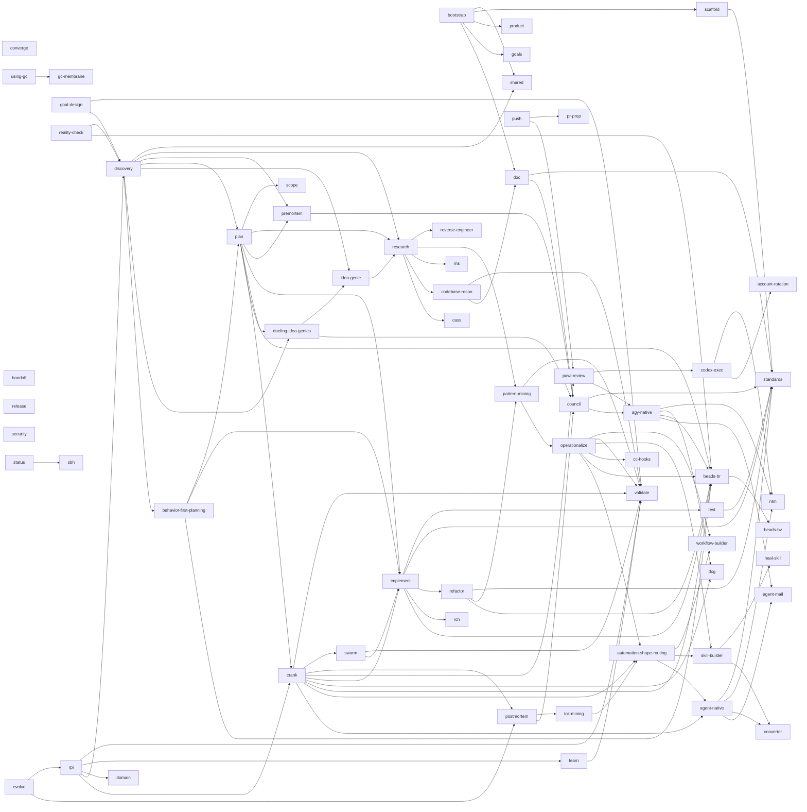
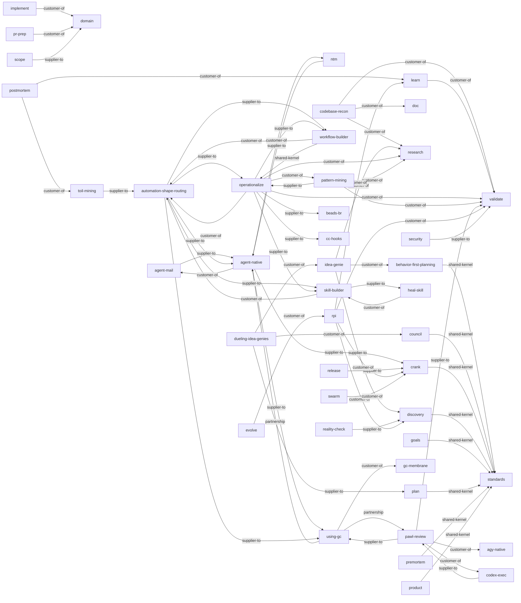

<!-- generated from skills/*/SKILL.md frontmatter -->

# AgentOps Context Map

Generated from SKILL.md frontmatter. See [ADR-0001](https://github.com/boshu2/agentops/blob/main/docs/adr/ADR-0001-ddd-hexagonal-adoption.md)
and [CDLC](https://github.com/boshu2/agentops/blob/main/docs/cdlc.md) for the architectural rationale.

## Skills by hexagonal role

### domain

- `behavior-first-planning` — Behavior-first planning discipline — intent → Gherkin behaviors → EXECUTED-red acceptance tests → spec → acceptance-gated bead DAG. No runnable acceptance test, no bead. Triggers: "plan behavior-first", "acceptance-first planning", "give these beads runnable done-criteria".
- `council` — Run multi-judge consensus. Use when: an irreversible or high-stakes decision needs independent judges before committing — architecture forks, one-way doors, scoring options.
- `crank` — Execute epics through waves. Triggers: "crank an epic", "execute epics through waves", "drive the bead wave plan".
- `discovery` — Create dense execution packets. Fold target for brainstorm + design (goal clarification, product-fit pressure testing). Triggers: "run discovery", "shape intent as BDD", "scope a feature into an execution packet".
- `domain` — Ubiquitous language for human-AI software building — canonical definitions (vertical slice, tracer bullet, primitive) loaded JIT when a term needs pinning. Triggers: "domain", "canonical vocabulary for human-ai software", "domain skill".
- `dueling-idea-genies` — Challenge a contested one-way-door idea with sealed independent perspectives, cross-review, and preserved dissent. Triggers: "challenge this irreversible idea", "compare independent proposals", "stress-test a one-way door".
- `evolve` — Run autonomous improvement loops. Triggers: "evolve", "improve everything", "autonomous improvement".
- `goals` — Maintain AgentOps goals. Triggers: "goals", "maintain agentops goals.", "goals skill".
- `idea-genie` — Generate an evidence-grounded opportunity portfolio for an open-ended product or engineering question. Triggers: "generate ideas from repository evidence", "what should we build next", "find supported opportunities".
- `learn` — Consume an immutable Validate verdict and emit evidence-bound bookkeeping. Triggers: "learn", "consume a validation verdict", "record observations".
- `operationalize` — >-
- `plan` — Decompose goals into issue plans. Triggers: "plan", "decompose goals into issue plans.", "plan skill".
- `postmortem` — Test an explicit retrospective causal question against evidence and counterfactuals after Validate and Learn. Triggers: "postmortem", "causal retrospective", "test a retrospective hypothesis".
- `premortem` — Stress-test plans before work. Use when: a plan is drafted but not yet executed and you want to surface failure modes, risks, and what would prove it wrong before committing.
- `product` — Create or refine PRODUCT.md. Triggers: "product", "create or refine product.md.", "product skill".
- `reality-check` — >-
- `rpi` — Run Discovery, Crank, Validate, and Learn as four ordered, independently receipted umbrellas. Triggers: "run rpi", "research-plan-implement one turn", "drive a turn through the operating loop".
- `shared` — Shared AgentOps skill contracts. Triggers: "shared", "shared agentops skill contracts.", "shared skill".
- `standards` — Provide repo coding standards. Triggers: "standards", "provide repo coding standards.", "standards skill".

### driving-adapter

- `agy-native` — |-
- `bootstrap` — Initialize AgentOps project files. Triggers: "initialize AgentOps", "bootstrap project files", "set up .agents scaffolding".
- `codex-exec` — |-
- `converge` — Drive a fix -> re-run-judge-panel loop to terminal agreement or a hard BLOCK via the Go ao converge command. Triggers: "converge", "drive a fix re-run-judge-panel loop", "converge skill".
- `goal-design` — Create validated goal-design packets. Triggers: "goal prompt", "goal-design packet", "turn this goal into loop-ready work".
- `implement` — Implement one tracked issue. Triggers: "implement", "implement one tracked issue.", "implement skill".
- `pawl-review` — Run one fresh, read-only, nonce-bound reviewer lane and hand its evidence to ao pawl without deciding the panel verdict. Triggers: "run a pawl reviewer", "fresh-context review lane", "collect independent review evidence".
- `pr-prep` — Prepare PR commits and body. Triggers: "pr-prep", "pr prep", "prepare pr commits and body.".
- `push` — Validate, commit, and push. Triggers: "push", "ship it", "commit and push".
- `research` — Explore and write findings. Triggers: "research", "explore and write findings.", "research skill".
- `status` — Show AgentOps work status. Triggers: "status", "show agentops work status.", "status skill".
- `validate` — Independently remeasure a bounded artifact and emit one immutable, evidence-bound verdict. Triggers: "validate", "independently validate", "vibe".

### driven-adapter

- `converter` — Convert AgentOps skill formats. Triggers: "converter", "convert agentops skill formats.", "converter skill".
- `scope` — Hard-block edits outside declared frozen directories and protect paths during risky changes. Triggers: "scope", "hard-block edits outside declared frozen", "scope skill".
- `security` — Run repository security scans for vulnerabilities, dependency risk, secrets, and release gates. Triggers: "security", "run repository security scans for", "security skill".

### supporting

- `account-rotation` — Switch coding-agent accounts on a usage/rate limit. Routes by host+agent: macOS+Claude to claude-acct; Codex/Gemini and Linux/WSL to caam. Triggers: "account-rotation", "account rotation", "switch coding-agent accounts on a".
- `agent-mail` — Use when coordinating agents with Agent Mail locks, inboxes, threads, and conflict-prevention handoffs. Triggers: "agent-mail", "agent mail", "use when coordinating agents with".
- `agent-native` — Run persistent software-factory workers through a substrate-neutral lifecycle with observable readiness, engagement, evidence, bounded recovery, and handoff. Triggers: "agent-native factory", "role-shaped agent panes", "supervise persistent workers".
- `automation-shape-routing` — Front door for agent automation: choose inline, bounded fanout, reusable skill/workflow/gate, persistent agent-native workers, or explicit Gas City. Triggers: "build automation", "which orchestration shape", "should this use NTM".
- `beads-br` — Local-first issue tracker (beads_rust) for AI agents — track tasks, manage dependencies, find ready work, sync via git JSONL. Triggers: "beads-br", "beads br", "local-first issue tracker beads rust".
- `beads-bv` — Graph-aware task triage with bv and br — prioritize work, find bottlenecks, track dependencies across projects. Triggers: "beads-bv", "beads bv", "graph-aware task triage with bv".
- `cass` — Mine past agent sessions for working prompts, decisions, and patterns (session archaeology). Triggers: "cass", "mine past agent sessions for", "cass skill".
- `cc-hooks` — Configure Claude Code hooks (PreToolUse, PostToolUse, Stop, Notification) — user-side, opt-in per host (AgentOps 3.0 ships none). Triggers: "cc-hooks", "cc hooks", "configure claude code hooks pretooluse".
- `codebase-recon` — Reconstruct a repository as cited entry-to-test flows, bounded claims, and a reusable baseline or verified delta. Triggers: "build a repository mental model", "trace this codebase", "refresh the prior recon".
- `dcg` — Handle blocked destructive commands and configure agent safety guardrails. Triggers: "dcg", "handle blocked destructive commands. use", "dcg skill".
- `doc` — Generate and validate repo docs, READMEs, and OSS doc packs. Triggers: "doc", "generate and validate repo docs", "doc skill".
- `gc-membrane` — The agentops-membrane pack: fail-closed cross-family verdict-bound close door on stock gc — close gate, finalize, pawl-verdict.v1, RBAC, quest intake, doctor. JIT via using-gc. Triggers: "gc-membrane", "membrane pack", "pawl-verdict.v1", "gc close door".
- `handoff` — Write compact session handoffs. Triggers: "handoff", "write compact session handoffs.", "handoff skill".
- `heal-skill` — Repair skill hygiene and deep-audit SKILL.md quality (absorbed skill-auditor). Triggers: "heal-skill", "heal skill", "repair skill hygiene", "skill-auditor", "audit skill", "skill audit".
- `ms` — meta_skill (ms) — the skill-search/load engine over both corpora (agentops + jsm). Find a skill for a task, search skills, or load runnable skill guidance. Triggers: "ms", "meta_skill", "skill search", "find a skill for", "load skill guidance".
- `ntm` — Orchestrate NTM tmux agent swarms and robot APIs — spawn/send panes, read robot state, triage, locks/mail, safety, pipelines. Single owner of swarm-tending doctrine. Triggers: "ntm", "orchestrates ntm tmux agent swarms", "ntm skill".
- `pattern-mining` — Test repeated implementation shapes against independent exemplars and a holdout before routing an earned abstraction. Triggers: "mine a recurring code pattern", "is this abstraction earned", "extract invariants from implementations".
- `rch` — Use when offloading slow builds to remote workers or recovering RCH worker, hook, SSH, sync, or disk issues. Triggers: "rch", "use when offloading slow builds", "rch skill".
- `refactor` — Execute safe refactors. Triggers: "refactor", "execute safe refactors.", "refactor skill".
- `release` — Run release validation. Triggers: "run release validation", "cut a release", "check release readiness".
- `reverse-engineer` — Reverse-engineer an authorized repo, binary, or product into a verifiable feature inventory and adoption map. Triggers: "reverse-engineer X", "tear down Y", "what should we steal from Z", "evaluate competitor/upstream", "should we fork/adopt/build-native".
- `sbh` — >-
- `scaffold` — Stamp project/component/CI scaffolds — but reach for it mainly for the repo-specific domain-slice binding (generic trees a frontier model needs no skill for). Triggers: "scaffold", "create project component or boilerplate".
- `skill-builder` — Scaffold or absorb new SKILL.md files against the unified AgentOps template. Triggers: "create a skill", "scaffold skill", "absorb external skill", "new skill".
- `swarm` — Dispatch parallel agents. Triggers: "swarm", "dispatch parallel agents.", "swarm skill".
- `test` — Generate tests and coverage plans. Triggers: "test", "generate tests and coverage plans.", "test skill".
- `toil-mining` — >-
- `using-gc` — Drive an explicitly selected Gas City factory: stand up a city, sling quests, watch the AgentOps membrane close gate, resolve stalls, and converge. Triggers: "using-gc", "gas city", "drive a gc city", "sling a quest", "gc stall".
- `workflow-builder` — Scaffold a new Claude Workflow script — deterministic multi-agent orchestration. Triggers: "build a workflow", "create a workflow", "scaffold workflow", "author a workflow".

### generic

- (no skills in this role yet)

### unclassified

- (no unclassified skills)

## Context relationships

## Execution dependencies

`A --> B` means skill A declares B in `metadata.dependencies`. `user-invocable` does not make an orphan a graph root.

## Topology diagnostics

| Diagnostic | Values |
|---|---|
| Explicit graph roots | `beads-br`, `bootstrap`, `converge`, `council`, `crank`, `discovery`, `evolve`, `goal-design`, `handoff`, `implement`, `plan`, `premortem`, `push`, `reality-check`, `release`, `rpi`, `security`, `status`, `using-gc`, `validate` |
| User-invocable skills | `agent-native`, `bootstrap`, `codebase-recon`, `crank`, `discovery`, `dueling-idea-genies`, `evolve`, `idea-genie`, `learn`, `pattern-mining`, `pawl-review`, `postmortem`, `push`, `release`, `rpi`, `using-gc`, `validate` |
| Zero-inbound skills | `bootstrap`, `converge`, `evolve`, `goal-design`, `handoff`, `push`, `reality-check`, `release`, `security`, `status`, `using-gc` |
| Dangling targets | _(none)_ |
| Dependency cycles | _(none)_ |
| Unreachable non-roots | _(none)_ |

## Data flow (consumes / produces)

| Skill | Direction | Artifact |
|-------|-----------|----------|
| `agent-mail` | consumes | task-intent |
| `agent-mail` | produces | acknowledged-handoff |
| `agent-mail` | produces | agent-identity |
| `agent-mail` | produces | file-reservation |
| `agent-native` | consumes | existing-tracked-work |
| `agent-native` | consumes | specification |
| `agent-native` | consumes | task-intent |
| `agent-native` | produces | agent-worker-evidence |
| `agent-native` | produces | worker-handoff |
| `agy-native` | produces | agy-run-evidence |
| `automation-shape-routing` | consumes | task-intent |
| `automation-shape-routing` | produces | automation-shape-verdict |
| `behavior-first-planning` | consumes | standards |
| `behavior-first-planning` | produces | .agents/plans/*.md |
| `behavior-first-planning` | produces | br-issue |
| `bootstrap` | consumes | doc |
| `bootstrap` | consumes | goals |
| `bootstrap` | consumes | product |
| `bootstrap` | consumes | shared |
| `codebase-recon` | consumes | existing-docs |
| `codebase-recon` | consumes | repo-context |
| `codebase-recon` | produces | codebase-recon.v1 |
| `codebase-recon` | produces | evidence-bounded-recon-report |
| `codex-exec` | produces | codex-run-output |
| `converge` | consumes | command-help |
| `converge` | produces | stdout |
| `converter` | produces | converted-skill |
| `council` | consumes | standards |
| `council` | produces | result.json |
| `council` | produces | verdict.json |
| `crank` | consumes | beads-br |
| `crank` | consumes | implement |
| `crank` | consumes | postmortem |
| `crank` | consumes | swarm |
| `crank` | consumes | validate |
| `crank` | produces | .agents/swarm/results/*.json |
| `crank` | produces | git-changes |
| `discovery` | consumes | plan |
| `discovery` | consumes | premortem |
| `discovery` | consumes | research |
| `discovery` | consumes | shared |
| `discovery` | produces | .agents/plans/*.md |
| `discovery` | produces | br-issue |
| `discovery` | produces | execution-packet.json |
| `doc` | consumes | repo-context |
| `doc` | produces | documentation |
| `domain` | produces | stdout |
| `dueling-idea-genies` | consumes | idea-portfolio.v1 |
| `dueling-idea-genies` | consumes | task-question |
| `dueling-idea-genies` | produces | idea-challenge.v1 |
| `evolve` | consumes | goals |
| `evolve` | consumes | postmortem |
| `evolve` | consumes | rpi |
| `evolve` | produces | git-changes |
| `evolve` | produces | goals-fitness-delta |
| `goal-design` | consumes | existing-docs |
| `goal-design` | consumes | project-goals |
| `goal-design` | produces | .agents/goal-design/<slug>/driver.md |
| `goal-design` | produces | .agents/goal-design/<slug>/intent.md |
| `goals` | produces | result.json |
| `handoff` | produces | .agents/handoff/*.md |
| `heal-skill` | produces | audit-report.json |
| `idea-genie` | consumes | repo-context |
| `idea-genie` | consumes | task-question |
| `idea-genie` | produces | idea-portfolio.v1 |
| `implement` | consumes | domain |
| `implement` | produces | git-changes |
| `learn` | consumes | validate |
| `learn` | produces | .agents/rpi/phase-4-summary.md |
| `learn` | produces | learn-receipt.json |
| `ntm` | consumes | task-intent |
| `ntm` | produces | agent-worker-transcript |
| `ntm` | produces | ntm-robot-state |
| `operationalize` | consumes | .agents/research/*.md |
| `operationalize` | consumes | pattern-mining.v1 |
| `operationalize` | produces | .agents/operationalize/*.md |
| `operationalize` | produces | routed-handoffs |
| `pattern-mining` | consumes | repo-context |
| `pattern-mining` | consumes | task-question |
| `pattern-mining` | produces | pattern-mining.v1 |
| `pawl-review` | consumes | code-under-review |
| `pawl-review` | consumes | specification |
| `pawl-review` | produces | review-lane-result.v1 |
| `plan` | consumes | standards |
| `plan` | produces | .agents/plans/*.md |
| `plan` | produces | execution-packet.json |
| `postmortem` | consumes | learn |
| `postmortem` | consumes | toil-mining |
| `postmortem` | produces | postmortem-report.md |
| `pr-prep` | consumes | domain |
| `pr-prep` | produces | git-changes |
| `premortem` | consumes | standards |
| `premortem` | produces | result.json |
| `premortem` | produces | verdict.json |
| `product` | produces | result.json |
| `push` | consumes | git-changes |
| `push` | produces | git-changes |
| `reality-check` | consumes | implement |
| `reality-check` | produces | result.json |
| `refactor` | consumes | repo-context |
| `refactor` | produces | git-changes |
| `release` | produces | result.json |
| `research` | consumes | repo-context |
| `research` | produces | .agents/research/*.md |
| `research` | produces | result.json |
| `reverse-engineer` | produces | .agents/research/*.md |
| `rpi` | consumes | crank |
| `rpi` | consumes | discovery |
| `rpi` | consumes | domain |
| `rpi` | consumes | learn |
| `rpi` | consumes | validate |
| `rpi` | produces | .agents/rpi/*.md |
| `scaffold` | produces | converted-skill |
| `scope` | produces | filesystem-gate |
| `security` | consumes | repo-context |
| `security` | produces | security-report.json |
| `shared` | produces | stdout |
| `skill-builder` | produces | converted-skill |
| `standards` | produces | stdout |
| `status` | consumes | br |
| `status` | produces | stdout |
| `swarm` | consumes | implement |
| `swarm` | consumes | validate |
| `swarm` | produces | .agents/swarm/results/*.json |
| `test` | consumes | repo-context |
| `test` | consumes | standards |
| `test` | produces | result.json |
| `toil-mining` | produces | result.json |
| `validate` | produces | result.json |
| `workflow-builder` | produces | workflow-script |
