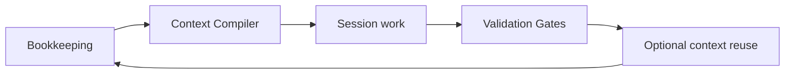

# AgentOps { .landing-hero }

### Autonomous code validation for coding agents.

<!-- agentops:claim:AOP-CLAIM-DOCS-INDEX-CORPUS -->
AgentOps keeps the books, compiles relevant context, and gates output so coding
agents can prove their work before you grant them more autonomy. Runtime corpus
state lives under the workspace-local, gitignored `.agents/` tree; durable
product truth stays in tracked contracts, code, and the provenance ledger.

AgentOps uses software-engineering practice people already understand — Agile/XP, BDD/Gherkin, DDD, hexagonal architecture, TDD, CI/CD, SRE, ADRs, provenance, and durable knowledge — then compiles those practices into dense, verifiable context for LLM agents under token scarcity. The internal lifecycle is the CDLC: context gets developed, tested, delivered, observed, and improved like any other software asset.

The verification membrane is the proven product: no verdict means not done.
Whether retrieval and accumulated context measurably improve future work remains
an experimental hypothesis, not a shipped moat claim.

<p class="hero-actions" markdown>
[:octicons-rocket-24: Install](#install){ .md-button .md-button--primary }
[:octicons-play-24: See It Work](#see-it-work){ .md-button }
[:octicons-mark-github-24: GitHub](https://github.com/boshu2/agentops){ .md-button }
</p>

---

## The Problem

Every agent session starts cold. Same mistakes. Same rework. The landmine in `auth.py`, the two-hour timeout debug, the flag the reviewer always catches — none of it carries forward.

**AgentOps solves this** with four product layers:

| Layer | What it does |
|-------|-------------|
| **Bookkeeping** | Records what agents tried, changed, validated, and learned so the work leaves evidence |
| **Context Compiler** | Assembles the right context for the right phase — decay-ranked, token-budgeted, loaded at session start |
| **Validation Membrane** | `/validate` checks the declared acceptance behavior; `/premortem` and `/council` add independent challenge when warranted |
| **Experimental context reuse** | Retrieves and promotes local learnings; measurable task uplift remains unproven |

The corpus can preserve a useful lesson for a later session, but retrieval value
must be measured rather than assumed.



Workspace-local runtime state lives under gitignored `.agents/`; durable product truth and receipts live in tracked contracts, code, schemas, tests, and the provenance ledger. Both remain operator-owned and auditable. No AgentOps-managed telemetry or hosted control plane; model runtimes, Git remotes, installers, and external tools are operator-selected dependencies. For constrained environments, see the [Assurance Profile](assurance-profile.md).

---

## Install

Pick the runtime you use.

=== "Claude Code"

    ```bash
    curl -fsSL https://raw.githubusercontent.com/boshu2/agentops/main/scripts/install-claude.sh | bash
    ```

=== "Codex CLI (macOS / Linux / WSL)"

    ```bash
    curl -fsSL https://raw.githubusercontent.com/boshu2/agentops/main/scripts/install-codex.sh | bash
    ```

=== "Codex CLI (Windows PowerShell)"

    ```powershell
    irm https://raw.githubusercontent.com/boshu2/agentops/main/scripts/install-codex.ps1 | iex
    ```

=== "OpenCode"

    ```bash
    curl -fsSL https://raw.githubusercontent.com/boshu2/agentops/main/scripts/install-opencode.sh | bash
    ```

=== "Gemini / Antigravity"

    ```bash
    curl -fsSL https://raw.githubusercontent.com/boshu2/agentops/main/scripts/install-agy.sh | bash
    ```

Restart your agent after install, then make one small validated change:
`/plan` → `/implement` → `/validate`. The [first-value path](first-value-path.md)
walks through the evidence each move must produce.

Day-2 install, update, backup, permission, recovery, and escalation paths:
[Install And Day-2 Operations](install-day2-ops.md).

The `ao` CLI is optional but recommended. It unlocks repo-native bookkeeping, retrieval, health checks, and terminal workflows.

=== "macOS"

    ```bash
    brew tap boshu2/agentops https://github.com/boshu2/homebrew-agentops
    brew install agentops
    ao version
    ```

=== "Windows PowerShell"

    ```powershell
    irm https://raw.githubusercontent.com/boshu2/agentops/main/scripts/install-ao.ps1 | iex
    ao version
    ```

---

## See It Work

One behavior, carried from intent to proof.

### Full loop: acceptance through validation

```text
> /plan "add retry backoff to rate limiter"

[plan]       Given a transient failure, when a retry is scheduled,
             then delay grows with bounded jitter
[implement] acceptance test RED → implementation → GREEN
[validate]  scenario mapped, behavior independently reproduced
Verdict: CONFIRMED — evidence recorded
```

Use `/rpi "add retry backoff to rate limiter"` when you want the same skill loop
coordinated as one full tick. Add `/premortem` before implementation or
`/council` after acceptance exists when the stakes justify more independent
judgment.

The point is not a bigger prompt. The point is behavior with an explicit
acceptance surface, independent verification, and durable evidence.

---

## The headline skills

Every skill works alone. Compose flows for end-to-end cycles.

| Skill | Use it when |
|-------|-------------|
| [`/plan`](skills/plan.md) | You need testable acceptance behavior and vertical slices |
| [`/implement`](skills/implement.md) | You want one scoped task built and validated |
| [`/validate`](skills/validate.md) | You need an independent verdict against the declared behavior |
| [`/rpi`](skills/rpi.md) | You want discovery, build, validation, and bookkeeping in one flow |
| [`/premortem`](skills/premortem.md) | You want to pressure-test a plan before implementation |
| [`/council`](skills/council.md) | You want additional independent judges for a high-stakes plan, change, or decision |
| [`/research`](skills/research.md) | You need codebase context and prior learnings before changing code |
| [`/evolve`](skills/evolve.md) | You want a goal-driven improvement loop with regression gates |

!!! info "Full catalog"
    [:octicons-book-24: **Skills reference**](SKILLS.md) — current entry points and links to generated source maps.
    [:octicons-routes-24: **Decision tree**](skills-decision-tree.md) — "which skill do I need next?"

---

## Optional scheduled work

<!-- agentops:claim:AOP-CLAIM-DOCS-INDEX-AUTONOMOUS-CYCLES -->
The `evolve` skill can read `GOALS.md`, select a fitness gap, run a bounded
iteration, and record its evidence.

```text
> /evolve

[evolve] GOALS.md loaded
[cycle-1] Worst gap selected
[rpi]     Implements the fix
[gate]    Tests and quality checks pass
[learn]   Verdict observations + plan impact recorded; promotion remains separate
```

An operator-selected substrate may schedule whole skill-loop units or
bookkeeping-only maintenance. AgentOps ships no in-repo daemon, and scheduling
does not establish that the corpus compounds or improves task success.

Archived `curate` and `compile` surfaces are not part of the default skill or
CLI path. Use the current [skill router](SKILLS.md) and generated
[CLI reference](https://github.com/boshu2/agentops/blob/main/cli/docs/COMMANDS.md)
instead of copying historical commands.

---

## Next steps

1. **[Install](#install)** — pick your runtime.
2. **Seed** your repo with `ao quick-start` (`ao quickstart` also works).
3. **Make one validated change:** `/plan` → `/implement` → `/validate` (or `/rpi "a small goal"`) — see [Intent → Validated Code](architecture/intent-to-validated-code.md) and the [first-value path](first-value-path.md). Use `/council` for high-stakes review after acceptance exists; use `BEADS_DIR="$(ao beads dir)" br ready` then `/implement` to continue tracked work.

Read the lineage at [12factoragentops.com](https://12factoragentops.com) — DevOps applied to coding agents in twelve factors.

---

## Explore

<div class="grid cards" markdown>

-   :material-book-open: **[Newcomer Guide](newcomer-guide.md)**

    ---

    Repo orientation, mental model, and a fast path to becoming productive.

-   :material-school: **[Levels L1–L5](levels/index.md)**

    ---

    Progressive learning curriculum from single-session work to full autonomous orchestration.

-   :material-console-line: **[CLI Reference](https://github.com/boshu2/agentops/blob/main/cli/docs/COMMANDS.md)**

    ---

    Every `ao` command, flag, and exit code. Auto-generated on every build.

-   :material-file-tree: **[Architecture](ARCHITECTURE.md)**

    ---

    System design: bounded contexts, ports and adapters, operating loop, and validation membrane.

-   :material-compare: **[Comparisons](comparisons/README.md)**

    ---

    AgentOps vs Spec-Driven Development, Claude-Flow, Superpowers, Compound Engineer.

-   :material-file-document-multiple: **[Contracts](contracts/index.md)**

    ---

    RPI run registry, finding registry, Dream runs, and every
    other inter-component contract.

</div>

---

<p class="hero-footer" markdown>
Built by the AgentOps contributors. [Philosophy](philosophy.md) · [The Science](the-science.md) · [Strategic Direction](strategic-direction.md)
</p>
