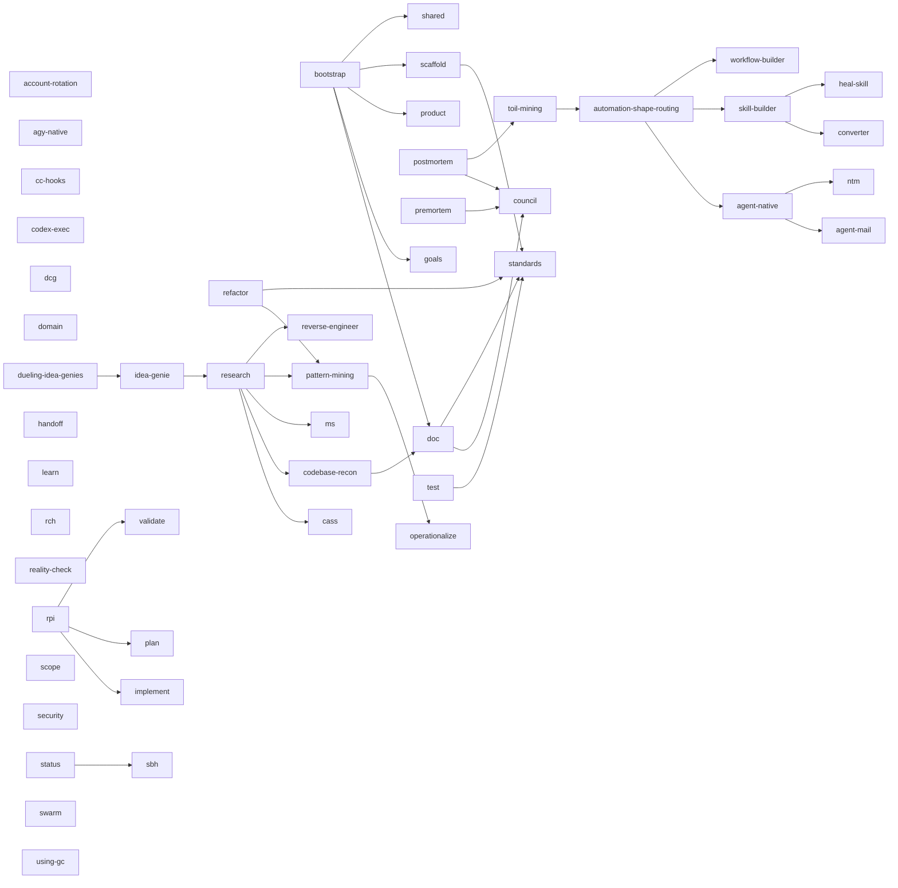

<!-- generated from skills/*/SKILL.md metadata -->

# AgentOps skill graph

```mermaid
graph LR
  account_rotation["account-rotation"]
  agent_mail["agent-mail"]
  agent_native["agent-native"]
  agy_native["agy-native"]
  automation_shape_routing["automation-shape-routing"]
  bootstrap["bootstrap"]
  cass["cass"]
  cc_hooks["cc-hooks"]
  codebase_recon["codebase-recon"]
  codex_exec["codex-exec"]
  converter["converter"]
  council["council"]
  dcg["dcg"]
  doc["doc"]
  domain["domain"]
  dueling_idea_genies["dueling-idea-genies"]
  goals["goals"]
  handoff["handoff"]
  heal_skill["heal-skill"]
  idea_genie["idea-genie"]
  implement["implement"]
  learn["learn"]
  ms["ms"]
  ntm["ntm"]
  operationalize["operationalize"]
  pattern_mining["pattern-mining"]
  plan["plan"]
  postmortem["postmortem"]
  premortem["premortem"]
  product["product"]
  rch["rch"]
  reality_check["reality-check"]
  refactor["refactor"]
  research["research"]
  reverse_engineer["reverse-engineer"]
  rpi["rpi"]
  sbh["sbh"]
  scaffold["scaffold"]
  scope["scope"]
  security["security"]
  shared["shared"]
  skill_builder["skill-builder"]
  standards["standards"]
  status["status"]
  swarm["swarm"]
  test["test"]
  toil_mining["toil-mining"]
  using_gc["using-gc"]
  validate["validate"]
  workflow_builder["workflow-builder"]
  agent_native --> agent_mail
  agent_native --> ntm
  automation_shape_routing --> agent_native
  automation_shape_routing --> skill_builder
  automation_shape_routing --> workflow_builder
  bootstrap --> doc
  bootstrap --> goals
  bootstrap --> product
  bootstrap --> scaffold
  bootstrap --> shared
  codebase_recon --> doc
  doc --> council
  doc --> standards
  dueling_idea_genies --> idea_genie
  idea_genie --> research
  pattern_mining --> operationalize
  postmortem --> council
  postmortem --> toil_mining
  premortem --> council
  refactor --> pattern_mining
  refactor --> standards
  research --> cass
  research --> codebase_recon
  research --> ms
  research --> pattern_mining
  research --> reverse_engineer
  rpi --> implement
  rpi --> plan
  rpi --> validate
  scaffold --> standards
  skill_builder --> converter
  skill_builder --> heal_skill
  status --> sbh
  test --> standards
  toil_mining --> automation_shape_routing
```

Hard dependencies only. Optional context relationships are listed in the context map.
