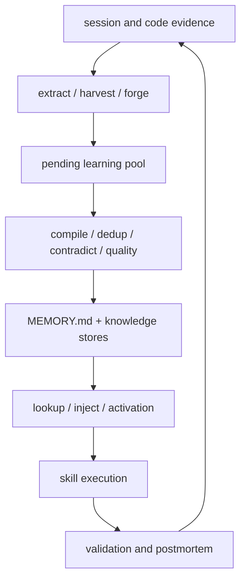
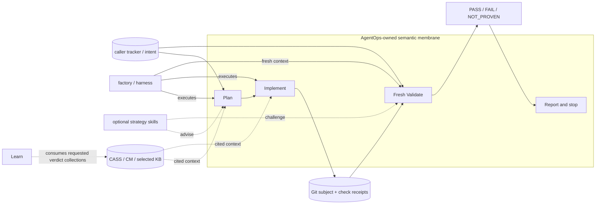
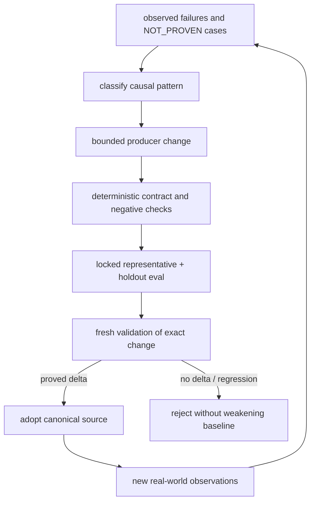

# Skill-system evolution: from autonomous flywheel to federated proof graph

**As of:** 2026-08-16
**Scope:** every release represented in `CHANGELOG.md` (`2.16.0` through
`3.5.0`) plus the current unreleased tree
**Question:** what meta-loops and graphs did the skill system actually build,
and where can skills still create compounding improvement in agent harnesses?

## Executive finding

AgentOps did not evolve into one ever-larger autonomous loop. It repeatedly
tried that shape, observed that orchestration, stored state, and control
ceremony could grow faster than validated capability, and then separated the
system into a **federated graph with one small proof traversal**:

```text
caller intent -> Plan -> Implement -> fresh Validate -> report and stop
                    \        |              /
                     exact subject identity

optional, later, caller-selected:
verdict collections -> Learn -> proposed skill/knowledge change
    -> deterministic checks + holdout eval -> a new RPI traversal
```

The leverage point remains the skill corpus, but its role is narrower and more
powerful than “the agent's operating system.” A skill is the portable semantic
adapter that tells a capable harness **when to invoke judgment, what evidence
to preserve, which authority to query, and where to stop**. Deterministic
mechanism and trust-sensitive receipts belong in the Go CLI; runtime-specific
syntax belongs in generated projections; authoritative work, source, runtime,
and knowledge stay in their native systems.

The resulting recursive-improvement claim is conditional rather than
automatic:

> A skill system compounds only when observed failures produce a bounded
> change to an authoritative knowledge or skill source, the changed behavior
> beats a locked baseline or holdout, and a fresh context validates the exact
> subject. Accumulating artifacts, citations, agreement, cycles, or green
> self-authored checks is not compounding.

This conclusion is a synthesis of release claims and current contracts, not a
claim that every historical mechanism remains live. In particular, the
current unreleased tree retires the live `ao flywheel` product surface and its
“COMPOUNDING/DECAYING” state. `learn` remains an optional consumer of durable
verdicts, not a mandatory stage and not an authority over the next run.

## Evidence and method

This analysis uses four evidence classes, in precedence order:

1. **Current executable contracts:** `AGENTS.md`, the RPI architecture,
   schemas, current `skills/*/SKILL.md` metadata, and blocking gates.
2. **Current generated views:** the skill graph and skill router. These are
   projections, not independent authorities.
3. **Release record:** every section of `CHANGELOG.md`, used to reconstruct
   the sequence before the repository history available in this checkout.
4. **Historical decisions and audits:** especially the hookless
   rearchitecture, deterministic evolve loop, catch-to-producer experiment,
   state tiers, Cathedral Cut, and skill-overhaul records.

The checkout's reachable Git history begins on 2026-07-21, while the changelog
begins at 2.16.0 on 2026-02-23. Therefore the release-by-release account before
3.3 is a **documented release reconstruction**, not an independent diff of
each historical tag. No release tags are reachable in this checkout. Counts
are used only when the release record states them; they are not silently
normalized across changing definitions of “skill” and runtime projection.

## The evolution in seven regimes

```mermaid
flowchart LR
  A["2.16-2.20\nself-running RPI + knowledge flywheel"] -->
  B["2.21-2.26\nCodex projection + autonomous DAG"] -->
  C["2.27-2.33\ncompounding signals + specialist graph"] -->
  D["2.34-2.38\nstrict orchestration + knowledge activation"] -->
  E["2.39-2.41\ndaemon, ports, gates, eval workbench"] -->
  F["3.0-3.2\nhookless core, external factories, membrane"] -->
  G["3.3-now\nCathedral Cut + honest federated contracts"]

  E -. "control surface exceeded demonstrated value" .-> F
  F -. "ceremony still induced model spirals" .-> G
```



### Regime 1 — make the loop run and remember (2.16–2.20)

The initial system coupled three ambitions:

* an autonomous `evolve`/RPI execution loop;
* mechanical health and stagnation controls; and
* a persistent knowledge flywheel fed at session boundaries.

The skill was both workflow and policy. `evolve` selected work, ran RPI, wrote
cycle history, measured fitness, and decided whether to continue. Session
hooks extracted learnings, promoted memory, injected context, deduplicated and
checked contradictions. The implicit graph was circular:

```text
work -> RPI -> validation/retro -> learning artifact -> memory/injection
  ^                                                       |
  +---------------- next autonomous cycle ----------------+
```

This established the enduring thesis—experience should change future agent
behavior—but also mixed authority, storage, orchestration, and judgment in one
loop.

### Regime 2 — port the semantics into Codex (2.21–2.26)

The next problem was harness portability. AgentOps introduced Codex-first
install and generated skill projections, a Codex skill API, runtime-specific
overrides, DAG-first traversal, and parity gates. The RPI lifecycle became a
three-phase autonomous chain with test-level selection and output contracts.

Two durable architectural ideas appeared:

1. **canonical semantic source -> generated harness adapter** rather than
   manually maintained copies; and
2. **graph-shaped delegation** rather than a monolithic prompt.

The 2.26.1 fix is revealing: heading structure caused the model to stop after
phase two, so orchestrator skills were compressed into a single DAG code
block. Skill representation was already understood as executable harness
design, not merely documentation.

### Regime 3 — measure whether memory compounds (2.27–2.33)

The system made its knowledge thesis explicit: golden signals, citation
priming, forge-to-pool ingestion, search over sessions and repository
knowledge, reviewer reference packs, harvest across workspaces, knowledge
activation, and flywheel maintenance. Skills became the delivery surface for
retrieved knowledge and the source of structured findings.

At the same time, the catalog expanded into lifecycle and specialist skills.
RPI became an orchestrator over discovery, implementation, validation,
testing, research, review, and retrospective behavior. This increased
coverage but also increased the probability that an agent would perform the
process rather than change the subject.

The knowledge graph in this regime was approximately:



The key weakness was epistemic: more flow through this graph did not by itself
show that retrieved knowledge improved held-out coding behavior.

### Regime 4 — enforce the orchestration graph (2.34–2.38)

The system responded to inconsistent agent execution by adding scenarios,
strict delegation, compression escape flags, line limits, knowledge operator
surfaces, and stronger cross-runtime parity. This was the high-water mark of
the belief that a detailed skill graph could reliably steer weaker or less
consistent models.

It produced useful invariants—explicit delegation, domain checklists,
reference integrity, runtime parity—but also a tax: the orchestrator needed to
remember which sub-skill, mode, artifact, and gate controlled each stage.
Meta-work became a competing objective.

### Regime 5 — turn the loop into a control plane (2.39–2.41)

AgentOps then attempted to make the system durable and observable through an
in-repository daemon, job queue, schedules, workers, projections, mutation
tokens, ports, ledgers, and a large gate surface. Practice lineage connected
skills, hooks, commands, schemas, and evals into a derivation graph. A
behavioral eval workbench and head-to-head skill-delta gate were the most
important additions because they could test the leverage thesis rather than
merely describe it.

This regime built three distinct graphs but partially conflated them:

* **execution graph:** jobs, schedules, workers, factories, worktrees;
* **proof graph:** criteria, checks, verdicts, provenance, claims;
* **knowledge graph:** practices, findings, citations, corpus injection.

The port architecture made ownership explicit, but the product also assumed
ownership of too many lifecycle transitions. Release 2.41.1 demonstrated the
gap between green-looking orchestration and release truth: path-filtered CI
had hidden failed validation and stale call sites survived a command removal.

### Regime 6 — remove hidden control, retain proof (3.0–3.2)

Version 3.0 made the first major subtraction: hookless by default, daemon
removed, scheduling and overnight ownership removed, and Gas City treated as
the orchestration substrate. Skills and explicit CLI/gate ports replaced
ambient prompt injection. The core insight was that portability improves when
semantic policy is invoked deliberately and deterministic enforcement is not
performed by prose.

Versions 3.1 and 3.2 then hardened distribution, native gates, skill-corpus
resolution, evals, verdict integrity, and memory experiments. The 3.2
“membrane” was a sophisticated proof/learning graph:

```text
fresh reviewer catch -> classify recurrence
  -> if mechanical: derive a deterministic check
  -> if judgment-class: route to a producer skill/rule
  -> recall in future context -> measure recurrence
```

The accompanying ADR found an important limit: none of 13 recurring catch
classes in the measured corpus was mechanically compilable, and many catches
lacked usable defect reasons. This invalidated the simple story “every review
finding becomes a gate.” Judgment-class knowledge needs a human- or
model-readable producer rule plus independent evaluation, not forced
compilation.

### Regime 7 — the Cathedral Cut and honest contracts (3.3–now)

Version 3.3 removed the machinery built to steer weaker models and reduced the
core to four skills: Plan, Implement, fresh Validate, and RPI. It introduced
exact subject manifests, fresh-context identity, criterion-level verdicts,
and content-addressed evidence while explicitly refusing ownership of Git,
CI, retry, queue, release, or delivery state.

Versions 3.4 and 3.5 completed the boundary:

* all shipped skills declared real effects, honest outputs, and closed write
  directories;
* verdict persistence became conditional rather than ritual;
* factories became external peers operated through their own coordinator;
* AgentOps linked skills into harnesses instead of owning the harness;
* multi-behavior planning described a manifest without creating tracker work;
* caveats gained explicit homes rather than being deleted to obtain PASS.

The unreleased tree goes further by removing `ao flywheel` and its knowledge-
compounding status. That is not abandonment of learning. It is a correction
of authority: an optional Learn consumer may propose improvements from verdict
collections, but AgentOps does not claim a live knowledge lake, automatic
escape velocity, or control of what the caller does next.

## Release-by-release trace

The following table records the skill-system delta of **every release present
in the changelog**. Patch releases are included because several expose failure
modes that shaped the later architecture.

| Release | Skill/loop evolution | Architectural signal |
|---|---|---|
| 2.16.0 | Hardened `evolve` stagnation, fitness, cycle history, skill healing, and RPI lifecycle tests. | Autonomous improvement begins as a disk-observed control loop. |
| 2.17.0 | Recast goals as five OODA verbs and used directive cascades to reduce idle cycles. | Goals act as feedback control, not static prose. |
| 2.18.0 | Added notebook/memory sync, lookup, dedup, contradiction, health metrics, and work-scoped injection. | A persistent knowledge graph is coupled directly to execution context. |
| 2.18.1 | Made lean session injection, pruning, and pool ingestion automatic; excluded empty learnings. | Automation increases flow while early quality filters fight artifact inflation. |
| 2.18.2 | Made seeding and storage safer and removed tracked session state. | Knowledge/runtime state begins separating from source. |
| 2.19.0 | Added knowledge-graph operations, RPI worker visibility, and regenerated Codex modules/overrides. | One semantic system starts spanning multiple harnesses. |
| 2.19.1 | Cut quickstart latency and repaired stale command references across generated Codex skills. | Prompt size and projection drift are observed as runtime defects. |
| 2.19.2 | Retrospectively repaired missing release documentation. | The release narrative itself is recognized as incomplete evidence. |
| 2.19.3 | Patch release with no recorded skill-system delta. | Honest null: the changelog supplies no evolution claim. |
| 2.20.0 | Closed session-to-learning and handoff-to-learning loops; added production RPI serving, mining, defrag, scoped context, and maturity promotion. | Peak early integration of orchestration and knowledge compounding. |
| 2.20.1 | Consolidated Codex skills under one raw skill home and fixed multiline metadata conversion. | Runtime projection becomes an adapter over canonical skills. |
| 2.21.0 | Rolled Codex-first skills across the catalog with override governance and smoke/parity validation. | Portability becomes a first-class graph invariant. |
| 2.22.0 | Added execution profiles, headless teams, and validation feedback capture. | Skills adapt behavior to repository and runtime context. |
| 2.22.1 | Completed closed-loop prevention validation and repaired release gates. | Feedback loops require deterministic closure checks. |
| 2.23.0 | Split discovery and validation orchestration, refactored RPI delegation, and scored knowledge packets. | The monolith becomes a delegated skill DAG. |
| 2.23.1 | Synced embedded/Codex skills after audit fixes. | Generated copies demand continuous drift control. |
| 2.24.0 | Added temporal/domain premortems, persistent retro history, and council-finding extraction. | Judgment outputs become future learning inputs. |
| 2.25.0 | Standardized a test pyramid across the lifecycle, required autonomous three-phase RPI, and formalized the Codex skill API/output contracts. | Validation semantics become portable, typed expectations. |
| 2.25.1 | Repaired Codex test-pyramid parity and removed Claude-only backend leakage. | Harness-specific adapters must not absorb foreign primitives. |
| 2.26.0 | Mapped bug classes to test levels and audited all Codex skills/references. | Skill knowledge selects concrete proof depth. |
| 2.26.1 | Compressed RPI/discovery/validation into DAG blocks after headings caused premature stopping. | Skill form directly changes model execution behavior. |
| 2.27.0 | Added flywheel golden signals, citation priming, forge-to-pool flow, and catalog/runtime quality fixes. | The system tries to distinguish compounding from accumulation. |
| 2.27.1 | Made golden signals unconditional after hidden analysis contradicted a `COMPOUNDING` status. | Optional observability can create false-positive health. |
| 2.28.0 | Auto-triggered knowledge refresh, scaled plan depth, configured reviewers, and synchronized Codex features. | Context and rigor become dynamically routed. |
| 2.29.0 | Brokered session/repo search, enriched reviewer knowledge, and added flywheel proof/citation feedback. | Retrieval and judgment graphs become mutually reinforcing. |
| 2.30.0 | Added hookless Codex lifecycle support and made long RPI runs replayable. | Explicit runtime paths start replacing hook dependence. |
| 2.31.0 | Wired nine lifecycle skills into RPI and harvested cross-workspace knowledge. | Skill breadth and automatic delegation reach a local maximum. |
| 2.32.0 | Added knowledge activation and runtime selection with quality telemetry. | Retrieval is promoted from storage to execution-time policy. |
| 2.33.0 | Added adversarial validation and wired knowledge operators into Plan/Validate. | Independent challenge becomes part of the proof graph. |
| 2.34.0 | Added hidden holdout scenarios, satisfaction scoring, agent-built behavioral specs, mixed-vendor judgment, and retrieval train/holdout splits. | Behavioral evaluation becomes an explicit defense against self-authored proof. |
| 2.35.0 | Added native Codex hooks and a knowledge-compiler skill while decomposing CLI logic behind injected domain packages. | Runtime automation peaks, while mechanics begin moving below the skill membrane. |
| 2.36.0 | Exposed the autonomous evolve loop, added overnight Dream, generated review-only skill drafts from repeated patterns, and decomposed Plan/Premortem details into references. | Recursive improvement directly proposes new skills, but orchestration and knowledge ownership continue expanding. |
| 2.37.0 | Made compile/forge first-class, connected Dream curation to evolve, formalized an `.agents` wiki, and added retrieval-quality ratchets. | The Karpathy-style knowledge wiki becomes an integrated day/night learning graph. |
| 2.37.1 | Added ranked morning packets, confidence telemetry, and bounded corroboration for weak overnight output. | The knowledge loop gains routing based on evidence confidence. |
| 2.37.2 | Added swarm evidence validation, lead-only worker Git guards, and explicit excluded/near-miss reporting in compile/harvest. | Multi-agent authority and negative evidence become more explicit. |
| 2.38.0 | Mandated strict sub-skill delegation for RPI/discovery/validation with explicit compression escapes. | The detailed orchestration contract reaches its high-water mark. |
| 2.39.0 | Introduced a daemon control plane, durable jobs, workers, schedules, projections, mutation tokens, and knowledge harvesting. | Execution, proof, and knowledge graphs are centralized. |
| 2.40.0 | Added complete practice derivation, many structural gates, and a head-to-head behavioral eval workbench. | Provenance becomes graph-wide; eval delta offers a real learning signal. |
| 2.41.0 | Completed bounded-context ports, exposed operator/loop/corpus/claim commands, and strengthened release readiness. | Typed ports clarify ownership but greatly expand control surface. |
| 2.41.1 | Fixed a release shipped with masked validation failures and stale removed-command call sites. | Green process state is shown not to imply end-to-end truth. |
| 3.0.0 | Removed default hooks, daemon, schedules, and owned GC bridge; retained explicit skills, CLI ports, gates, and validation. | First major decoupling: AgentOps stops owning runtime lifecycle. |
| 3.0.1 | Removed stale hook-era validation checks. | Deletion requires removal from the proof graph too. |
| 3.1.0 | Productized multi-harness images, native Go gates, skill-overlap resolution, and eval/refinery surfaces. | Distribution and deterministic checking replace ambient control. |
| 3.2.0 | Added verdict integrity, membrane memory, a wiki/KB experiment, plan duels, token accounting, and stricter gates. | Proof and learning become content-bound, but the system again grows broad. |
| 3.3.0 | Performed the Cathedral Cut; defined the four-skill one-pass core, exact manifests, fresh validation, optional adapters, and report-and-stop. | Judgment boundary—not orchestration—is the product invariant. |
| 3.4.0 | Overhauled all 50 skill contracts, externalized factories, made verdict storage optional, and enforced honest effects. | Skills become semantic adapters in a federated graph. |
| 3.5.0 | Added factory-coordinator doctrine, plan manifests, bounded caveat homes, and CLI-backed GC maintenance. | AgentOps describes handoffs without acquiring foreign lifecycle authority. |
| Unreleased | Retires the live flywheel product/status and consumer-free artifacts; Learn remains optional. | Compounding is no longer a product state AgentOps can self-declare. |

The release entries are changelog-level summaries and should not be read as
file-exact diffs; the reachable Git history does not contain the pre-3.3
release commits.

## The present graph

The generated hard-dependency graph is intentionally sparse: RPI depends on
Plan, Implement, and Validate; the many specialist skills have no declared
hard dependency edges. That sparsity is a feature. Optional context and
caller-selected strategies do not become mandatory lifecycle stages.



Authority follows the edges rather than being copied into the membrane:

| Node | Owns | AgentOps relation |
|---|---|---|
| Caller tracker | intent, work status, dependencies, closure | Query and bind identity; do not mirror. |
| Git/repository policy | source bytes and delivery history | Derive exact subject; never infer semantic PASS from commit/merge. |
| Harness/factory | runtime execution and native state | Supply portable skills and read native state; do not dispatch or repair through side doors. |
| Checks | factual receipts | Preserve output and scope; do not ask them for semantic judgment they cannot make. |
| Fresh validator | independent acceptance judgment | Require distinct identity and exact unchanged subject. |
| CASS/CM/selected KB | historical or curated knowledge | Retrieve with provenance and freshness; do not absorb authority. |
| `.agents/ao/` | caller-requested proof | Persist only for a named consumer or explicit request. |
| Scratch/projections | disposable derived state | Rebuild, expire, and never treat as authority. |

## The meta-loops that survived—and those that did not

### 1. The subject proof loop (survives as the core)

```text
intent identity -> bounded change -> factual checks -> fresh semantic judgment
```

This is called a loop historically, but one invocation is deliberately a
single traversal. It has a strong negative feedback mechanism: exact identity,
changed-path coverage, and criterion evidence prevent the author from moving
the goalposts. It stops after reporting so that a failing validator cannot
silently become the next implementer.

### 2. The skill projection loop (survives as build mechanics)

```text
canonical SKILL.md -> metadata/schema validation -> generated harness view
  -> install/link smoke -> drift detection -> edit canonical source
```

This is the key leverage loop for Codex and other harnesses. Improvements are
made once in semantic source, then projected through a declared adapter. The
historical parity failures show why generated output must be regenerated and
tested rather than hand-edited.

### 3. The deterministic defect loop (survives when the defect is mechanical)

```text
reproduced defect -> negative witness -> CLI/gate fix -> prove gate can fail
```

This loop compounds reliably because its knowledge becomes executable. The
negative-witness ratchet protects against ornamental gates. Its domain is
limited: it cannot encode most judgment-class review findings.

### 4. The judgment learning loop (survives only as optional consumption)

```text
fresh verdicts -> classify recurring failure -> proposed producer rule/skill
  -> holdout evaluation -> fresh validation -> adopt or reject
```

This is the honest recursive skill-improvement loop. The producer is the
canonical skill, reference, or curated KB—not a second tracker and not an
unbounded log. A recurrence class is evidence for a proposal, not proof that
the proposal works.

### 5. The autonomous evolve loop (retired from the core)

Historically, `evolve` repeatedly chose work and ran RPI until an operator
stopped it. It proved that long-running execution was possible, but cycle
count and self-continuation were poor proxies for delivered capability. It
also coupled work authority, retry, budget, and lifecycle to AgentOps. Those
responsibilities now belong to the caller or selected factory.

### 6. The live knowledge flywheel (retired as a product claim)

The flywheel attempted to measure collection, citation, reuse, maturation,
escape velocity, and compounding. Several mechanisms remain useful as source-
system capabilities, but AgentOps no longer owns or reports a global
compounding state. The reasons visible across the evolution are:

* artifact volume can grow while behavioral quality does not;
* citation can measure retrieval or popularity without measuring correctness;
* correlated agents can reinforce the same mistake;
* stored projections can drift from source authority;
* judgment catches often cannot become deterministic gates; and
* an in-path learning stage compromises the clean independence of validation.

### 7. The catch-to-producer loop (retained as a lesson, not machinery)

The membrane experiment discovered that mechanical compilation was the wrong
route for the measured judgment catches. Its lasting contribution is a router:

```text
finding
  |-- reproducible invariant violation --> negative witness + deterministic gate
  |-- judgment/policy failure ----------> skill/reference/KB producer rule
  `-- insufficient evidence ------------> NOT_PROVEN; do not synthesize a rule
```

## What “compound engineering” can mean now

The current architecture supports compound engineering if the unit of
compounding is **validated behavior**, not stored knowledge. Let:

* `T` be a locked distribution of representative and holdout tasks;
* `S_n` be skill/knowledge source version `n`;
* `H` be a fixed harness/runtime configuration for the comparison;
* `Q(S_n, H, T)` be acceptance-weighted task quality, with explicit failure,
  refusal, and not-proven denominators; and
* `C(S_n, H, T)` be cost/latency/context load with a stated countermetric.

An improvement compounds only if a change produces a reproducible delta:

```text
Q(S_n+1, H, holdout) > Q(S_n, H, holdout)
```

without buying the result through acceptance weakening, hidden model changes,
unbounded cost, or leaked holdout knowledge. The loop then becomes:



This is recursive self-improvement in the defensible sense: outputs of use
generate candidates for the system that shapes future use. It is **not**
self-authorizing. Each recursion crosses an independent validation boundary,
and the caller decides whether to begin another traversal.

### The minimum learning record

A useful learning proposal needs no new universal packet. In its existing
authoritative owner, it should make five facts recoverable:

1. the observed failure(s), including `FAIL` and `NOT_PROVEN` rather than only
   successes;
2. the proposed causal class and counterexamples;
3. the canonical producer surface to change;
4. the locked tasks/criteria and countermetric that can falsify the change;
5. provenance and freshness sufficient to distinguish evidence from policy.

If no consumer, gated subject, observed defect, or retirement condition exists,
the record is ceremony and should not be created.

## Design implications for skills as the leverage point

### Keep skills semantic and thin

A high-leverage skill should contain:

* a discriminative trigger, including when **not** to use it;
* authoritative inputs and their freshness/provenance requirements;
* bounded effects and write scope;
* an observable output contract;
* semantic judgment that cannot be reduced to a deterministic check;
* explicit stop conditions and authority boundaries; and
* references only when they materially improve the decision.

It should not contain a shadow queue, retry controller, release manager,
knowledge index, or long script implementing deterministic mechanics.

### Put mechanics below the prompt membrane

Parsing, hashing, containment, manifests, atomic writes, deadlines, receipts,
and deterministic validation belong in `ao` Go code. Thin POSIX glue may adapt
arguments. This reduces token load, removes model discretion from invariants,
and gives every harness identical mechanics.

### Treat harness ports as projections, not forks

Codex-specific syntax or capability differences belong in the declared
projection/override system. The canonical skill remains the semantic owner.
Every projection loop needs:

* source identity;
* deterministic regeneration;
* runtime-specific negative tests;
* install/link smoke; and
* a drift gate that points back to the owner.

### Optimize the graph for optionality

Only true hard dependencies should appear as hard edges. Research,
premortem, council, postmortem, retrieval, and factories are strategies or
peers selected by the caller and context. Making them mandatory recreates the
orchestrator-compression problem and lets graph traversal substitute for work.

### Train on honest outcomes

A growing KB must preserve failures, refusals, caveats, stale evidence, and
NOT_PROVEN outcomes. Otherwise the learning corpus selects for confidence and
ceremonial completion. Every quality metric needs a denominator and a
countermetric—for example pass rate paired with unresolved/not-proven rate,
or reuse paired with holdout delta and context cost.

### Separate authoring, checking, and judging

The most important graph cut is not between tools; it is between epistemic
roles:

```text
author candidate != deterministic check != fresh semantic judge
```

Checks establish facts. A fresh context judges their meaning against intent.
Neither high agent count nor cross-model agreement repairs a mutated subject,
missing scope, or shared-context contamination.

## A practical improvement protocol

For a future skill or KB evolution experiment:

1. **Select one observed behavior defect.** Prefer a repeated failure with
   exact transcripts, task identity, and environmental facts.
2. **Route it.** Mechanical defects go to code/gates; judgment defects go to a
   skill, reference, or curated knowledge owner; under-evidenced cases remain
   NOT_PROVEN.
3. **Lock the comparison.** Freeze task inputs, acceptance, harness/model,
   budget, and representative plus holdout sets before editing the producer.
4. **Make one bounded change.** Do not combine prompt, model, tool, and
   acceptance changes in one result.
5. **Run deterministic checks.** Validate metadata, references, projection
   regeneration, effect boundaries, and negative witnesses.
6. **Measure behavioral delta.** Report the full denominator, failures,
   refusals, NOT_PROVEN results, cost, latency, and context load.
7. **Obtain fresh judgment.** Validate the exact source/projection content and
   criterion evidence from a context that did not author the candidate.
8. **Adopt or reject and stop.** Adoption changes the canonical owner. It does
   not automatically launch another improvement cycle.

## Falsifiable predictions

This synthesis makes claims that future data can disprove:

1. **Thin semantic skills plus CLI mechanics outperform verbose orchestrator
   skills** on equal-model holdouts in completion quality per context token.
2. **Sparse hard-dependency graphs reduce process-only completion** without
   reducing acceptance coverage when optional strategies remain discoverable.
3. **Failure-routed producer changes reduce recurrence** of their targeted
   class more than undifferentiated memory injection does.
4. **Fresh exact-subject validation increases NOT_PROVEN initially** but
   lowers false PASS on mutated or partially checked work.
5. **Citation/reuse growth without holdout delta predicts no compounding.**

If these do not hold under controlled evaluation, the corresponding skill or
architecture rule should change. The system's ability to delete a failed
meta-loop is itself part of recursive improvement.

## Conclusion

The full release arc is a movement from **autonomous recursive machinery** to
**bounded recursive learning across a proof membrane**. Early releases proved
that agents could run loops and accumulate knowledge. Middle releases exposed
the operational and epistemic cost of turning those loops into a centralized
control plane. The 3.x cuts retained the parts that create trustworthy
leverage: portable skill semantics, exact subject identity, deterministic
mechanics, independent validation, explicit authority, and behavioral evals.

The system's meta-graph is therefore not a circle owned by AgentOps. It is a
federation of intent, source, runtime, proof, and knowledge authorities. RPI is
one safe traversal through that graph. Learning is a later optional traversal
that may alter a skill or knowledge source, but only a new controlled
experiment can show that the alteration improved future coding behavior.

That boundary is what makes skill-driven recursive improvement credible:
**the skills may evolve with use, but they never get to certify their own
evolution.**
